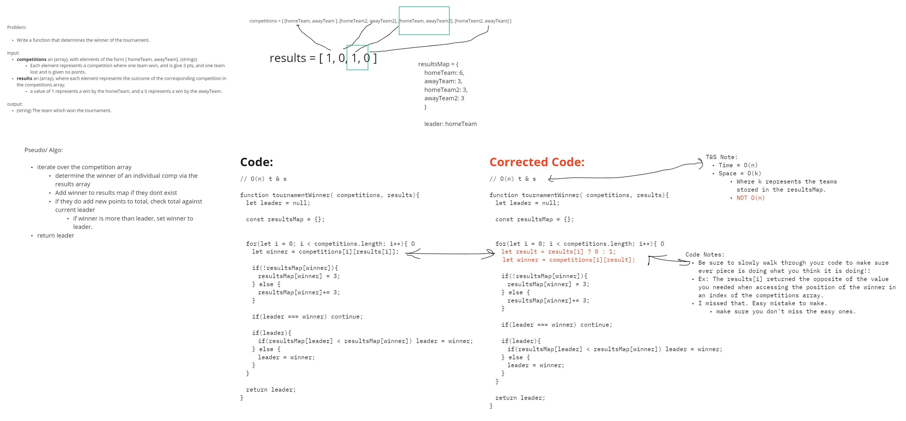

# Tournament Winner

- This is an **Array** and **Map** type question.
- 
<br>

### Solution:

  - Time and Space:
    - **Time** = O(n)
    - **Space** = O(k)
      - Where k represents the **teams stored** in the resultsMap.
      - **NOT O(n)**

```js
function tournamentWinner(competitions, results) {

  // Create a variable to track leader of the competition
  let leader = null;

  // create an object to store the total points of each winner
 const resultsMap = {};

// Iterate over the competitions array
 for(let i = 0; i < competitions.length; i++){

  // swap the value at a given result index so that it aligns with the winner of a competition.
	let result = results[i] ? 0 : 1;

  // Access the winner of an individual competition. 
  let winner = competitions[i][result];

  // if the winner isn't already in the results map, add it.
  if(!resultsMap[winner]){
   resultsMap[winner] = 3;
  // else, if it is, increment it's value by 3.
  } else {
   resultsMap[winner]+= 3;
  }

  // if the leader and the winner are the same, complete the loop here.
  if(leader === winner) continue;

  // set the leader
  if(leader){
   if(resultsMap[leader] < resultsMap[winner]) leader = winner;
  } else {
   leader = winner;
  }
 }

// return the final leader
 return leader;
}

```
<br>


### Notes: 

- **Time:**
  - ~40 minutes (needs improved)
- **Issues:**
  - Be sure to slowly walk through your code to make sure ever piece is doing what you think it is doing!!
    - Ex: The results[i] returned the opposite of the value you needed when accessing the position of the winner in an index of the competitions array.
    - I missed that. Easy mistake to make.
  - **make sure you don't miss the easy ones.**

### Whiteboard:

