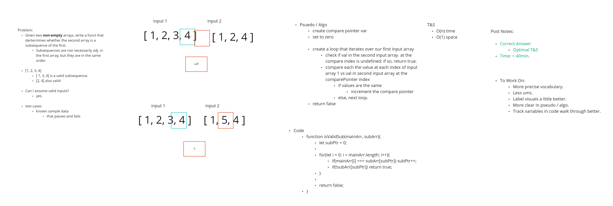

# Valid Subsequence

- relatively easy problem, but it deals with a concept that is found in a lot of harder coding interview problems: **subsequences**.

> **Subsequence**: A sequence that can be derived from another sequence by deleting some or no elements without changing the order of the remaining elements.

- Might be able to stop early, but you will probably need to traverse most or the whole array.

- **Subsequence cares about order.**

### My Solution:

  - in line with suggested solutions.
  - T&S:
    - **O(n) time**
    - **O(1) space**

```js 

function isValidSubsequence(array, sequence) {
  let subPtr = 0; // Pointer to track our position in sequence

	for(let i = 0; i < array.length; i++){ // Iterate over our main array
		if(array[i] === sequence[subPtr]) subPtr++; // if values at i of array and subPtr of sequence, increment subPtr

		if(!sequence[subPtr]) return true; // return true if we have reached the end of sequence
	}

	return false; // return false if we have reached the end of array
}

```

### Whiteboard

