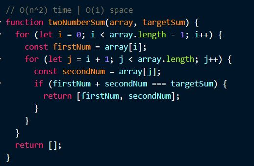
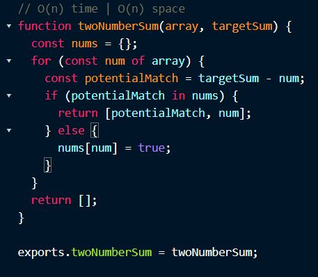
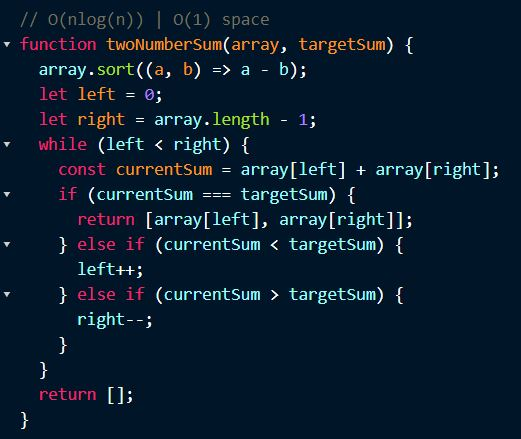
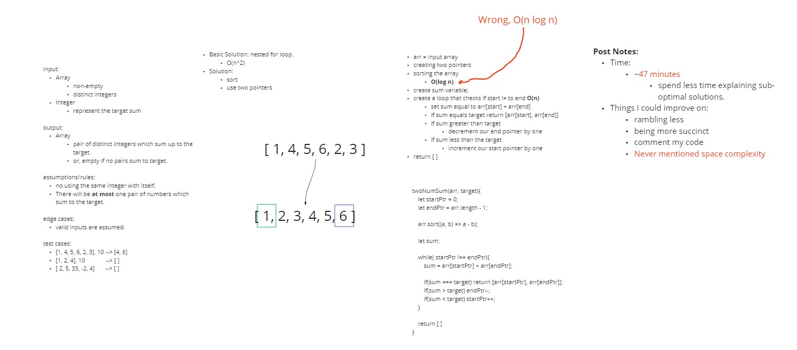

#  Two Number Sum

- This is an **Array** type question.
<br>

#### Solution #1, nested for loops

  - possible first thought, nested for loop
  - consider one number at a time against every other number looking for the target sum.
<br>

  - Time and Space:
    - **O(n^2) time, so not great**
    - **O(1) space**

  
<br>

#### Solution #2, hashtable

- Solve using a hash table
  - This will take more space
  - but will allow us to access the numbers in constant time

```js

  // what we are looking for:
  x + y = sum

  // can also be written as 
  y = sum - x

  // if x is the current number we are evaluating, we can 
  // check to see if y is in our hashtable.

```

  - we can loop over our array,
  - first we can determine our `y`, given `x` in the array
  - using the **`in`** operator we can check to see if `y` is in our array
    - if so we can return our found solution
    - if not, we can add `x` to our `nums` hashtable, which represents the existing values in our array.
<br>

  - Time and Space:
    - **O(n) time**
    - **O(n) space**



## Solution #3, sorting 

  - We know that **good sorting algorithms will take O(n log n) time**
    - Examples of 'good' sorting algos:
      - mergesort
      - quicksort
      - heapsort
<br>

  - create a left and right pointer
    - place these at the start and end of our arrays
    - create a loop, check that the l and r pointers are not equal
      - sum the values at those indices in the array
      - if the sum is equal to the target, return the pointers
      - if the sum is greater, decrement the right pointer
      - if the sum is less, increment the left pointer
  - return empty array if loop exits

  - Time and Space:
    - **O(n log n) time**
    - **O(1) space**



#### Attempt #1

- Time:
  - ~45 minutes (needs improved)
    - Could have spent less time discussing alternate solutions
  - got sorting algo time complexity wrong
    - good sorting algos run in **O(n log n) time**
    - got it confused with O( log n)
  - Other things to improve on:
    - ramble less
    - be more succinct
    - comment code as I go
    - **mention space complexity**

