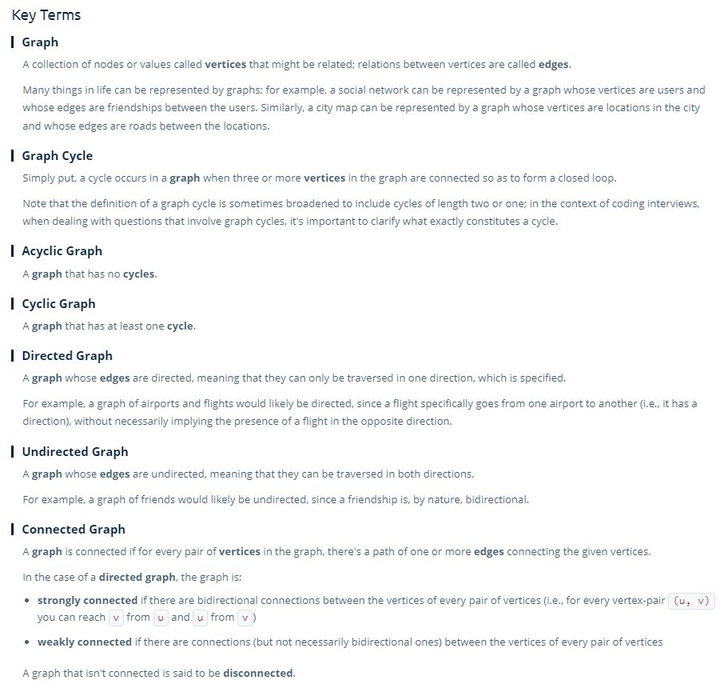

# Graphs

- Graphs are another data structure that is very common in interviews. 

> A Graph is a collection of nodes that **may or may not be connected to one another.**

- Nodes in a graph are called **vertices, plural - vertex, singular**.
- Connections in a graph are called **edges**.
 

## Key Concepts

- A **connected** graph is a graph in which you can reach any given node, if there is some path between any two nodes in a graph.
 

- A **directed** graph is a graph in which the edges have some direction, there is a specific direction of the connection between two points.
- An **undirected** graph has no direction between it's connected vertices. 
 

- A **cyclic** graph is a graph in which you have 3 or more vertices that are connected in such a way as to create a closed loop.
- an **acyclic** graph has no loops.

## Key Methods

- Breadth First Search Traversal
- Depth First Search Traversal
- **Covered in the Questions section**

## Graph Representations

- Graphs can be represented an **adjacency list**, which is an object or hashtable in which the key is an individual vertex, and the value for that key is the nodes it is connected to.

## Time and Space Complexity

- Space:
  - v where v is all the vertices in a graph
  - e where e is the number of edges
  - **So the space is O(v+e) space**

- Time
  - **DFS and BFS Traversal are O(v+e) time**

## Key Terms

