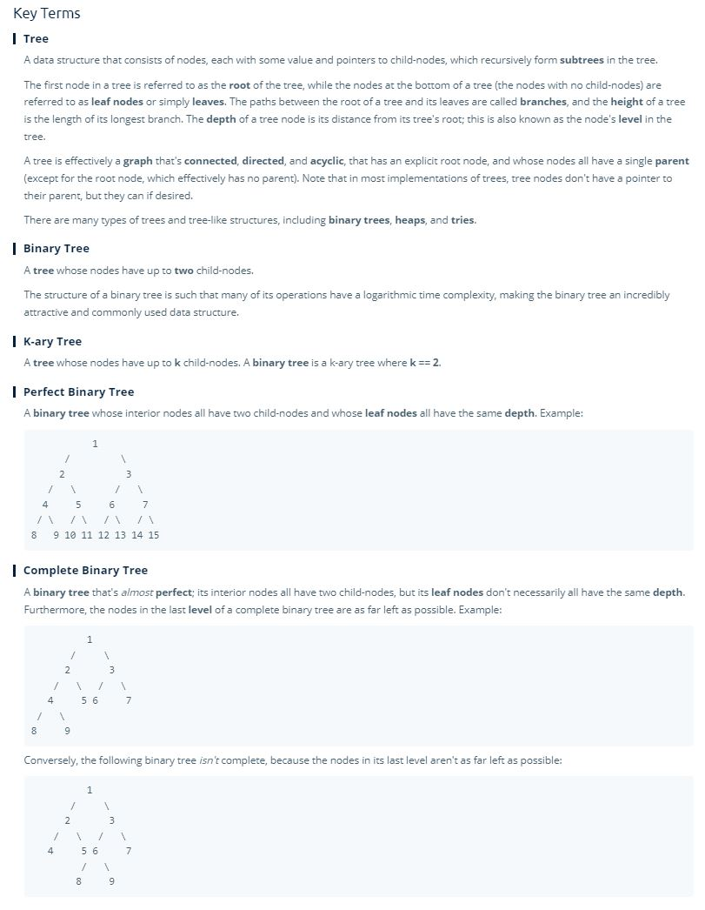
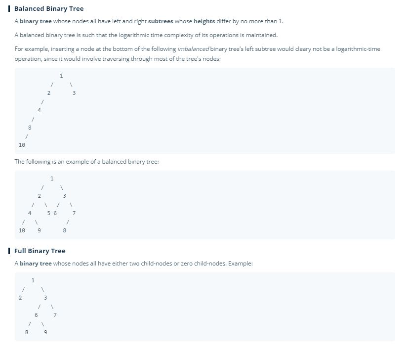

# Trees

- Trees are one of the most prominent data structures in all of coding, software engineering, and coding interviews.

> A tree is a type of **connected acyclic directed graph**, that is 'rooted' or has a top most node, then every node has or can have children, and **each node can have only one parent node.**

> The most common type of tree is a **binary tree**, which is a standard tree where each parent node has, at most, **two child nodes.**

- **There are many types of trees, differing by their rule sets**
  - Ex:
    - **Ternary Tree:** each parent node has, at most, **three** child nodes.
    - **K-ary Tree:** each parent node has, at most, **K** child nodes.
    - **Binary Search Trees**
    - **Heaps (min and max)**
    - **Tries:** Stores characters in a string.
    - etc... 
 

- **Can also have trees where each child node points back to it's parent.**

## Time and Space Complexity

- Space: **O(n)**
 

- Time:
  - Traversing all n node: **O(n)**
  - Traversing a single subtree (on average): **O(log(n)**
    - Assuming a balanced BST

## Vocabulary

- **Branch:** Any path the starts at the root node and ends at a bottom node in a tree.
- **Leaf Node:** Any bottom most node, or node at the end of a branch.
- **Level:** A single "level" of a tree or where the number of connections from the root are equivalent. 
- **Complete Tree:** A tree where every level is filled up, but the final level can not be filled up, however, the nodes need to be filled up from left to right.
- **Full Tree:** A tree where the nodes in that tree are either empty, or completely full.
- **Depth:** How far down a tree goes.
- **Perfect Tree:** Where are the leaf nodes have the same depth ( or on the same level).

## Key Terms

