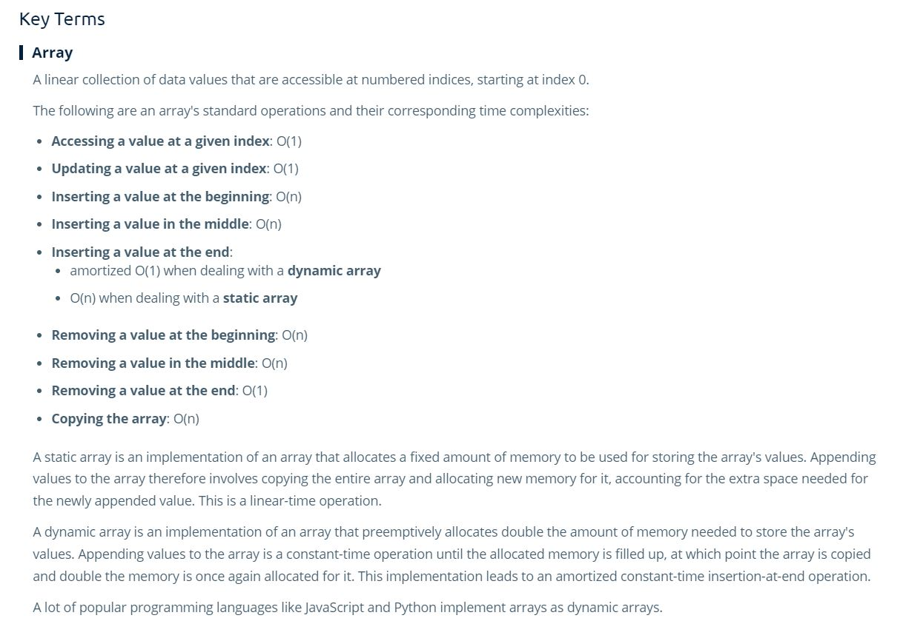

# Arrays

- Arrays require contiguous places in memory.
  - A 3 index array of 64 bit integers will take 24 memory slots.
 

- there are **static** and **dynamic** arrays.
  - **Static Array:** it's length is set and reserved ahead of time. It will never change.
  - **Dynamic Arrays:** it's length can change over time as needed.
 

-For this course will will consider arrays as **static**.

## Array Time Complexity

| Action  | Big 0  | S&T  |
|---|---|---|
|  get() | O(1)  | st  |
|  set() | O(1)  |  st |
| traverse()  | O(n)  | t  |
| copy()  | O(n)  | st  |
|  insert() - beg, mid| O(n), O(1) | t, s  |
|  insert() - end, dynamic | O(1), O(1) | t, s  |
|  insert() - end, static | O(n), O(1) | t, s  |
|  removeBeginning() | O(n)  | st  |
|  removeMiddle() | O(n)  | st  |
|  removeEnd() | O(1)  | st  |

## Dynamic Arrays in Different Languages

- Dynamic Arrays
  - C++: vectors
  - Java: array lists
 

- In Python, JS, and other modern languages
  - Standard arrays are Dynamic
 

- A dynamic array will allow you to have faster insertions at the end of the array.
- Many dynamic arrays allocate twice as much memory as you're asking for (depending on the language).

## Key Terms

