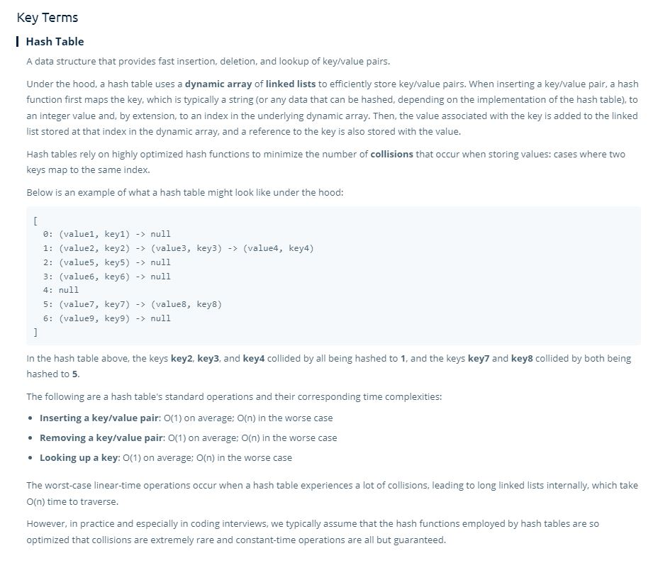

# hashtables

- **Hashtables are very common in interview questions**
- Many languages have hashtables built in, in JS it is an Object or a Map.

> A hashtable is a **key-value store**.

- In a hashtable you can access a value, given a key.
 

- **Insertion, Deletion, Searching** given a key are **constant time**, **on average.** If it is a bad hashing function (which you can almost forget about, since we have good hashing functions).
 

- Hashtables are **0(n) space**

- Hashtables are similar to an array, but our indices do not have to be numbers, they can be strings, etc...

## Under the Hood

- Hashtables are arrays under the hood
- The key (a string or other data type) is transformed into an number (index) via a hash function behind the scenes.
 

- It is possible that a hash function will map a given input to the same output (**collision**), because of this we can store our values in the array as linked lists
 

- If you find that the original underlying array is too small it is possible to resize the array, but it is pretty complicated.

## Key Terms

