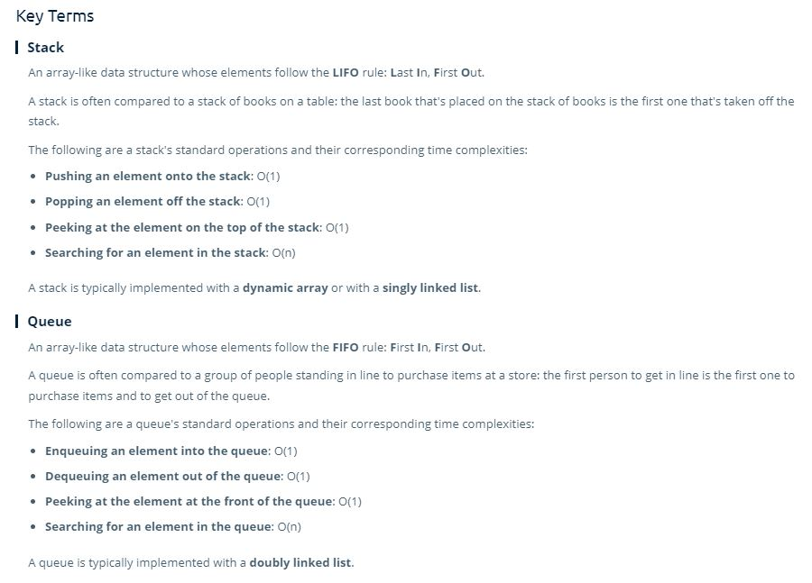

# Stacks and Queues

> Stacks are a data structure that supports inserting and removing elements following the **LIFO** (Last In First Out) principle.

> Queues are a data structure that supports inserting and removing elements following the **FIFO** (First In First Out) principle.

- A Stack can be implemented using a dynamic array (or linked list) under the hood
- A Queue is typically implemented using a Linked List (but can use dynamic arrays, but at the cost of time complexity).

## Space And Time Complexity of Stacks and Queue 

| Action  | BigO  | T&S  |
|---|---|---|
| insert()  | O(1)  | st  |
| delete()  | O(1)  | st  |
| peek() - top (s) - front (q)  | O(1)  | st |
| search(val)  | O(n)  |  t  |

- **Stacks and Queues are base data structures that can be built out to do more complex tasks**
  - Such as a minStack or maxStack
  - Priority Queues

## Key Terms

