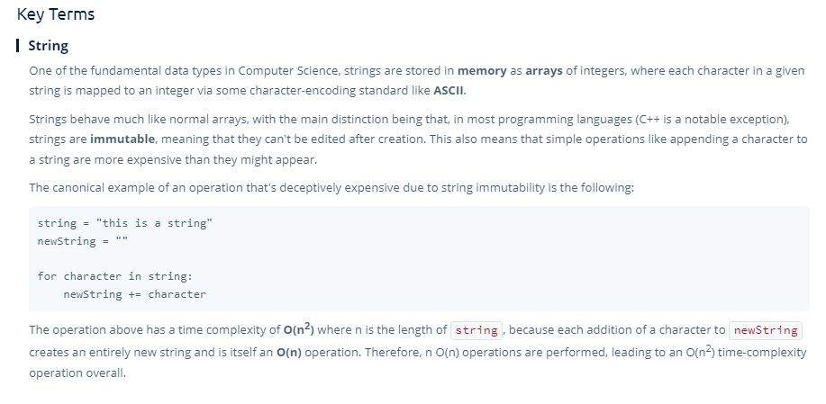

# Strings

- We generally think of stings as fundamental data types, but they behave sort of like data structures.
- They are implemented differently depending on the language.

> Strings are typically **stored in memory as an array of integers**, where each character is an ASCII character meaning that each character is mapped to an integer. 
> 
> **A -> 65, B -> 65... a -> 97, b -> 98, etc..**

## Time and Space Complexity

- In some languages strings are mutable, in others they are not.
- **In Javascript strings are immutable.**
- When a string is immutable, you must copy it and make the changes you want in the process in order to make changes.

| Action  | Big 0  | S&T  |
|---|---|---|
|  get() | O(1)  | st  |
| traverse()  | O(n)  | t  |
| copy()  | O(n)  | st  |
|  set() | O(1)  |  st |
|  act on individual char | O(1)  |  st |


- Example:

```js

  let foobar = "This is a string.";

  foobar+= "x";

  // You may think this is an O(n) operation, but under the hood it is not.
  // JS copies the string and adds "x" to the end


  // ================

  "abc" + "def" // This is an (n + m) operation.

```
## Dealing with Immutable Strings

- **If you are working in a language where a string is immutable, it is recommended that you first split out the characters into an array first.**
  - Splitting out the string into an array is a **O(n)** operation.
- Now you can append values or mutate the array in **O(1)** time.
- Then you can concatenate the array back into a string as an **O(n)** operation.

```js 

  "this is a string".split(''); // [t, h, i, s, ...]

  [t, h, i, s, ...].join('');

```

## Key Terms



