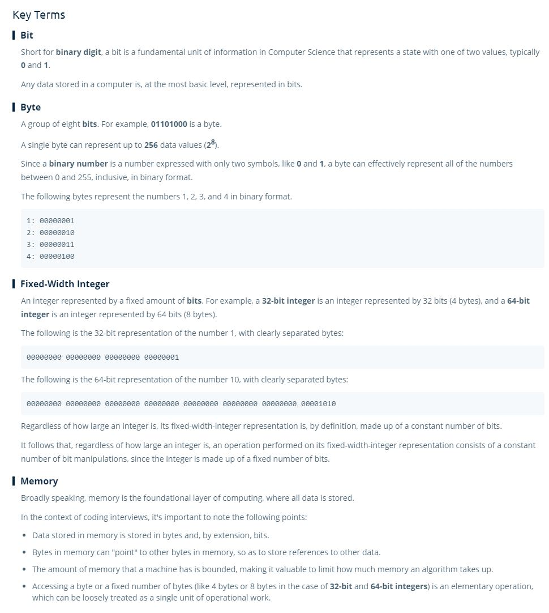

# Memory

- When declaring a variable 

- Memory is made up of 0s and 1s, and these 0s and 1s are called **bits**.
- One memory slot can hold 8 bits, 8 bits is called a **byte**.
- In computer memory, numbers are represented in **Binary** (0s and 1s) a base 2 format.
  - (0 - 255, 2^8) in byte.
- We often need to store numbers larger than 255, in C++ an `int` data type is a 32bit integer, and a `long` data type is a 64 bit integer. 
  - To store these data types, we need **multiple memory slots**, so for a 32 bit integer, it is 4 bytes, or 4 slots in memory.
- When you are dealing with an integer, you are almost always dealing with a **Fixed Width Integer**, meaning if you are dealing with a 32 bit int, it will always take up 4 memory slots.
- **Each memory slot has an address, and you can store, in memory, a reference or, *pointer*, to that address in memory.**
- Your computer can access and read the value at any memory slot extremely quickly, so it is considered a basic operation. 

### Key Terms:

