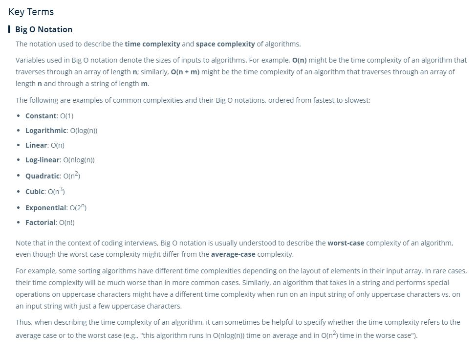

# Big O Notation

> **Time Complexity:** A measure of how fast an algorithm runs.
 

> **Space Complexity:** A measure of how much auxiliary memory an algorithm takes up.
  

- **It does not make sense to describe the time complexity in time passed.**
- **It is more meaningful to describe the time complexity as a relationship to the size of the input.**

> **Time Complexity:** A measure of how fast an algorithm runs, **as the size of the input increases.**
> **Space Complexity:** A measure of how much auxiliary memory an algorithm takes up, **as the size of the input increases.**

### Big O Notation:

- "As the size of my input increases..."

| speed  | name  | notation  | explanation  |
|---|---|---|---|
|  fastest |  **constant** | **O(1)**  | As the size of the input increases, the speed of the algo stays the same.  |
|   | **Logarithmic**  | **O(log(n))**  |   |
|   | **Linear**  | **O(n)** | As the size of the input increases, the speed of the algo increases equally. |
|   | **Log-Linear**  | **O(n log(n))**  |   |
|   | **Quadratic**  | **O(n^2)** | As the size of the input increases, the speed of the algo increases exponentially.  |
|   | **Cubic**  | **O(n^3)** |   |
|   | **Exponential**  | **O(2^n)**  |   |
| slowest  | **Factorial**  | **O(n1)** |   |
 

- **One unit of Big O notation, is equivalent to one basic operation**
- **When we are analyzing a function, we don't really care about the exact numbers to execute a function, we care about the relationship with the size of the input.**
  - O(n^2 + n + 1) = O(n^2)
    - Smaller terms are insignificant compared to the largest terms.
 

- Big O Notation we refer to the **Worst Case**
 

> If you have two terms, say n and m, you do **Not** drop either term. If you have O(n^2 + m), you leave it as such, because n and m are different.

### Key Terms

