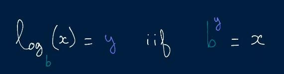
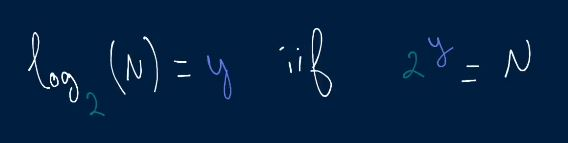
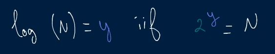
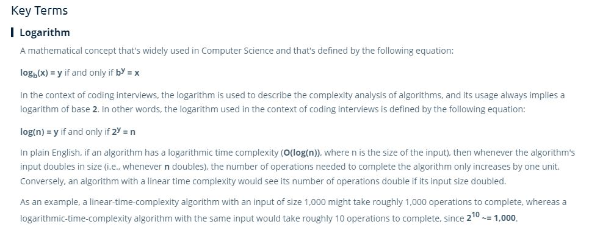

# Logarithms 

- In Big O notation, the **base**, **b**, is **ALWAYS ASSUMED TO BE 2**.

- Because of this, when writing Bog O Notation, we simply drop the 2.

- Here, log(n) is the power to which you need to put 2, to get n.

> **2? = n**
> 
> The **?** here is **log(n)**

- **When ever you increase the power of 2 by one, you are doubling that value.**
  - When you double the number in the question mark in **2? = n** you are doubling **n**.
    - Ex:
      - **24 = 16**
      - **25 = 32**
      - **220 = 1048576**

- **For log(n) algorithms, as the input size doubles, then number of operations only increases by one.**

### Key Terms

