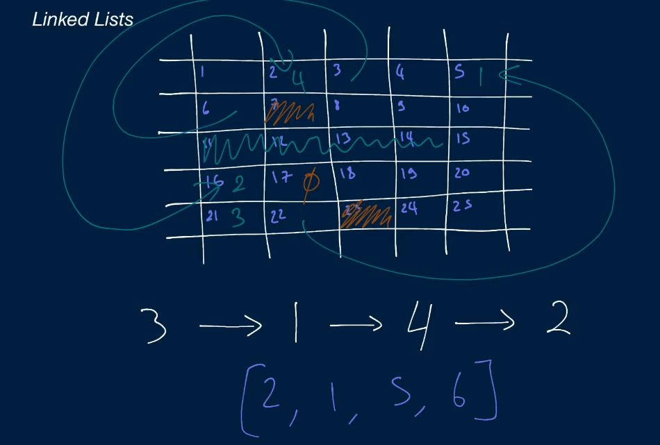
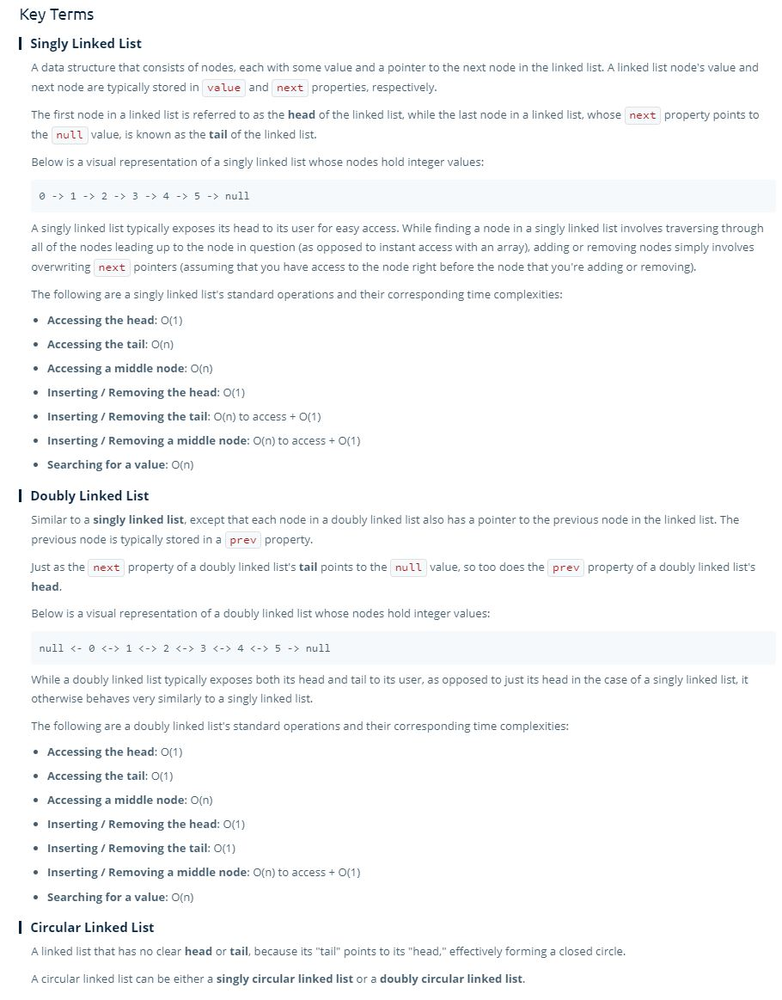

# Linked Lists

## Singly Linked List 

- Linked lists are one of the basic data structures and they are used a lot in coding questions, either by themselves or as a base for a more complex data structure.

> A linked list is very similar to an array, it differs in how it is stored in memory.

- Linked list is comprised of individual **nodes**, which contain a **value**, and a **pointer**.
- Unlike arrays, each node can be placed in a different spot in memory, where it uses the pointer of one node to point to the spot in memory which contains the next node.
- **Arrays are stored in contiguous memory slots, Linked Lists are not.**

- **Linked Lists only have a reference to the head, therefore, accessing an element in the LL is O(n) instead of O(1) like an array.**
  - You have to traverse the linked list to find a given index
 

- **Some linked lists will have a reference to the tail as well as the head, depends on how it is implemented.**

## Time And Space of a Linked List

| Action  | BigO  | T&S  |
|---|---|---|
| accessHead()  | O(1)  | st  |
| accessTail()  | O(n), O(1)  | t, s  |
| accessMiddle()  | O(n), O(1)  | t, s  |
| insertHead(), removeHead() | O(1)  | st  |
| insertTail(), removeTail() - with tail pointer| O(1)  | st  |
| insertTail(), removeTail() - without tail pointer| O(n)  | st  |
| insertMid(), removeMid() | O(n)  | st  |
| search(val)  | O(n)  |  st  |

## Doubly Linked List and Beyond

> Every node in a Doubly Linked List has **two pointer** one which points to the **next** node, and one which points to the **previous** node.

- You are not limited to standard SLLs and DLLs.
  - You can add a pointer to the head of the LL if you wish
  - You can add a third pointer to somewhere else.
  - **These are just base data structures with which you can build more complex data structures.**

## Key Terms

