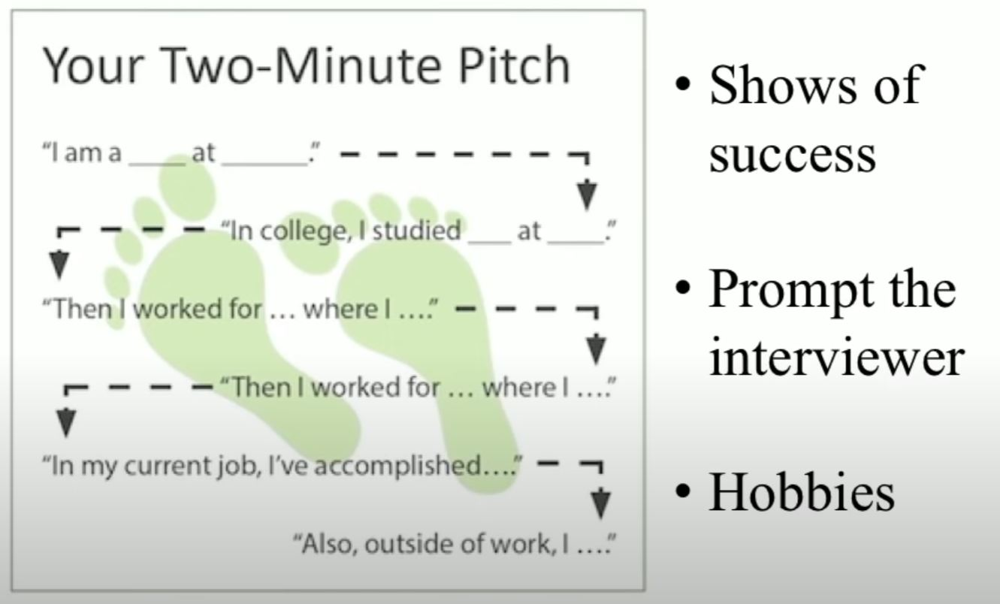
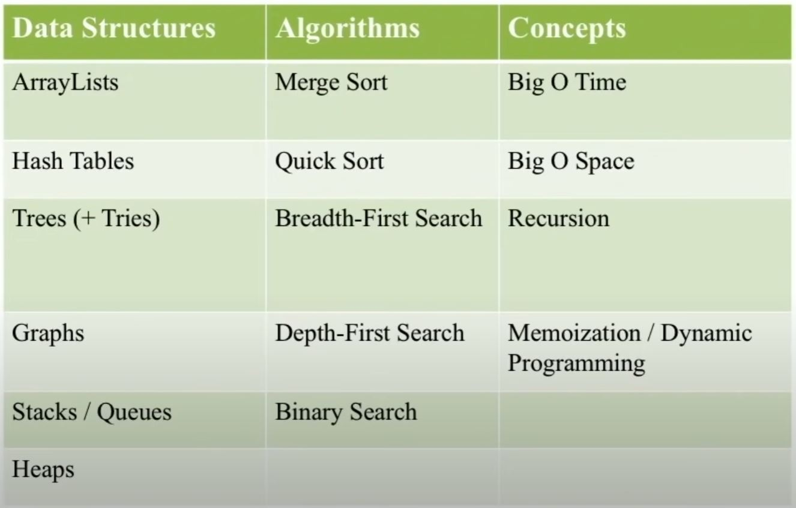
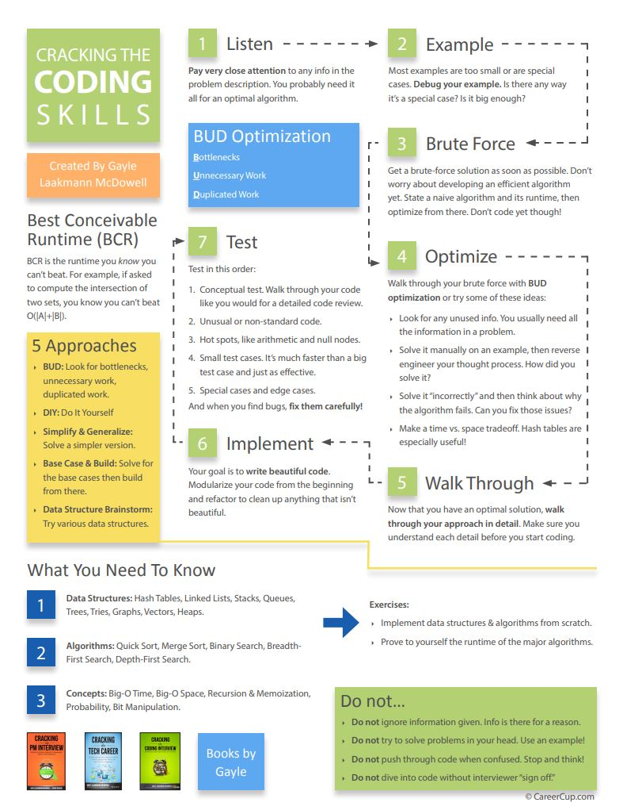

# Cracking the Facebook Coding Interview: The Approach

- These notes are based off of this talk by Gayle McDowell, Author of Cracking the Coding Interview:
  - [Link](https://www.youtube.com/watch?v=wCl9kvQGHPI)

### Intro

- This talk is about how to approach and succeed in a Facebook coding interview, but the lessons here can be applied to any coding interview, dispel any mysteries about the process, and to help those getting ready for interviews avoid common pitfalls.

### What to Expect

- This is a typical, general description of the process you may expect to see at Facebook.
   
- Typical Interview:
  - Prior Experience: 5 minutes
  - 1 to 2 Questions: 45 minutes
    - 1 complex or 2 simpler
    - Questions FOR the Interviewer: 5 minutes

### Behavioral Questions

- Questions on your background
   

#### Two minute pitch:

- Shows of success
- Prompt the interviewer
  - What do you want your interviewer to ask you about?
- Hobbies
  - If you have a compelling hobby...
  - Frame them in the most positive light
  - Any technical hobby

#### Your past work:

- 1 to 2 cool projects and be prepared to talk about them in depth:
  - Hard / cool
  - You played a central role
  - Technical Depth
  - What did you do?
  - What would you do differently?
     
- All past work
  - Challenges, architecture, tradeoffs, mistakes, successes, motivations.
  - Teamwork, leadership, conflicts, etc.

#### What about YOU?

- Be **PASSIONATE**
- Be **KNOWLEDGEABLE**
- Be a **GOOD TEAMMATE**
 
- Show that you are someone who can contribute and that you are someone people want to work with.

### Design Questions

- Expect design questions relevant to your background
- Systems design and scalability for backend

  - Will be dependant on what role you are applying for as well.
     

- The way you should approach design questions is with the acronym W.W.Y.D.A.W:

  - **W**hat **W**ould **Y**ou **D**o **A**t **W**ork
     

- Scope the Problem
  - Ask questions
  - Make assumptions
- Define Key Components
  - Can be somewhat naive
- Identify Issues
  - Bottlenecks, tradeoffs
- Repair and Redesign
   

- Discuss **Top -> Down**

  - General to specific
  - Talk about each component at an equal level of depth
     

- Behavioral Part of System Design
  - **Drive**
    - Lead the process
    - Be open about issues
  - **Teamwork**
    - Be open to feedback
    - Tweak as necessary
  - **Use the whiteboard**
  - **You are leading, but it is a group discussion**

### How to Prepare for Design Questions

- Read about the design of major companies
  - Think, don't memorize
- Know key concepts
  - Tasks, sharding, caches.
- Web stacks, REST, etc...
- Practice back-of-the-envelop calculations

### Algorithm Questions

- **Algorithm Questions are Asked because they show:**
  - Your analytical skills
  - How you think
  - How you decide to make trade offs
  - How you push through hard problems
    - Are eager to work through hard problems
    - Aren't just happy with good enough
  - How well you communicate
  - How strong your CS fundamentals are

#### Essential CS Knowledge

#### Preparation

- **MASTER** Big O
- Implement DS/Algorithms
- Practice with Real Interview Questions
  - **Check Glassdoor.com for real questions**
- Code on Paper or Whiteboard
  - Be able to write complete, syntactically correct code without helpers
  - Writing on paper/whiteboard is **slower**
    - Every mistake takes more time to fix than it would on a computer
- Mock Interviews
  - Services or Buddy
  - **It is helpful to play the role of the interviewer as well!!**
- **PUSH YOURSELF!**
  - Quality over quantity when it comes to practice problems!
  - When the interviewer asks you the problem, they are expecting you to not already know how to solve it, but to figure out how to solve it on the spot.
    - This means that you may struggle some, but how you push through the struggle is what the interviewer is looking to see!
  - Get comfortable seeing a problem, it being hard, and finding a way to make progress!
  - **Try to use the hints and looking at the answer as little as possible!**
    - Do as much as you can to push yourself forward before you look for more help!
      - (This is what you will want to do in an interview)

### Big O Crash Course

- Big O is an equation to discuss how the runtime (or space) scales as the input grows.
- Big O is a discussion about the general trend, we therefore:
  - Drop constants
 

- Common Mistakes:

- **Confusing O(n + m) and O(n^2)**
  - Different inputs or different lengths of nested loops will lead to O(n \* m)
- **Confusing Adding and Multiplying** 
  - **Adding:** "I do this thing, it's done, I do this other thing." - **Multiplying:** "I do this thing for every time I do this other thing."
 

- When you see recursion, you should be thinking memoization
  - Memoization can take some recursive solutions from O(2^n) to O(n)

### Solving Algorithm Problems

- *Algorithm problems are an attempt to validate your problem solving and coding skills.*

- **What is NOT expected:**
  - To know the answer already
  - To solve the problem immediately
  - To code perfectly
    - **But that should be your goal!**
 

- Being a little slower, or having a bug or two, isn't going to necessarily result in a rejection, but... 
- The fewer bugs you have, the more quickly you solve the problem, the better a coder you will seem to your interviewer.
 

- **What IS expected**
  - Be **EXCITED** to solve hard problems
  - Don't be mentally lazy, and just accept the first thing that comes to mind without consideration or testing.
  - **Drive!**
    - Keep trying when you are stuck
      - **GETTING STUCK IS NORMAL**
      - Saying "I don't know" is a big red flag!
    - Look for a **great** solution, not just any old solution
  - **Pay attention** to your interviewer and what they are saying!
    - They are saying things for a reason
    - Phrases like "Are you sure..." probably means you are wrong about something or there is a better way the thing they are asking about...
      - Hear the meaning behind their question or statement
    - *If your interviewer says the same thing more than once, there is probably a very good reason.*
  - **Write real, compilable code**
    - Sometimes you can get away with pseudo code, but it is unusual, so it is not worth the risk.
    - Syntax issues are a *much larger* concern than using the wrong name for a built in method...
  - **Show me how you think about the problem, share your thought process**
    - It is more about showing your interviewer your thought process than it is about the time it takes to solve the problem.
    - **THINK OUT LOUD! THINK OUT LOUD! THINK OUT LOUD**
      - Your interviewer can recognize some great insight you made, nor correct you if you start down a wrong path if you don't think out loud.
      - **Notice when you are being quiet and try to at least give the headlines of your thought process.**

### How to Approach Solving Algorithms Problems

- Many common mistakes can be avoided by following the steps outlined above.

#### Step 1: Listen (for clues)

- Listen to the problem completely, make sure you have heard it correctly, do ask any follow up questions you may have.
 

- Now go one step further...
  - Listen to how the interviewer constructed the problem
  - Listen for little clues that are often in the problem...
    - Interviewers tend not to give you information that you don't need... 
      - So everything said should give you some idea of how to solve the problem.
      - *If you can solve the problem without some given piece of information, it probably means you are not solving the problem optimally.*

#### Step 2: Draw an Example

- It is very important to draw an example, it will help clarify your thoughts both to yourself and your interviewer.
- It is common to misinterpret a problem, drawing an example can prompt your interviewer to help correct your path if you have gone in an incorrect direction.
 

- You example should: *"complex and meaty"*
  - Be Big Enough
    - As an example, a 4 element array is not big enough.
  - Avoid Special Cases
    - If you are given two arrays and are not told they are the same length, they should never be the same length in your example...
  - **This is one of the best ways to avoid common problems down the road.**
 

#### Step 3: Brute Force / Naive

- This is an important step
- Don't code it, but state the algorithm (unless your interviewer asks you too...), then go into optimizations.
- It's ok if your first solution is slow, just make sure you are then considering how to optimize.
 

- Benefits of a Brute Force Solution
  - It you miss heard the problem, a brute force solution will often make it clear that you misheard it. 
  - Sometimes even the brute force solution is difficult to get to.
    - So you want to make it clear that you are at least at the level where you are able to derive a non-optimal solution.
  - It is often a very good jumping off point for finding an optimized solution. 
 

- State the brute force solution, then ask your interviewer if they would like you to code this solution, or to optimize it.

#### Step 4: Optimizing Your Solution

##### Techniques for Optimizing Algorithms

1. **BUD:**
  - *Bottlenecks*
    - What is slowing your algorithm down or requiring extra space?
      - What are the biggest terms in your Big O analysis??
        - Can we shrink these??
    - Identify the bottleneck and get rid of it!
  - *Unnecessary Work*
    - Recognize conditions that lead to unused work.
  - *Duplicated Work*
    - Notice when you are doing the same thing over and over again and see if there is a way you can reuse that work.
 

2. **Space/Time Tradeoffs**
  - *Hash Tables and Other Data Structures*
    - Many many problems involve hashtables
  - *Precomputing*
    - When you find yourself redoing the same work over and over, you can often use memory to save your algorithm from repeating work.
 

3. **Do It Yourself**
   - Give yourself a nie big meaty example and just get the output.
     - Then once you have the output, reverse engineer the problem.
       - *How did you come to that output?*
 

4. **Recursion / Base Case and Build**
  - Any time you think *"this problem sounds recursive"*, you are probably only correct **50%** of the time.
    - So be careful and think the problem through when you have the thought. It may be a trap.
  - *Recursion can be implemented bottom-up or top-down.*
    - Generally, bottom-up works better than top down...
  - Whenever you think **Backtrack** think recursion.
  - When you have **Repeated Sub Problems** think recursion
    - If you are in doubt, draw out a call tree and look for repeats
 

- **PUSH YOURSELF**
  - It's not about solving the problem immediately, its about can you drive/push through it and come up with a solution!
  - Really push yourself, the problems are going to be hard.

#### Walk Through Your Algorithm

- **Know Your Variables**
- **Know When They Change**
 

- Take a moment to walk through your algorithm one or two more times **before you start coding!**
- You should be able to picture your code before you start writing it.
- **Rushing will never help you.**
 

#### Write Beautiful Code (Implementing Your Solutions)

- **How to Write Whiteboard Code:**
  - *Write straight*
    - Make your code easy to read and each line distinguishable
  - *Space*
    - Give yourself as much space as possible to write your code
  - *Use Arrows*
    - If you need to insert new code, don't erase lines you have already written
  - *Error cases / ToDos*
    - **Think about error cases**
      - In some cases where there are many boundary/error cases, you may want to write a "ToDo" and spend time working on your algorithm instead.
  - *Good Variables*
    - **SUPER IMPORTANT**
      - Interviewers only have 10/20 lines of code to evaluate you on
        - one of the things they will always evaluate is how good your variable names are.
        - *Good variable names are important in the real day to day work software developers do.*
      - The issue is this can slow you down
        - You can get around this by addressing it
          -  either writing it full once, then abbreviating it, if given permission to do so...
          -  or, by using a short variable name and leaving a comment when the variable is declared, stating what the variable name would be if on a computer.
         - **Always check with your interviewer**
  - *Modularization*
    - If you can break down your algorithm into specific steps, you can break those out into different functions
      - You can then write a function that calls those functions to return an answer to your problem
    - This shows that you know how to write reusable, easy to test code.
    - It can help simplify the problem, help make the problem easier to write, and your interviewer may tell you to skip parts all together.
    - Modularize your code **top-down NOT bottom-up**
      - Don't spent your time on the least important things.
  - *Language* 
    - Choose the language you are most comfortable with. 
    - **Always know the tradeoffs of the language you pick**
      - In JS, know the run times of the built in methods if you use them!

#### Testing

- Don't just throw the example you have on the board in as a test case...
 

- **FIRST Analyze**
  - What is it doing? Why?
    - *Walk through your code line by line, explain what it is doing and why it is doing it.*
  - Anything that looks weird?
    - Look out for error hot spots
      - Double check things that look weird, any math specifically, as that tends to a place a lot of errors occur
      - Check your syntax, make sure everything is written as you intended to in your brain
- **THEN use test cases**
  - Small test cases
    - Faster than bigger cases and often just as effective
  - Edge cases
  - Bigger test cases
    - Throw in only if you have time
- **BUT...**
  - *Test your code, not your algorithm*
  - *If you find a bug, don't just rush in to fix it, make sure your fix is the correct fix.*
    - Don't solve a specific case of the bug, solve the root cause.

### Questions for Your Interviewer

- You **Should** ask your interviewer some questions at the end.
  - Have some prepared.
- Ask the questions YOU want to know.
 

- Asking questions shows 
  - Passion
  - Knowledge
  - Interest
  - Communication
  - Curiosity
 

- Consider When Coming Up with Questions:
  - *What's made you happy/unhappy in past job?*
  - *What are your goals?*
  - *Culture / Work Style of company*
  - *Career goals*
  - *Technologies Used*

### Final Thoughts

- Everything in this process is done for a reason.
  - **The reason is to identify people who would be successful at their company**
    - Are you technically capable?
    - Can you work effectively on a team?
- Remember it is as much an opportunity for you to determine if the company is the right place for you as much as if you are right for the company.
