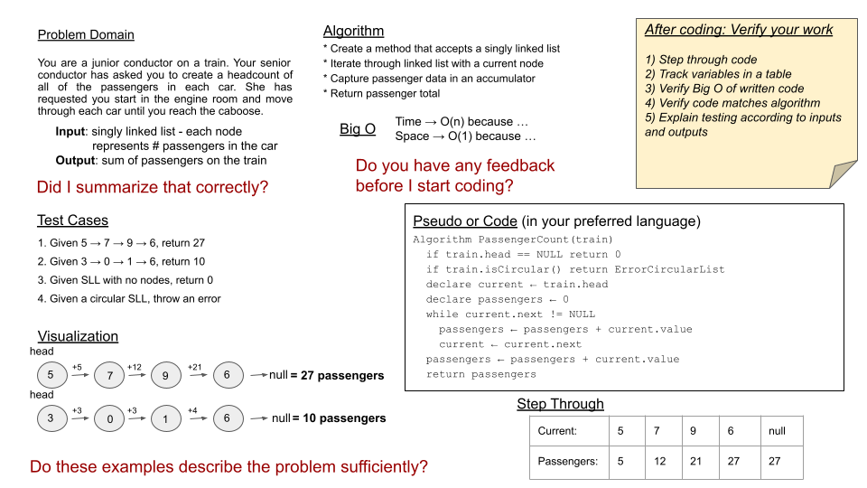

# Steps to Follow When Solving a Code Challenge:

- **When approaching a new problem, evaluate what data structure might work best, and what the trade offs of using it might be.**

## Steps:

#### 1. Repeat the Problem

  - Repeat the problem **in your own words.**
  - Explain the problem.
  - Discuss the **inputs and outputs and their types**
  - Make sure you **understand the problem** before moving forward.
 

  - Discuss **Test Cases**
  - Discuss **Edge Cases**
 

  - **ASK:** **Did I summarize this correctly?**
 

#### 2. Visualize

  - **Draw out the problem domain.**
  - Visually **step through the problem.**
  - Label appropriate properties.
  - Define inputs and outputs.
  - Use the visual to work through how you will solve the problem.
 

  - **ASK:** **Do these examples define the problem sufficiently?**
 

#### 3. Algorithm / Pseudocode

  - Break down the steps you will need to take in order to solve the problem.
  - **Consider the steps your input will take as it moves towards the output**
  - Properly flush out the steps you will need to take at a high level.
 

  - [Link to Code Fellows Pseudocode Guide](https://codefellows.github.io/common_curriculum/data_structures_and_algorithms/Pseudocode)

#### 4. Discuss the Big O of the Solution You Have Come Up With

  - **Analyze the space AND time efficiency of your algorithm.**
  - Revisit this if you make changes to your algorithm
  - Discuss ways this may be improved.
 

  - **ASK:** **Do you have any feedback before I start coding?**

#### Code Your Solution

  - Write out real code that follows your algorithm / pseudocode.
  - **Be descriptive in your variable naming.**
  - Abstract portions of your code, or make use of helper functions (if allowed).
  - Always ask if you are allowed to use built-in methods or not, don't assume.
  - **Document your code**, write comments along the way to help your interviewer follow along.
  - **Encapsulate complex logic whenever possible.**
 

  - Finish by doing a **line by line step through of your code.**
    - track variables in a written table along the way.
    - If you find a bug, fix it, but be sure to restart your walk through.
 

  - **ASK: How does this look to you? Do you have any questions?**

#### Discuss Testing

  - You should discuss a variety of **test cases**.
    - a standard input and output
    - a standard input that has a different output than your first listed i/o
    - some edge cases in how the data is structured; you’ll probably list several of these  (the array is already sorted! the tree is very unbalanced! the string is just the character ‘a’ twelve times! etc.)
    - the input is null/negative/zero (the “normal” edge cases)
 

## General Tips

  - it is extremely important that you verify the problem domain verbally, even if you don’t write it on the whiteboard.
  - if you are very comfortable with your language’s syntax, you may find that the pseudocode step slows you down without providing any benefits. In that case, it’s fine to skip the pseudocode step.
  - It is almost always a bad idea to figure out half of your algorithm, write code for that half of your algorithm, and then figure out the rest of your algorithm. 

---
## Resources 

- [Code Fellows Resource](https://codefellows.github.io/common_curriculum/data_structures_and_algorithms/Whiteboard_Workflow.html)

