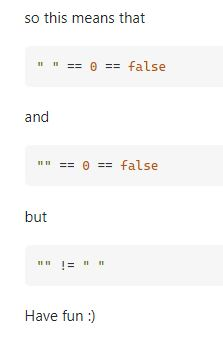

# General Notes and Observations

4/13/22

- **Coding interviews / coding challenges are designed to assess how productive someone can be with the language.**

4/14/22

- Think of coding interviews as your first task on the job, prove to your interviewer that if you were asked to do this on the job that you could do the task well and in the expected manor.

4/18/22

- One of the things you are judged on in a coding interview is how well you can ask clarifying questions. So don't hesitate to ask if you need something clarified.

4/19/22

- **If you are solving an algorithm that has to do with comparing two arrays that contain the same amount of values, be sure to start by checking to see if they are the same length!**

4/20/22

- Don't confuse Big O of 2n and Big O of n^2, they are very different things. 2 passes of n vs 2 passes for each in n
- When considering solutions for a problem, start at the best time complexity, then work backwards until you find a solution, then try to apply that solution to see if you can find a better solution.

5/22/22

- **Don't forget that when checking for existence! You need to account for the possibility that the value will be zero and therefore return a falsy value.**

- Every detail of a problem is in there for a reason. Make sure you're considering all details. They are all hints towards the solution.

- You can use the `in` operator to check for existence to avoid the problem mentioned above.

5/24/22

- Break problems into smaller and smaller chunks until you find your solution.

9/25/22

- **ALWAYS ALWAYS use a comparison function with Array.sort() it will return some screwy answers if you don't!**

  - Example:
    - `[-1, 3, -4, 0, 2].sort()` will return `[-1, -4, 0, 2, 3]`
    - `[[-1, 3, -4, 0, 2].sort((a, b) => a - b)` will return `[-4, -1, 0, 2, 3]`

- Break problems down into their sub-parts. What variables will you need? What logic? What pointers? etc...

10/18/22

- Difference between Objects, Maps, and Sets in JS

  - https://osgoodgunawan.medium.com/map-vs-set-vs-object-in-javascript-7345b455afcd#:~:text=The%20difference%20between%20Map%20and%20Set,the%20keys%20to%20the%20value.

10/19/22 

  

- 
