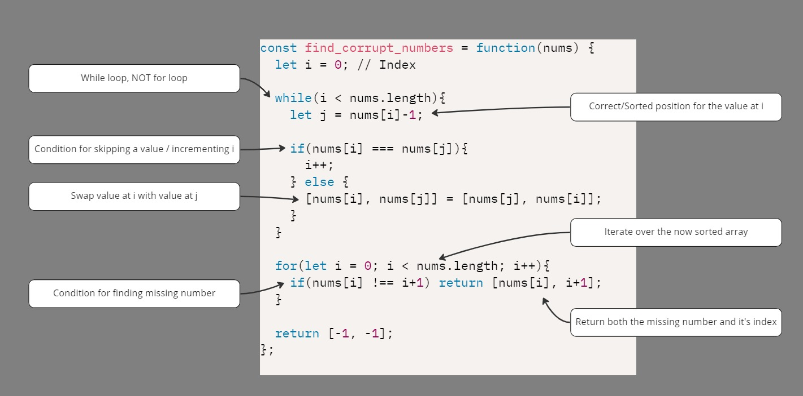

# Cyclic Sort: General Notes

 

## Notes:

  

- Cyclic Sort describes an approach to dealing with problems involving arrays containing numbers in a given range.
  - For Example: 
    - You are given an unsorted array containing `n` numbers taken from the range `1` to `n`. The array can have duplicates, which means that some numbers will be missing. Find all the missing numbers.
  - To efficiently solve this problem, we can use the fact that the input array contains numbers in the range of `1 to n`. 
    - For Example:
      -  To efficiently sort the array, we can try placing each number at its correct place, i.e., placing `1` at `index '0'`, placing `2` at `index ‘1’`, and so on. 
  - Once we are done with the sorting, we can iterate the array to find all indices missing the correct numbers. These will be our required numbers.

//==============

 - These problems are all about knowing when to skip a number within the array as you sort the array.
   - Such as:
     - When the value at the current index is our of bounds (larger than the array size or < 0)
     - When the value is a duplicate or the value is at the correct position.

 

- **Identification**: given array of 0 to N, do some missing, repeated kind of operation
- **PigeonHole principle**: If you have `N boxes` and `greater than N items`, at least one box has more than 1 item.

 

**- All of these problems follow almost the exact same pattern.**
- I find it more readable and easier to understand when you define the conditions for incrementing i **before** swapping in the while loop.

