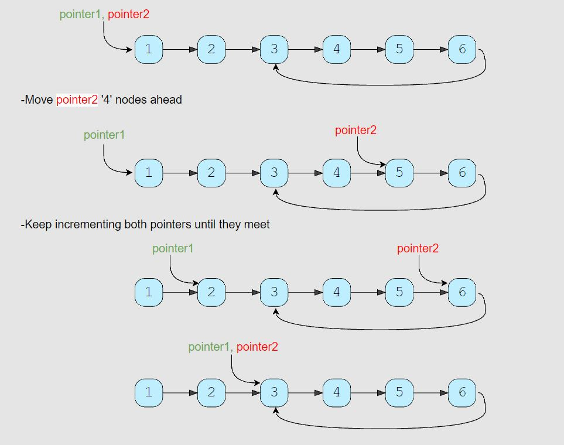

# Start of LinkedList Cycle (medium)

> **Prompt:** Given the **head of a Singly LinkedList that contains a cycle**, 
> - write a function to find the starting node of the cycle.

<br>

- **Example:**


<br>

### **Big O:**

  - Time: `O(n)`
  - Space: `O(1)`

<br>

### **Code:**

```js
// class Node {
//   constructor(value, next=null){
//     this.value = value;
//     this.next = next;
//   }
// }

// No comments

const find_cycle_start = function (head) {
  let fast = head,
      slow = head,
      cycleLen = null;

  while(fast && fast.next) {
    slow = slow.next;
    fast = fast.next.next;
    if (fast === slow) {
      cycleLen = findCycleLen(slow);
      break;
    }
  }
  if (cycleLen === null) return null;

  return findCycleStart(head, cycleLen);
};

function findCycleLen(node){
  let current = node,
      count = 0;

  while(true) {
    count++;
    current = current.next;
    if (current === node) return count;
  }
}

function findCycleStart(node, length) {
  let slow = node,
      fast = node;

  for (let i = 0; i < length; i++) {
    fast = fast.next;
  }

  while(true) {
    if (slow === fast) return slow;
    fast = fast.next;
    slow = slow.next;
  }
}

// Comments

const find_cycle_start = function (head) {
  // find the cycle
  let fast = head,
      slow = head,
      cycleLen = null;

  // Find the length of that cycle
  while (fast && fast.next) {
    slow = slow.next;
    fast = fast.next.next;
    if (fast === slow) {
      cycleLen = findCycleLen(slow);
      break;
    }
  }

  // If no cycle is found, return null
  if (cycleLen === null) return null;

  // Once you know the length of the cycle you can find where the cycle starts
  return findCycleStart(head, cycleLen);
};

//Find and return the length of the cycle
function findCycleLen(node) {
  // See notes in Problem 1.
  let current = node,
      count = 0;

  while (true) {
    count++;
    current = current.next;
    if (current === node) return count;
  }
}

//Find where the cycle starts
function findCycleStart(node, length) {
  // Create a fast and slow pointer back at the head of the list
  let slow = node,
      fast = node;

  // Move the fast pointer up the list by the length of the cycle.
  for (let i = 0; i < length; i++) {
    fast = fast.next;
  }

  // Now we will move both the fast and the slow pointers up at the same rate,
  // because the fast pointer is exactly one cycle length in front of the slow pointer,
  // when the slow pointer reaches the first node in the cycle, the fast pointer will have just
  // completed one loop of the cycle. At this point slow and fast will be the same node, that node represents the first node in the cycle.
  // We return this node as the solution to the problem.
  while (true) {
    if (slow === fast) return slow;
    fast = fast.next;
    slow = slow.next;
  }
}
```

<br>

### **Comments:**
  - _Pointers:_ A fast and slow pointer to find the cycle. A current pointer to find the length of the cycle. Two pointers one pointer a cycles length in front of the other pointer to find the start of the cycle.
  - _Movement:_ To find the cycle, the slow pointer moves at one node per iteration while the fast pointer moves at two nodes per iteration towards the end of the list. To find the length, the current pointer moves around the cycle one node per iteration. To find the start both pointers move at a rate of one node per iteration.
  - _Variables:_ One extra variable to count the length of the cycle.



<br>

### **Basic Pattern:**
  1. Find if there is a cycle
  2. Once a cycle is found, find the length of the cycle.
  3. Start two pointers at the head of the LL, then move one pointer up by the length of the cycle, now move both pointers by one each iteration until they meet.
  4. Return the node where they meet, that is the start of the cycle.

<br>

### **Algorithm:**

  1. Create two pointers (fast and slow) and a variable to hold the length of the cycle.
  2. Loop over the LL while the node at the fast and fast.next pointers are not null.
     1. If the fast and slow pointers are pointing to the same node we have found a cycle.
     2. Here we will move the current node one node at a time around the cycle counting each node until it gets back to the node it started at, the count at that point will be the length of the cycle.
     3. Once we have that length we can break out of the loop.
  3. Now we can create two pointers that will both start at the head of our LL.
     1. We will begin by moving one of the two pointer up by the length of the cycle we just found.
     2. Then we can iterate over our LL moving both pointers by one note each time through the loop.
     3. Once the both pointers are pointing to the same node, we have found the start of our LL.
  4. We can return that node, it is the start of our cycle.

<br>

### **Alternative Code:**

```js
// This solution is much simpler, it still runs in O(n) time, but uses O(n) space.

const find_cycle_start = function (head) {
  // Create a new set using the built in JS Set object.
  let nodeSet = new Set();

  // Create a pointer that will track the current node we are examining.
  let current = head;

  // Iterate over the linked list
  while (current) {
    // If the current node is already in our set, we return that node, 
    // This is because the first node we see for a second time will be the first node in our cycle.
    if (nodeSet.has(current)) return current;

    // Add the current node to our set as it has not been seen yet.
    nodeSet.add(current);

    // Move our current pointer to the next node in the list.
    current = current.next;
  }

  // Here we are returning the head, as that is what the problem requires us to do if no cycle is found, this could also be false, or -1, or null... it is whatever the problem requires us to return to signal that there is no cycle.
  return head;
};
```