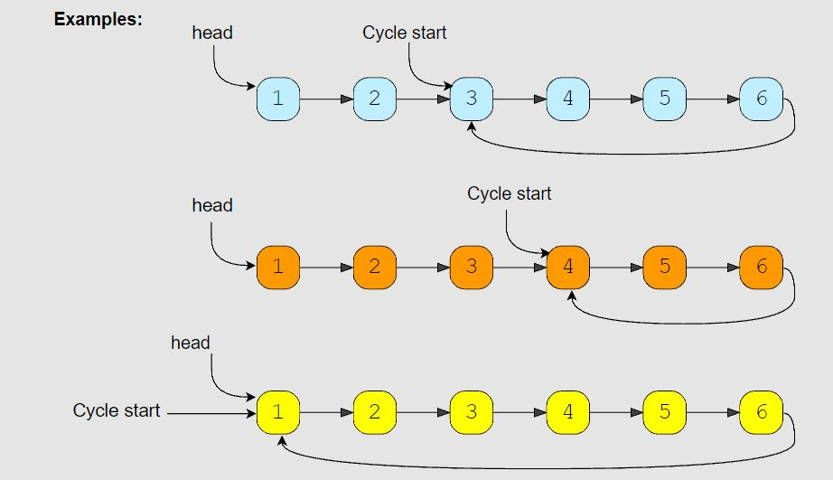

# Fast and Slow Pointers

<hr>

## General Notes

- The Fast & Slow pointer technique is a pointer algorithm that uses two pointers which move through an array (or linked list) at different speeds. This approach is quite useful when dealing with cyclic linked list or arrays.

- Keywords to look for: **cycle**

<br>

- Be cautious of how the node is defined, mostly watch out for `node.val` vs `node.value`

## Problems

### LinkedList Cycle (easy)

> **Prompt:** Given the **head of a Singly LinkedList**, write a function to determine _if the LinkedList has a cycle in it or not_.

<br>

- **Big O:**

  - Time: `O(n)`
  - Space: `O(1)`

- **Code:**

```js
// class Node {
//   constructor(value, next=null){
//     this.value = value;
//     this.next = next;
//   }
// }

// No comments
const has_cycle = function (head) {
  let slow = head,
    fast = head;

  while (fast && fast.next) {
    slow = slow.next;
    fast = fast.next.next;
    if (slow === fast) return true;
  }

  return false;
};

// Comments
const has_cycle = function (head) {
  // Create two pointers
  let slow = head,
    fast = head;

  // We are going to iterate over the LL while we haven't reached the end.
  while (fast && fast.next) {
    // Each loop we will move the pointers, but at different rates.
    // The slow pointer will move one node at a time.
    // The fast pointer will move two nodes at a time.
    slow = slow.next;
    fast = fast.next.next;

    // The fast and slow pointers should never be the same node,
    // if they are, it means that the fast pointer has circled around back on the slow pointer.
    // In that case we will return trues as we have found a loop.
    if (slow === fast) return true;
  }

  // If we reach the end of the list, we return false,
  // as we will never reach the end of the list if there is a loop.
  return false;
};
```

<br>

- **Comments:**
  - _Pointers:_ Two a fast and slow pointer.
  - _Movement:_ The slow pointer will move through the list one node at a time and the fast pointer will move through the list two nodes at a time.
  - _Variables:_ No extra variables (other than pointers).
  - When you have two pointers, both starting at the beginning of a linked list, and moving through the list at two different speeds, one fast, one slow, if your linked list is non-cyclic, those pointers should never meet. However, if there is a cycle in your linked list, once both pointers enter the cycle, eventually your two pointers will point to the same node, we can look for that condition to check to see if there is a cycle.

<br>

- **Basic Pattern:**
  1. Create two pointers, set both pointers to the head of the LL.
  2. Create a loop that will run while we haven't reached the end of the LL.
     1. Set the slow pointer to be the next node after itself.
     2. Set the fast pointer to be two nodes after itself.
     3. If the slow pointer is equal to the fast pointer, return true, as we have found a loop.
  3. If get to the end of the LL, we can return false as there is no cycle within our loop.

#### **Bonus Problem Notes**:

> Length of Cycle:
>
> - Given the head of a LinkedList with a cycle, find the length of the cycle.

<br>

- **Solution Notes:**

  - _We can use the above solution to find the cycle in the LinkedList. Once the fast and slow pointers meet, we can save the slow pointer and iterate the whole cycle with another pointer until we see the slow pointer again to find the length of the cycle._

- **Code:**

```js
// class Node {
//   constructor(value, next = null) {
//     this.value = value;
//     this.next = next;
//   }
// }

function find_cycle_length(head) {
  // Create pointers to run fast and slow algo
  let slow = head,
    fast = head;

  while (fast && fast.next) {
    slow = slow.next;
    fast = fast.next.next;
    if (slow === fast) {
      // found the cycle
      // Return the cycle length
      return calculate_cycle_length(slow);
    }
  }
  // If we reach here there is no cycle
  return 0;
}

function calculate_cycle_length(slow) {
  let current = slow, // Create a new pointer starting at slow
    cycle_length = 0; // Cycle length count

  // Loop until the current pointer circles around back to the slow pointer, counting each step as it goes
  while (true) {
    current = current.next;
    cycle_length += 1;
    if (current === slow) {
      break;
    }
  }

  // return the length of the cycle once counted
  return cycle_length;
}
```

### Start of LinkedList Cycle (medium)

> **Prompt:** Given the **head of a Singly LinkedList that contains a cycle**, _write a function to find the starting node of the cycle._

<br>

- **Example:**



<br>

- **Big O:**

  - Time: `O(n)`
  - Space: `O(1)`

- **Code:**

```js
// class Node {
//   constructor(value, next=null){
//     this.value = value;
//     this.next = next;
//   }
// }

// No comments

const find_cycle_start = function (head) {
  let fast = head,
    slow = head,
    cycleLen = null;

  while (fast && fast.next) {
    slow = slow.next;
    fast = fast.next.next;
    if (fast === slow) {
      cycleLen = findCycleLen(slow);
      break;
    }
  }
  if (cycleLen === null) return null;

  return findCycleStart(head, cycleLen);
};

function findCycleLen(node) {
  let current = node,
    count = 0;

  while (true) {
    count++;
    current = current.next;
    if (current === node) return count;
  }
}

function findCycleStart(node, length) {
  let slow = node,
    fast = node;

  for (let i = 0; i < length; i++) {
    fast = fast.next;
  }

  while (true) {
    if (slow === fast) return slow;
    fast = fast.next;
    slow = slow.next;
  }
}

// Comments

const find_cycle_start = function (head) {
  // find the length of the cycle
  let fast = head,
    slow = head,
    cycleLen = null;

  // Once you find that a LL contains a cycle, find the length of that cycle
  while (fast && fast.next) {
    slow = slow.next;
    fast = fast.next.next;
    if (fast === slow) {
      cycleLen = findCycleLen(slow);
      break;
    }
  }

  // If no cycle is found, return null
  if (cycleLen === null) return null;

  // Once you know the length of the cycle you can find where the cycle starts
  return findCycleStart(head, cycleLen);
};

//Find and return the length of the cycle
function findCycleLen(node) {
  // Starting at the node where the fast and slow pointers meet, so we know that we are in the cycle,
  // Iterate over the nodes  counting each node as you go
  // Return the count once you are back where you started
  let current = node,
    count = 0;

  while (true) {
    count++;
    current = current.next;
    if (current === node) return count;
  }
}

//Find where the cycle starts
function findCycleStart(node, length) {
  // Create a fast and slow pointer back at the head of the list
  let slow = node,
    fast = node;

  // Move the head pointer up the same number of times as the length of the cycle.
  for (let i = 0; i < length; i++) {
    fast = fast.next;
  }

  // Now we will move both the fast and the slow pointers up at the same rate,
  // because the fast pointer is exactly one cycle length in front of the slow pointer,
  // when the slow pointer reaches the first node in the cycle, the fast pointer will have just
  // completed one loop of the cycle. At this point slow and fast will be the same node, the first
  // node in the cycle, we can return this node as the solution to the problem.
  while (true) {
    if (slow === fast) return slow;
    fast = fast.next;
    slow = slow.next;
  }
}
```

<br>

- **Comments:**
  - _Pointers:_ A fast and slow pointer to find the cycle. A current pointer to find the length of the cycle. Two pointers one pointer a cycles length in front of the other pointer to find the start of the cycle.
  - _Movement:_ To find the cycle, the slow pointer moves at one node per iteration while the fast pointer moves at two nodes per cycle towards the end of the list. To find the length, the current pointer moves around the cycle one node per iteration. To find the start both pointers move at one node per iteration.
  - _Variables:_ One extra variable to count the length of the cycle.

<br>

- **Basic Pattern:**
  1. Find if there is a cycle
  2. Once a cycle is found, find the length of the cycle.
  3. Start two pointers at the head of the LL, then move one pointer up by the length of the cycle, now move both pointers by one each iteration until they meet.
  4. Return the node where they meet, that is the start of the cycle.

<br>

- **Algorithm:**

  1. Create two pointers (fast and slow) and a variable to hold the length of the cycle.
  2. Loop over the LL while the node at the fast pointer and the node in front of it is still defined.
     1. If the fast and slow pointers are pointing to the same node we have found a cycle.
     2. From that node we can send out a current pointer around the loop
        1. Here we will move the current node one node at a time and count each node until it gets back to the node it started at, that count will be the length of the cycle.
     3. Once we have that length we can break out of the loop.
  3. Now we can create two pointers that will both start at the head of our LL.
     1. We will begin by moving one of the two pointer up by the length of the cycle we just found.
     2. Then we can loop over our LL moving both pointers by one each time through the loop.
     3. Once the both pointers are pointing to the same node, we have found the start of our LL.
  4. We can return that node, it is the start of our cycle.

- **Alternative Code:**

```js
// This solution is much simpler, it still runs in O(n) time, but uses O(n) space.

const find_cycle_start = function (head) {
  // Create a new set using the built in JS Set object.
  let nodeSet = new Set();

  // Creat a pointer that will track the current node we are examining.
  let current = head;

  // Iterate over the linked list
  while (current) {
    // If the current node is already in our set, we return that node, as the first node we see for a second time will be the first node in our cycle.
    if (nodeSet.has(current)) return current;

    // Add the current node to our set as it has not been seen yet.
    nodeSet.add(current);

    // Move our current pointer to the next node in the list.
    current = current.next;
  }

  // Here we are returning the head, as that is what the problem requires us to do if no cycle is found, this could also be false, or -1, or null... it is whatever the problem requires us to return to signal that theere is no cycle.
  return head;
};
```

<br>

### Happy Number (medium)

> **Prompt:** Write an algorithm to determine if a number n is a **'happy number'**.
>
> - Starting with any positive integer, _replace the number by the sum of the squares of its digits_.
> - Repeat the process until the **number equals 1 (where it will stay)**, or it **loops endlessly in a cycle** WHICH DOES NOT INCLUDE 1.
> - Those numbers for which this process ends in 1 are happy.

<br>

- **Example:**

```js

// Explanation 1:
Input: n = 19
Output: true
Explanation:
12 + 92 = 82
82 + 22 = 68
62 + 82 = 100
12 + 02 + 02 = 1

//Explanation 2:
Input: n = 2
Output: false
```

<br>

- **Big O:**

  - Time: **`O(logN)`**
  - Space: `O(1)`

- **Code:**

```js
/**
 * @param {number} n
 * @return {boolean}
 */

// No comments

var isHappy = function (num) {
  let slow = num,
    fast = num;

  while (true) {
    slow = squaredSum(slow);
    fast = squaredSum(squaredSum(fast));
    if (fast === 1) return true;
    if (slow === fast) return false;
  }
};

function squaredSum(num) {
  let squaredSum = 0;

  while (num > 0) {
    const singleDigit = num % 10;
    num = (num - singleDigit) / 10;
    squaredSum += singleDigit ** 2;
  }

  return squaredSum;
}

// Comments

var isHappy = function (num) {
  // Here we are creating two "pointers" that are going to move through possibly solutions at different rates, the slow, one solution at a time and the fast through two at a time.
  let slow = num,
    fast = num;

  // We are going to loop until one of two conditions are two, we will ALWAYS meet one of those conditions.
  while (true) {
    slow = squaredSum(slow); // Here the slow is checking one squared sum at a time.
    fast = squaredSum(squaredSum(fast)); // Here fast is checking the squared sum of the squared sum.
    if (fast === 1) return true; // If a 1 is found we have found a happy number.
    if (slow === fast) return false; // If the fast and slow are the same that means we entered a cycle, and therefore the number is not a happy number.
  }
};

function squaredSum(num) {
  // Create a variable to hold our squared sum as we add together the square of each digit.
  let squaredSum = 0;

  while (num > 0) {
    // Find the current last digit by taking the number modus 10. E.g. 23 % 10 === 3
    const singleDigit = num % 10;

    // Subtract the last digit from the number, then devide by 10. E.g. 23 - 3 = 20, 20/10 = 2;
    num = (num - singleDigit) / 10;

    // Add the square of the single digit to the total sum.
    squaredSum += singleDigit ** 2;
  }

  return squaredSum;
}
```

<br>

- **Comments:**
  - _Pointers:_ Not so much pointers, you will be using two variables that will act as a "fast and slow pointers," but will actually just hold the results of calling the helper function. The "slow" pointer will hold the results of running the function once, and the "fast" will hold the results of calling the helper function on the results of calling the helper function. (It helps to look at the code for this one).
  - _Movement:_ In attempting to find if a number is "happy", the results of looking will create a cycle or just repeat 1 over and over again. If there is a loop calling the function twice over on itself will produce the same results as calling the function once, just twice as fast, and jumping passed one of the results. Eventually, if you are in a loop, the fast and slow pointers will move around until they are the same number, this is what we are looking for.
  - _Variables:_ No vars in main function, there is one extra var used in the helper function to track the squared sum.
  - This is an **implicit LinkedList** problem. Implicit meaning we don't have actual linked nodes and pointers, but the data does still form a LinkedList structure. The starting number is the head "node" of the list, and all the other numbers in the chain are nodes.

<br>

- **Basic Pattern:**

  1. Create two variables that will track the fast and slow values.
  2. Create a infinite loop
     1. Set slow equal to the sum of it's values squared.
     2. Set fast equal to the sum of it's values squared, then those values squared and summed.
     3. If the value of fast is equal to one, the number is happy, return true.
     4. If the value of fast is equal to the value of slow, the number is not happy, return false.

  - Find Squared Sum: 1. Create a variable to hold the squared sum. 2. Loop while the number (variable holding the input number originally) is greater than 0. 1. Find and store the current right most digit by taking the number modus 10. 2. Set the number to be equal to itself stubtracted by that right most digit, and then divide by 10. 3. Add the square of the right most digit to the squaredSum variable. 3. Return the squared sum.
    <br>

#### **Alternate Solutions**: Using Hashmap and While Loop

```js
const find_happy_number = function (num) {
  let numSet = new Set();

  while (num !== 1 && !numSet.has(num)) {
    numSet.add(num);
    num = digitsToSquaredSum(num);
  }

  return num === 1;
};

function digitsToSquaredSum(num) {
  let squaredSum = 0;

  while (num > 0) {
    const singleDigit = num % 10;
    num = (num - singleDigit) / 10;
    squaredSum += singleDigit ** 2;
  }
  return squaredSum;
}
```

<br>

#### **Alternate Solution:** Using Hashmap and Recursion

```js
const find_happy_number = function (num) {
  let numSet = new Set();

  function happyChecker(sum) {
    if (sum === 1) return true;
    if (numSet.has(sum)) return false;
    numSet.add(sum);
    const squaredSum = digitsToSquaredSum(sum);
    return happyChecker(squaredSum);
  }

  return happyChecker(num);
};

function digitsToSquaredSum(num) {
  let squaredSum = 0;

  while (num > 0) {
    const singleDigit = num % 10;
    num = (num - singleDigit) / 10;
    squaredSum += singleDigit ** 2;
  }
  return squaredSum;
}
```

### Middle of the LinkedList (easy)

> **Prompt:** Given the head of a Singly LinkedList, write a method to return the middle node of the LinkedList. If the total number of nodes in the LinkedList is even, return the second middle node.

<br>

- **Example:**

```js
Input: 1 -> 2 -> 3 -> 4 -> 5 -> 6 -> null
Output: 4
```

<br>

- **Big O:**

  - Time: `O(n)`
  - Space: `O(1)`

- **Code:**

```js
// No comments
class Node {
  constructor(value, next = null) {
    this.value = value;
    this.next = next;
  }
}

const find_middle_of_linked_list = function (head) {
  let slow = head,
    fast = head;

  while (fast && fast.next) {
    slow = slow.next;
    fast = fast.next.next;
  }

  return slow;
};

// Comments
class Node {
  constructor(value, next = null) {
    this.value = value;
    this.next = next;
  }
}

const find_middle_of_linked_list = function (head) {
  // Create two pointers at the start of the LL.
  let slow = head,
    fast = head;

  // Iterate over the LL while the fast pointer hasn't reached the end of the list.
  while (fast && fast.next) {
    // Move the pointers down the list, the slow one node at a time and the fast two nodes at a time.
    slow = slow.next;
    fast = fast.next.next;
  }

  // Return the slow pointer, it will be half way down the list when the fast pointer reaches the end.
  return slow;
};
```

<br>

- **Comments:**
  - See code comments


### Palindrome LinkedList (medium)

> **Prompt:** Given the head of a Singly LinkedList, *write a method to check if the LinkedList is a palindrome or not*.
> - Your algorithm should **use O(1), constant space**
> - **The input LinkedList should be in the original form once the algorithm is finished.** 
> - The algorithm should run in **O(N) time complexity** where ‘N’ is the number of nodes in the LinkedList.

<br>

- **Example:**

```js
Input: 2 -> 4 -> 6 -> 4 -> 2 -> null
Output: true
```

<br>

- **Big O:**
  - Time: `O(n)`
  - Space: `O(1)`

- **Code:**

```js

class Node {
  constructor(value, next = null) {
    this.value = value;
    this.next = next;
  }
}

// No comments
const is_palindromic_linked_list= function(head) {
  let fast = head, mid = head;

  while(fast && fast.next){
    mid = mid.next;
    fast = fast.next.next;
  }

  let reversedHead = reverse(mid);
  let copyReversedHead = reversedHead;

  while(head && reversedHead){
    if(head.value !== reversedHead.value) break;
    head = head.next;
    reversedHead = reversedHead.next;
  }
  reverse(copyReversedHead);

  if(head !== null || reversedHead !== null) return true;
  return false;
};

function reverse(head) {
  let prev = null;
  while (head !== null) {
    next = head.next;
    head.next = prev;
    prev = head;
    head = next;
  }
  return prev;
}

// Comments
const is_palindromic_linked_list= function(head) {

  // Find the middle of the linked list
  let fast = head, mid = head;

  while(fast && fast.next){
    mid = mid.next;
    fast = fast.next.next;
  }

  // Reverse from the middle of the linked list to the end
  let reversedHead = reverse(mid);

  // Save a reference to the head of the reversed portion, we will need to switch it back at the end
  let copyReversedHead = reversedHead;

  // Iterate over the first half of the linked list and compare the values at each node.
  // If the nodes don't match, it means either that we have found two nodes that are not the same.
      // We cannot return false yet, because the prompt states the list "should be in the original form once the algorithm is finished."
  // We will break out of the loop if the nodes don't match or if the one of the heads is null.
  while(head && reversedHead){
    if(head.value !== reversedHead.value) break;
    head = head.next;
    reversedHead = reversedHead.next;
  }

  // Here we are reversing the second half of the linked list back to it's original state.
  reverse(copyReversedHead);

  // Now we check to see if the reverseHead reached the end of it's list when we were comparing.
  // Either it reached the end of it's list or it stopped when it encountered a mismatched value.
  if(!reversedHead) return true;

  // If we have reached here the list is not a palindrome.
  return false;
};

// Can't use recursive, we need O(1) space 
function reverse(head) {

  // Create a previous node.
  let prev = null,
      curr = head;

  // Iterate until we get to the end of the list.
  while (curr) {

    // Create a next pointer and set it to the current pointers next node.
    let next = curr.next;

    // Now set the current nodes next to the prev node (which will start with null, since the head is now the end it will point to null).
    curr.next = prev;

    // Now we will set the prev to be the current node as it will be the next one to be pointed to.
    prev = curr;

    // Finally we will set current to be the node currently in next, as it is the next node to be evaluated.
    curr = next;
  }

  // The last time we set prev it will be what was the last node in the original list and is now the head of the reversed list.
  return prev;
}
```
<br>

- **Comments:**
  - *Pointers:* This problem uses several different pointers and of different types. We first use a fast and slow pointer to find the center of the LL. We then use two head pointers to point to the heads of the start of the list and the reversed portion. Finally, we will use a pointer to the original head of reversed portion of the list.
  - *Movement:* The first two pointers move in a fast and slow pattern to find the center of the linked list. The two heads of the list portions move in tandem down their respective lists. The second copy of the head of the reversed portion of the list is used to tell the reverse function where to start.
  - *Variables:* Only pointers are used in the main function, two temp variables are used in the reverse function.


<br>

- **Basic Pattern:**
  1. Find the middle of the linked list.
  2. Reverse the second half of the LL.
  3. Compare the nodes in each list.
  4. Reverse the second half of the LL back to it's original order.
  5. Return the results of the comparison.

<br>

- **Algorithm:**
  1. Find the middle of the linked list.
  2. Reverse from the middle of the linked list to the end.
  3. Save a reference to the head of the reversed portion, we will need to switch it back at the end.
  4. Iterate over the first half of the linked list and compare the values at each node.
     1. If the nodes don't match, it means that we have found two nodes that are not the same, 
        1. here we will **break** the loop, NOT RETURN, WE NEED TO REVERSE THE LIST BACK TO PROPER ORDER FIRST (as per the prompt).
  5. Reverse the second half of the LL to it's orginal state.
  6. Check if the original pointer to the head of the reversed second half the LL, is equal to null.
     1. If so, it means we reached the end of our comparison without finding a mismatch, so we can **return true**.
  7. If we did not return true from the last line, it means a mismatch was found, so we **return false**.

