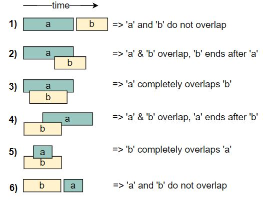
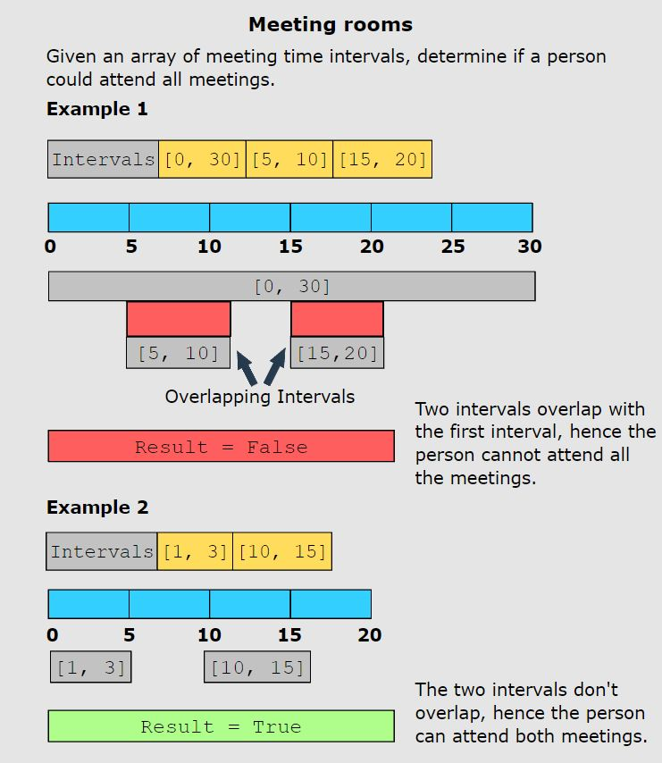
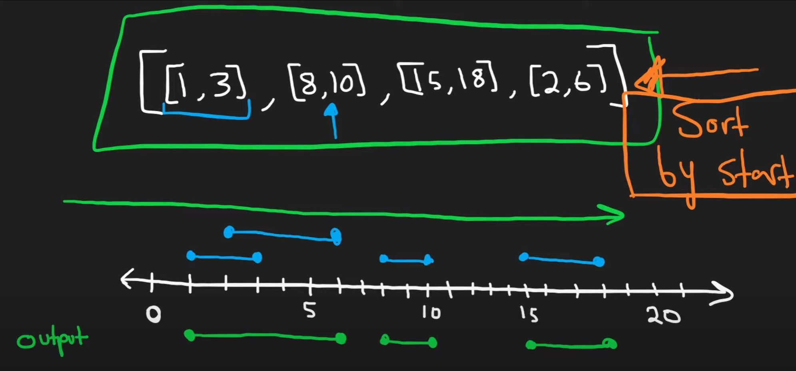
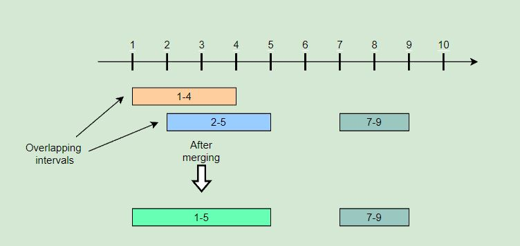

# Merge Intervals

<hr>

## General Notes

- **The merge intervals pattern deals with problems involving overlapping intervals.** 
- **The most common problems solved using this pattern are scheduling problems.**

<br>

- The key to understanding this pattern and exploiting its power lies in understanding how any two intervals may overlap. The illustration below shows the six different ways in which two intervals can relate to each other:

<br>



<br>

- The following examples illustrate some problems that can be solved with this approach:

<br>



<br>

- **You are looking at a merge interval problem if both of these conditions are fulfilled:**
  - The input data is an array of intervals.
  - The problem requires dealing with overlapping intervals, either to find their intersection, their union, or the gaps between them. 
    - This may be required as the final goal, or as an intermediate step in the computation of intervals.

<br>

- **Real World Problems:**

  - **Display busy schedule**: Display the busy hours of a user to other users without revealing the individual meeting slots in a calendar.

  - **Schedule a new meeting**: Add a new meeting to the tentative meeting schedule of a user in such a way that no two meetings overlap each other.

  - **Task scheduling in operating systems (OS)**: Schedule tasks for the OS based on task priority and the free slots in the machine’s processing schedule.

<br>

- Videos: 
  - [Nick White: merge intervals](https://www.youtube.com/watch?v=qKczfGUrFY4&list=RDLV44H3cEC2fFM&index=3)
    - See 10:35 for breakdown.
  - [Neetcode: merge intervals](https://www.youtube.com/watch?v=44H3cEC2fFM)
    - Easier to understand when visualized.
    - 


## Problems

<hr>

## Merge Intervals (medium)

> **Prompt:** Given a **list of intervals**, **merge all the overlapping intervals** to **produce a list that has only mutually exclusive intervals**.

<br>

### **Example:**

```js
Intervals: [[1,4], [2,5], [7,9]]
Output: [[1,5], [7,9]]
Explanation: Since the first two intervals [1,4] and [2,5] overlap, we merged them into 
one [1,5].
```



<br>

### **Big O:**
  - Time: `O(n log n)` // due to sorting the input array.
  - Space: `O(n)` // due to sorting the input array, and the output array.

<br>

### **Code:**

```js
// No comments
const merge = function(intervals) {
  intervals.sort((a, b) => a.start - b.start); 
  const merged = [intervals[0]]; 


  for(let i = 1; i < intervals.length; i++){
    let last = merged.length - 1; 
    let interval = intervals[i];

    if(merged[last].end >= interval.start){ 
      merged[last].end = Math.max(merged[last].end, interval.end);
    } else {
      merged.push(interval);
    }
  }

  return merged;
};

// Comments
const merge = function(intervals) {
  intervals.sort((a, b) => a.start - b.start); // Sort the input array by start value
  const merged = [intervals[0]]; // Create output array, holding the first interval from the input array.

  // Iterate over the input array
  for(let i = 1; i < intervals.length; i++){
    let last = merged.length - 1; // index of last interval in output array.
    let interval = intervals[i];  // current interval

    // If the end of the last interval overlaps 
    // the start of the current interval...
    if(merged[last].end >= interval.start){ // <--- Merge Condition

    // Set the end of the last interval (in the output array) to
    // whatever is larger between it's current end value, 
    // and the end value of the current interval.
      merged[last].end = Math.max(merged[last].end, interval.end);
    } else {

      // If no merge, add the current interval to the output array.
      // In the next loop we will be trying to merge the following interval 
      // with this newly added interval.
      merged.push(interval);
    }
  }

  return merged;
};
```
<br>

### **Comments:**
  - *Pointers:* 
  - *Movement:* 
  - *Variables:*


<br>

### **Basic Pattern:**
  1. Sort input array by start value.
  2. Create output array, holding the first interval from the input array.
  3. Iterate over the input array.
     1. If we meet the condition to merge, (the end of the last interval overlaps the start of the current interval).
        1. We merge by making the end value of the last interval in the output array the larger of the two values between it's value and the end value of the current (i) interval in the input array.
     2. If no merge, push the current (i) interval onto the output array.
  4. Return the output array.

<br>

### LeetCode Solution:

- This is the same algorithm, but using the syntax required for the LeetCode problem.

```js
/**
 * @param {number[][]} intervals
 * @return {number[][]}
 */
var merge = function(intervals) {
    const start = 0, end = 1; // readability
    let int = intervals;      // readability
    
    int.sort((a, b) => a[start] - b[start]); // Sort intvervals in ascending order, this will allow us to compare to the next interval.

        // m = merged, output array
    let m = [int[0]]; // Create output array, start with first interval in output array.

    // Iterate over the input interval array.
    // We will refer to the i'th interval as the current interval.
    for(let i = 1; i < int.length; i++){

        let last = m.length - 1; // reability, last interval in the output array.

        // If the end of the last interval overlaps the start of the current interval...
        if(m[last][end] >= int[i][start]){ // <------ Merge condition

            // Set the end of the last interval (in the output array) to
            // whatever is larger between it's current end value, and the end value of the current interval.
            m[last][end] = Math.max(m[last][end], int[i][end]);
        } else {

            // If no merge, add the current interval to the output array.
            m.push([int[i][start], int[i][end]]);
        }
    }

    // Return the output array.
    return m;
};
```