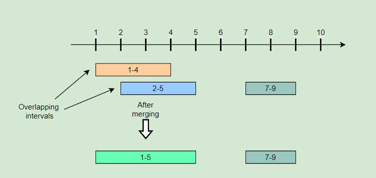

# Merge Intervals (medium)

> **Prompt:** Given a **list of intervals**, **merge all the overlapping intervals** to **produce a list that has only mutually exclusive intervals**.

<br>

## **Example:**

```js
Intervals: [[1,4], [2,5], [7,9]]
Output: [[1,5], [7,9]]
Explanation: Since the first two intervals [1,4] and [2,5] overlap, we merged them into 
one [1,5].
```



<br>

## **Big O:**
  - Time: `O(n log n)` // due to sorting the input array.
  - Space: `O(n)` // due to sorting the input array, and the output array.

<br>

## **Code:**

```js
// No comments
const merge = function(intervals) {
  intervals.sort((a, b) => a.start - b.start); 
  const merged = [intervals[0]]; 


  for(let i = 1; i < intervals.length; i++){
    let last = merged.length - 1; 
    let interval = intervals[i];

    if(merged[last].end >= interval.start){ 
      merged[last].end = Math.max(merged[last].end, interval.end);
    } else {
      merged.push(interval);
    }
  }

  return merged;
};

// Comments
const merge = function(intervals) {

  intervals.sort((a, b) => a.start - b.start); // Sort the input array by start value

  const merged = [intervals[0]]; // Create output array, holding the first interval from the input array.

  // Iterate over the input array
  for(let i = 1; i < intervals.length; i++){
    let last = merged.length - 1; // index of last interval in output array.
    let interval = intervals[i];  // current interval

    // If the end of the last interval overlaps 
    // the start of the current interval...
    if(merged[last].end >= interval.start){ // <--- Merge Condition

    // Set the end of the last interval (in the output array) to
    // whatever is larger between it's current end value, 
    // and the end value of the current interval.
      merged[last].end = Math.max(merged[last].end, interval.end);
    } else {

      // If no merge, add the current interval to the output array.
      // In the next loop we will be trying to merge the following interval 
      // with this newly added interval.
      merged.push(interval);
    }
  }

  return merged;
};

const merge = function(intervals) {
  intervals.sort((a, b) => a.start - b.start); // sort the input array
  let merged =[intervals[0]]; // create new output array and add first interval


  for(let i = 1; i < intervals.length; i++){
    let interval = intervals[i]; // current interval
    let mLastIndex = merged.length - 1; // index of last interval in output array

    // Merge the last interval in the output array with the current interval if they overlap
    // if they don't, add the current interval to the output array.
    if(merged[mLastIndex].end > interval.start){ // <-- merge condition

      // When we are merging we need to account for the last interval in the putput array
      // completely overlapping the current inteveral, so we check which end point is greater.
      merged[mLastIndex].end = Math.max(merged[mLastIndex].end, interval.end);
    } else {
      // If it is not overlapping, we add it to the output array and it will become the 
      // new last interval in the output array.
      merged.push(interval);
    }
  }

  // We return the output array containing out merged intervals.
  return merged;
};
```
<br>

## **Comments:**
  - We must **sort the input array** in order to lower the run time.
  - It helps to draw the problem out to visualize where and what you will be merging.


<br>

## **Basic Pattern:**
  1. Sort input array by start value.
  2. Create output array, holding the first interval from the input array.
  3. Iterate over the input array.
     1. If the end of the last interval overlaps the start of the current interval.
        1. We merge by making the end value of the last interval in the output array the larger of the two values between it's value and the end value of the current (i) interval in the input array.
     2. If no merge, push the current (i) interval onto the output array.
  4. Return the output array.

<br>

## LeetCode Solution:

- This is the same algorithm, but using the syntax required for the LeetCode problem.

```js
/**
 * @param {number[][]} intervals
 * @return {number[][]}
 */
var merge = function(intervals) {
    const start = 0, end = 1; // readability
    let int = intervals;      // readability
    
    int.sort((a, b) => a[start] - b[start]); // Sort intvervals in ascending order, this will allow us to compare to the next interval.

        // m = merged, output array
    let m = [int[0]]; // Create output array, start with first interval in output array.

    // Iterate over the input interval array.
    // We will refer to the i'th interval as the current interval.
    for(let i = 1; i < int.length; i++){

        let last = m.length - 1; // reability, last interval in the output array.

        // If the end of the last interval overlaps the start of the current interval...
        if(m[last][end] >= int[i][start]){ // <------ Merge condition

            // Set the end of the last interval (in the output array) to
            // whatever is larger between it's current end value, and the end value of the current interval.
            m[last][end] = Math.max(m[last][end], int[i][end]);
        } else {

            // If no merge, add the current interval to the output array.
            m.push([int[i][start], int[i][end]]);
        }
    }

    // Return the output array.
    return m;
};
```