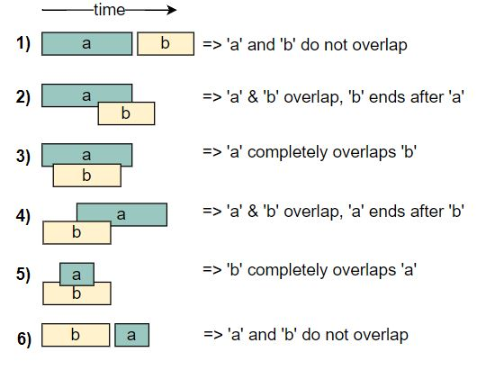
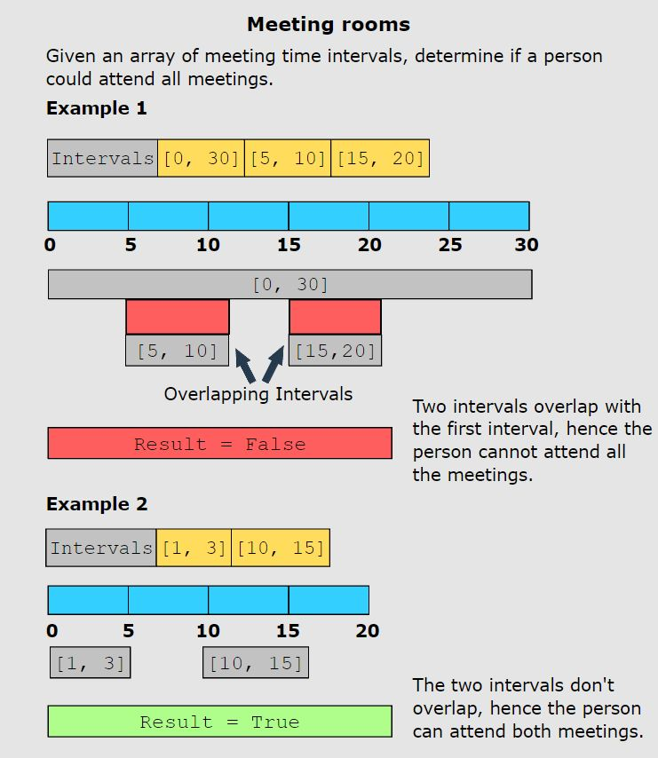
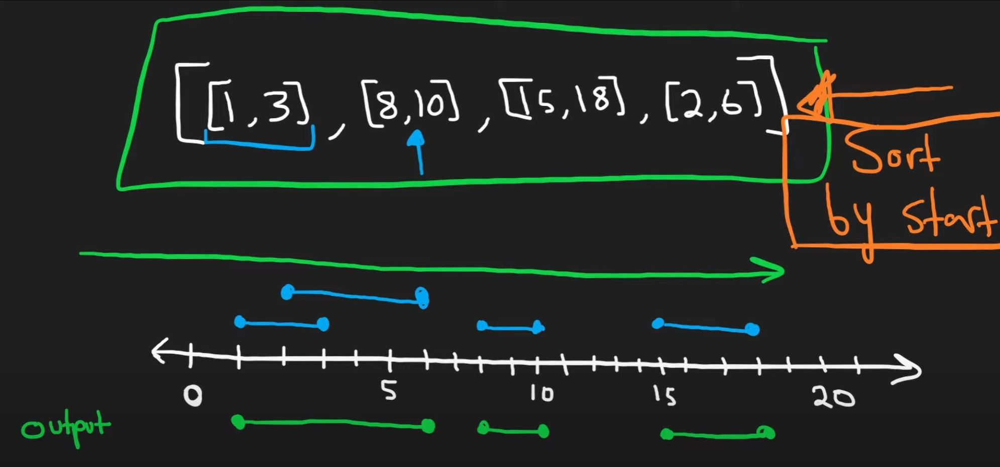
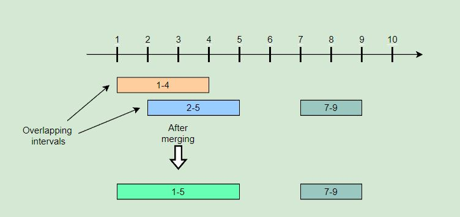

# Merge Intervals

<hr>

## General Notes

- **The merge intervals pattern deals with problems involving overlapping intervals.** 
- **The most common problems solved using this pattern are scheduling problems.**
- "Mutually exclusive intervals" == "Non-overlapping intervals" == "disjointed intervals"

<br>

- The key to understanding this pattern and exploiting its power lies in understanding how any two intervals may overlap. The illustration below shows the six different ways in which two intervals can relate to each other:

<br>



<br>

- The following examples illustrate some problems that can be solved with this approach:

<br>



<br>

- **You are looking at a merge interval problem if both of these conditions are fulfilled:**
  - The input data is an array of intervals.
  - The problem requires dealing with overlapping intervals, either to find their intersection, their union, or the gaps between them. 
    - This may be required as the final goal, or as an intermediate step in the computation of intervals.

<br>

- **Real World Problems:**

  - **Display busy schedule**: Display the busy hours of a user to other users without revealing the individual meeting slots in a calendar.

  - **Schedule a new meeting**: Add a new meeting to the tentative meeting schedule of a user in such a way that no two meetings overlap each other.

  - **Task scheduling in operating systems (OS)**: Schedule tasks for the OS based on task priority and the free slots in the machine’s processing schedule.

<br>

- Videos: 
  - [Nick White: merge intervals](https://www.youtube.com/watch?v=qKczfGUrFY4&list=RDLV44H3cEC2fFM&index=3)
    - See 10:35 for breakdown.
  - [Neetcode: merge intervals](https://www.youtube.com/watch?v=44H3cEC2fFM)
    - Easier to understand when visualized.
    - 


## Problems

<hr>

## Merge Intervals (medium)

> **Prompt:** Given a **list of intervals**, **merge all the overlapping intervals** to **produce a list that has only mutually exclusive intervals**.

<br>

### **Example:**

```js
Intervals: [[1,4], [2,5], [7,9]]
Output: [[1,5], [7,9]]
Explanation: Since the first two intervals [1,4] and [2,5] overlap, we merged them into 
one [1,5].
```



<br>

### **Big O:**
  - Time: `O(n log n)` // due to sorting the input array.
  - Space: `O(n)` // due to sorting the input array, and the output array.

<br>

### **Code:**

```js
// No comments
const merge = function(intervals) {
  intervals.sort((a, b) => a.start - b.start); 
  const merged = [intervals[0]]; 


  for(let i = 1; i < intervals.length; i++){
    let last = merged.length - 1; 
    let interval = intervals[i];

    if(merged[last].end >= interval.start){ 
      merged[last].end = Math.max(merged[last].end, interval.end);
    } else {
      merged.push(interval);
    }
  }

  return merged;
};

// Comments
const merge = function(intervals) {
  intervals.sort((a, b) => a.start - b.start); // Sort the input array by start value
  const merged = [intervals[0]]; // Create output array, holding the first interval from the input array.

  // Iterate over the input array
  for(let i = 1; i < intervals.length; i++){
    let last = merged.length - 1; // index of last interval in output array.
    let interval = intervals[i];  // current interval

    // If the end of the last interval overlaps 
    // the start of the current interval...
    if(merged[last].end >= interval.start){ // <--- Merge Condition

    // Set the end of the last interval (in the output array) to
    // whatever is larger between it's current end value, 
    // and the end value of the current interval.
      merged[last].end = Math.max(merged[last].end, interval.end);
    } else {

      // If no merge, add the current interval to the output array.
      // In the next loop we will be trying to merge the following interval 
      // with this newly added interval.
      merged.push(interval);
    }
  }

  return merged;
};

const merge = function(intervals) {
  intervals.sort((a, b) => a.start - b.start); // sort the input array
  let merged =[intervals[0]]; // create new output array and add first interval


  for(let i = 1; i < intervals.length; i++){
    let interval = intervals[i]; // current interval
    let mLastIndex = merged.length - 1; // index of last interval in output array

    // Merge the last interval in the output array with the current interval if they overlap
    // if they don't, add the current interval to the output array.
    if(merged[mLastIndex].end > interval.start){ // <-- merge condition

      // When we are merging we need to account for the last interval in the putput array
      // completely overlapping the current inteveral, so we check which end point is greater.
      merged[mLastIndex].end = Math.max(merged[mLastIndex].end, interval.end);
    } else {
      // If it is not overlapping, we add it to the output array and it will become the 
      // new last interval in the output array.
      merged.push(interval);
    }
  }

  // We return the output array containing out merged intervals.
  return merged;
};
```
<br>

### **Comments:**
  - We must **sort the input array** in order to lower the run time.
  - It helps to draw the problem out to visualize where and what you will be merging.


<br>

### **Basic Pattern:**
  1. Sort input array by start value.
  2. Create output array, holding the first interval from the input array.
  3. Iterate over the input array.
     1. If the end of the last interval overlaps the start of the current interval.
        1. We merge by making the end value of the last interval in the output array the larger of the two values between it's value and the end value of the current (i) interval in the input array.
     2. If no merge, push the current (i) interval onto the output array.
  4. Return the output array.

<br>

### LeetCode Solution:

- This is the same algorithm, but using the syntax required for the LeetCode problem.

```js
/**
 * @param {number[][]} intervals
 * @return {number[][]}
 */
var merge = function(intervals) {
    const start = 0, end = 1; // readability
    let int = intervals;      // readability
    
    int.sort((a, b) => a[start] - b[start]); // Sort intvervals in ascending order, this will allow us to compare to the next interval.

        // m = merged, output array
    let m = [int[0]]; // Create output array, start with first interval in output array.

    // Iterate over the input interval array.
    // We will refer to the i'th interval as the current interval.
    for(let i = 1; i < int.length; i++){

        let last = m.length - 1; // reability, last interval in the output array.

        // If the end of the last interval overlaps the start of the current interval...
        if(m[last][end] >= int[i][start]){ // <------ Merge condition

            // Set the end of the last interval (in the output array) to
            // whatever is larger between it's current end value, and the end value of the current interval.
            m[last][end] = Math.max(m[last][end], int[i][end]);
        } else {

            // If no merge, add the current interval to the output array.
            m.push([int[i][start], int[i][end]]);
        }
    }

    // Return the output array.
    return m;
};
```

## Insert Interval (medium)
<br>

> **Prompt:** Given a list of non-overlapping intervals sorted by their start time, **insert a given interval at the correct position and merge all necessary intervals** to produce a list that has only mutually exclusive intervals.

<br>

### **Example:**

```js
Input: Intervals=[[1,3], [5,7], [8,12]], New Interval=[4,6]
Output: [[1,3], [4,7], [8,12]]
Explanation: After insertion, since [4,6] overlaps with [5,7], we merged them into one [4,7].
```

<br>

### **Big O:**
  - Time: `O(n)`
  - Space: `O(n)`

<br>

### **Code:**

```js
// No comments
const insert = function(intervals, newInterval) {
  let lowerArray = [], 
      upperArray = [];

  for(const interval of intervals){
    if(interval.end < newInterval.start) lowerArray.push(interval);
    else if (interval.start > newInterval.end) upperArray.push(interval);
    else{
      newInterval.start = Math.min(newInterval.start, interval.start);
      newInterval.end = Math.max(newInterval.end, interval.end);
    }
  }

  return [...lowerArray, newInterval, ...upperArray];
};

// Comments
const insert = function(intervals, newInterval) {

  // Create two arrays that will hold the intervals before and after 
  // the merged intervals
  let lowerArray = [], 
      upperArray = [];

  // Check each interval in intervals
  for(const interval of intervals){

    // if the end of the current interval is before 
    // the new intervals start, we do not have an overlap.
    // So push the current interval on to the lowerArray.
    if(interval.end < newInterval.start)       lowerArray.push(interval);

    // if the start of the current interval is passed 
    // the end of the new interval, we do not have an overlap. 
    // So push the current interval on to the upperArray.
    else if (interval.start > newInterval.end) upperArray.push(interval);

    // if we have reached here our new interval overlaps our current interval.
    // here we are merging out new interval and the current interval.
    else{

      // make the start of the new interval the lesser of the start
      // of the current interval and the new interval.
      newInterval.start = Math.min(newInterval.start, interval.start);

      // make the end of the new interval the greater of the end 
      // of the current interval and the new interval.
      newInterval.end = Math.max(newInterval.end, interval.end);
    }
  }

  // Here we are using the ES6 spread operator to spread the 
  // lower array, then add the new interval, then spread the upper array
  // into one array to return.
  return [...lowerArray, newInterval, ...upperArray];
};
```
<br>

### **Comments:**
  - The trick with this problem is knowing when and how to merge the new value, and understanding all the conditions necessary to reach that point.
  - ES6 syntax makes this problem far easier to read.
  - See "Alternate Solution" for non-ES6 syntax.

<br>

### **Basic Pattern:**

  1. Push intervals before the new interval to results array.
  2. Merge the new interval with overlapping intervals.
  3. Push the remaining intervals to the results array.
  4. Return results array.

<br>

### **Algorithm:**
  1. Create two arrays that will hold the intervals before and after the merged interval.
  2. Iterate over each interval.
     1. Add intervals which end before the start of the new interval to the "before" array.
     2. Add intervals which start after the end of the new interval to the "after" array.
     3. Merge the new interval with the current interval if there is overlap by redefining the new interval.
        1. Make the start of the new interval the lesser of the two start values.
        2. Make the end of the new interval the greater of the two end values.
  3. Using the ES6 spread operator, spread the "before array", add the new interval, then spread the "after array" into one array and return that array.

<br>


### **Alternate Solution:**

```js
// Alternate Solution
const insert = function(intervals, newInterval) {
    let returnArray = [];
        i = 0;
    
    // while there is no intersection between curr interval and the newInterval
    while (i < intervals.length && intervals[i].end < newInterval.start) {
        returnArray.push(intervals[i]);
        i++;
    }
    
    // While there is an intersection between curr interval and the newInterval
    while (i < intervals.length && intervals[i].start <= newInterval.end) {
        newInterval.start = Math.min(newInterval.start, intervals[i].start);
        newInterval.end = Math.max(newInterval.end, intervals[i].end);
        i++;
    }
    
    // push the newly combined interval
    returnArray.push(newInterval);
    
    // push any remaining leftover intervals that do not intersect with the newInterval
    while (i < intervals.length) {
        returnArray.push(intervals[i]);
        i++;
    }

    return returnArray;
};
```

### **Alternate Solution Algorithm:**
  1. Create a results array.
  2. Create a counter variable and set it to 0.
  3. Run a while loop while the counter is less than the input array length and the current interval at the counter ends before the start of the new interval
     1. Push the current interval to the results array.
  4. Run a while loop while the counter is less..., and the current intervals start is less than the new intervals end (overlap).
     1. Make the start of the new interval the lesser of the two start values.
     2. Make the end of the new interval the greater of the two end values.
  5. Push the new interval to the results array.
  6. Run a while loop while the counter is less... (no need for a merge check condition).
     1. Push the current interval to the results array.
  7. Return the results array.

### **Leetcode Format:**

```js
var insert = function (intervals, newInterval) {
  let [newStart, newEnd] = newInterval;
  let left = [];
  let right = [];
  
  for (const interval of intervals) {
    const [currStart, currEnd] = interval;
	
	// current interval is smaller than newInterval
    if (currEnd < newStart) left.push(interval);
	
	// current interval is larger than newInterval
    else if (currStart > newEnd) right.push(interval);
	
	// there is a overlap
    else {
      newStart = Math.min(newStart, currStart);
      newEnd = Math.max(newEnd, currEnd);
    }
  }
  
  return [...left, [newStart, newEnd], ...right]; 
};

// Alternate Solution
const insert = (intervals, newInterval) => {
  
    let res = [];

    let start = 0;
    let end = 1;

    let i = 0;
    
    // while there is no intersection between curr interval and the newInterval
    while (i < intervals.length && intervals[i][end] < newInterval[start]) {
        res.push(intervals[i]);
        i++;
    }
    
    // While there is an intersection between curr interval and the newInterval
    while (i < intervals.length && intervals[i][start] <= newInterval[end]) {
        newInterval[start] = Math.min(newInterval[start], intervals[i][start]);
        newInterval[end] = Math.max(newInterval[end], intervals[i][end]);
        i++;
    }
    
    // push the newly combined interval
    res.push(newInterval);
    
    // push any remaining leftover intervals that do not interset with the newInterval
    while (i < intervals.length) {
        res.push(intervals[i]);
        i++;
    }

    return res;
};
```

## Intervals Intersection (medium)

> **Prompt:** Given two lists of intervals, **find the intersection of these two lists.** Each list consists of **disjoint intervals sorted on their start time**.

<br>

### **Example:**

```js
Input: arr1=[[1, 3], [5, 6], [7, 9]], arr2=[[2, 3], [5, 7]]
Output: [2, 3], [5, 6], [7, 7]
Explanation: The output list contains the common intervals between the two lists.
```

<br>

### **Big O:**
  - Time: `O(n+m)`
  - Space: `O(n+m)`

<br>

### **Code:**

```js
// No comments
const merge = function(arr1, arr2) {
  let result = [];
  
  let i = 0, j = 0;
  
  while(i < arr1.length && j < arr2.length){
    const merge1 = arr1[i].end >= arr2[j].start && arr1[i].start <= arr2[j].end;
    const merge2 = arr2[j].end >= arr1[i].start && arr2[j].start <= arr1[i].end;

    if(merge1 || merge2){
      const start = Math.max(arr1[i].start, arr2[j].start);
      const end = Math.min(arr1[i].end, arr2[j].end);

      result.push(new Interval(start, end));
    }
    arr1[i].end < arr2[j].end ? i++ : j++;
  }

  return result;
};

// Comments
const merge = function(arr1, arr2) {
  let result = []; // Array to hold intersecting intervals
  
  let i = 0, j = 0; // Counters
  
  // Loop until one of the arrays reaches the end
  while(i < arr1.length && j < arr2.length){

    // Intersections
    const merge1 = arr1[i].end >= arr2[j].start && arr1[i].start <= arr2[j].end;
    const merge2 = arr2[j].end >= arr1[i].start && arr2[j].start <= arr1[i].end;

    // Intersection
    if(merge1 || merge2){

      // Find the start and end of the intersection
      const start = Math.max(arr1[i].start, arr2[j].start);
      const end = Math.min(arr1[i].end, arr2[j].end);

      // Add the intersecting interval to the results array
      result.push(new Interval(start, end));
    }

    // Move the lesser of the two intervals to the next interval
    arr1[i].end < arr2[j].end ? i++ : j++;
  }

  return result;
};
```
<br>

### **Comments:**
  - It definitely helps to draw it out the problem and talk it through, it's all about the different conditions and it's very difficult to reason it out just by talking.


<br>

### **Basic Pattern:**
  1. Loop over the arrays.
  2. Check the current intervals for an intersection between the two.
  3. Create an interval out of the intersection and add it to the results array.
  4. return results array.

<br>

### **Algorithm:**
  1. Create a results array.
  2. Create two counters, set both to 0.
  3. Create a while loop to run while both counters are within the range of their respective arrays.
     1. If an intersection is found.
        1. Find the start and end of the intersection.
        2. Create a new interval with the start and end of the intersection and add it to the results array.
     2. Move the lesser of the two intervals to the next interval.
  4. Return the results array.

### **Leetcode Solution:**

```js
var intervalIntersection = function(arr1, arr2) {
  let result = [];
  const start = 0, end = 1;
  
  let i = 0, j = 0;
  
  while(i < arr1.length && j < arr2.length){
    const merge1 = arr1[i][end] >= arr2[j][start] && arr1[i][start] <= arr2[j][end];
    const merge2 = arr2[j][end] >= arr1[i][start] && arr2[j][start] <= arr1[i][end];

    if(merge1 || merge2){
      const iStart = Math.max(arr1[i][start], arr2[j][start]);
      const iEnd = Math.min(arr1[i][end], arr2[j][end]);

      result.push([iStart, iEnd]);
    }
    arr1[i][end] < arr2[j][end] ? i++ : j++;
  }
  
  return result;
};
```

Conflicting Appointments (easy)

> **Prompt:** Given an array of intervals representing ‘N’ appointments, **find out if a person can attend all the appointments**.

<br>

### **Example:**

```js
Appointments: [[4,5], [2,3], [3,6]]
Output: false
Explanation: Since [4,5] and [3,6] overlap, a person cannot attend both of these appointments.

// ====

Appointments: [[6,7], [2,4], [8,12]]
Output: true
Explanation: None of the appointments overlap, therefore a person can attend all of them.
```

<br>

### **Big O:**
  - Time: `O(n log n)`
  - Space: `O(n)`

<br>

### **Code:**

```js
// No comments
const can_attend_all_appointments = function(appts) {

  appts.sort((a, b) => a.start - b.start);

  for(let i = 0; i < appts.length - 2; i++){
    if(appts[i].end >= appts[i+1].start) return false;
  }

  return true;
};

// Comments
const can_attend_all_appointments = function(appts) {

  // Sort the input array by start time in ascending order.
  appts.sort((a, b) => a.start - b.start);

  // Iterate over the appointments until the second to last.
  for(let i = 0; i < appts.length - 1; i++){

    // If an overlap is found, return false.
    if(appts[i].end >= appts[i+1].start) return false;
  }

  // Return true if no overlap is found.
  return true;
};
```
<br>

### **Comments:**
  - The trick to this problem is **sorting the array by the start values**.


<br>

### **Basic Pattern:**
  1. Sort the input array.
  2. Iterate over the appointments until the second to the last.
     1. If an overlap is found, return false.
  3. Return true if no overlap is found.

### **Leetcode Solution:**

- Leetcode uses 2D arrays instead of interval objects.

```js
var canAttendMeetings = function(intervals) {
    if(intervals.length === 0 || intervals.length === 1) return true;

    const start = 0, end = 1;
    intervals.sort((a, b) => a[start] - b[start]);

    for(let i = 0; i < intervals.length - 1; i++){
        if(intervals[i][end] > intervals[i+1][start]) return false;
    }

    return true;
};
```