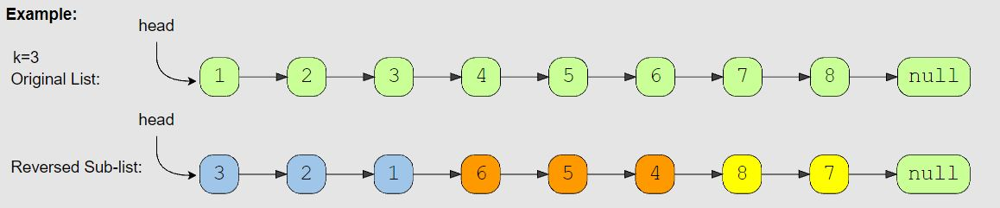

# Reverse every K-element Sub-list (medium)

> **Prompt:** Given the head of a LinkedList and a number ‘k’, **reverse every ‘k’ sized sub-list starting from the head**.
> - If, in the end, you are left with a sub-list with less than ‘k’ elements, reverse it too.

<br>


### **Example:**



<br>

### **Big O:**
  - Time: `O(n)`
  - Space: `O(1)`

<br>

### **Code:**

```js
// No comments
const reverse_every_k_elements = function(head, k){    
  let prevStart = head, 
      secondPrevStart = null; 
  
  let curr = head; 

  while(curr){
    
    let prev = null, 
        i = 0; 

    while(curr && i < k){
      let next = curr.next;
          curr.next = prev;
          prev = curr;
          curr = next;
          i++;
    }

    if(!secondPrevStart){
      head = prev;
    } else {
      prevStart.next = prev;
      prevStart = secondPrevStart;
    }

    secondPrevStart = curr;
  }
  return head
}

// Comments
const reverse_every_k_elements = function(head, k){    
  let prevStart = head, // holds the start of a sub-group prior to reversal
      secondPrevStart = null; // holds the start of the following sub-group prior to reversal, these two will follow each other all the way down.
  
  let curr = head; // pointer for reversals

  // Run until we reach the end of the list
  while(curr){
    let prev = null, // pointer for reversal, start at null
        i = 0; // used to count nodes in group

    // Reverse k nodes counting the number of nodes with i, stop early if you hit null, or stop when you've reached a full group of nodes.
    while(curr && i < k){
      let next = curr.next;
          curr.next = prev;
          prev = curr;
          curr = next;
          i++;
    }
    
    // If there is not a secondPrevStart, that means we just reversed the first sub group,
    // we need to reset the head of the LL to be the new head of the reversed section
    if(!secondPrevStart){
      head = prev;
    } else {

      // If we already have a secondPrevStart, we need to 
      // point our prevStart's next pointer to the current prev pointer,
      // then update our prevStart
      // We will move these along down the LL updating the pointers after each reversal.
      prevStart.next = prev;
      prevStart = secondPrevStart;
    }

   // After each reversal we will make the secondPrevStart the first node of the next group to be reversed.
   secondPrevStart = curr;
  }
  return head
}
```
<br>

### **Comments:**
  - This problem become much easier once you track the head of the sub group before it is reversed, and the head of the next sub group before it is reversed as well.


<br>

### **Basic Pattern:**
  1. Track the pre-reversal heads of two sub-groups.
  2. Reverse the first sub-group.
  3. Point the head pointers to the correct starts of the next group.

<br>

### **Algorithm:**
  1. Create two pointers that will point to the heads of two subsequent sub-groups, set the first to head, the second to null.
  2. Create a current variable to track where we are in the list at a given time.
  3. Create a while loop that will run while the current node is not null (hasn't reached the end of the list).
     1. Create a previous pointer for the reversal, set it to null.
     2. Create a counter variable i, set it to 0.
     3. Loop while the current variable is not null, and i is less than k (the number of nodes in a sub-group).
        1. Run reversal algo.
        2. Increment i.
     4. If the second head pointer is null,
        1. Set the head of the LL to be the node currently pointed to by the prev pointer.
     5. If the second head pointer is not null,
        1. Set the first head pointer's next pointer to point towards the node in prev.
        2. Update the first head pointer to be the second head pointer.
     6. Set the second head pointer to point to the node currently in the curr pointer. (This is the first node of the next group we will reverse).

<hr>

## ALTERNATE Reverse every K-element Sub-list (medium)

-- **_Note: I realized that this is not an optimal solution, this runs in O(n*m) time, not O(n). This is because we are finding the end of the sub-group for each group. As we have more and more subgroups (as n grows), we are going to need to iterate over k nodes each time looking for the end of each group (m)._**

<br>

> **Prompt:** Given the head of a LinkedList and a number ‘k’, **reverse every ‘k’ sized sub-list starting from the head**.
> - If, in the end, you are left with a sub-list with less than ‘k’ elements, reverse it too.

<br>

### **Example:**


<br>

### **Big O:**
  - Time: `O(n*m)` 
  - Space: `O(1)`

<br>

### **Code:**

```js
// No comments
const reverse_every_k_elements = function(head, k){
  let newListHead = null,
      newSubHead = null,
      start = head;
  
  while(start){ 
    let end = findEnd(start, k); 
    let prevHead = start; 
    [newSubHead, start] = reverse(start, end); 
    prevHead.next = findEnd(start, k); 
    if(!newListHead) newListHead = newSubHead; 
  }
  return newListHead;
}

function findEnd(head, count){
  if(!head) return null;
  let curr = head;

  while(count-1 && curr.next){ 
    curr = curr.next;
    count--;
  }
  return curr;
}

function reverse(start, end){
  let curr = start,
      prev = null,
      endNext = end.next; 

  while(curr !== endNext){
    let next = curr.next;
        curr.next = prev;
        prev = curr;
        curr = next;
  }
  return [prev, curr];
}

// Comments
const reverse_every_k_elements = function(head, k){
  let newListHead = null,
      newSubHead = null,
      start = head;
  
  // Run while there are more sub-groups left
  while(start){
    // find the end of the first sub-group, k nodes away.  
    let end = findEnd(start, k); 

    // Save the current head of the sub-group.
    let prevHead = start; 

    // Reverse the current sub group,  
    // returns new sub-section head and next sub-section start node.
    [newSubHead, start] = reverse(start, end); 

    // Here we are connecting the new last node in the section to 
    // what will be the first node in the next section once it is reversed.
    // If there are no more sub-sections left this will return null.
    prevHead.next = findEnd(start, k); 

    // After the first reversal we will save the new head 
    // of the first section as the new head of the linked list.
    if(!newListHead) newListHead = newSubHead; 
  }
  
  return newListHead;
}

//============ Helper Functions ========================

// Here we are taking the start node of a sub-section 
// and returning the end node of that section
function findEnd(head, count){
  if(!head) return null;
  let curr = head;

  // if no curr.next end loop early, we have reached the end of our list
  while(count-1 && curr.next){ 
    curr = curr.next;
    count--;
  }

  // If we reach a null value before the end of the section, 
  // that is the last section and we return the current node.
  return curr;
}

function reverse(start, end){
  let curr = start,
      prev = null,

      // We need a pointer to the next node in the list after the reversed section,
      // we can't just use end.next as the condition in the while loop, because end is modified.
      endNext = end.next; 

  while(curr !== endNext){
    let next = curr.next;
        curr.next = prev;
        prev = curr;
        curr = next;
  }

  // We are returning the node currently in prev, 
  // which will be the beginning of our reversed list,
  // and the node in curr which will be the start of our next section.
  return [prev, curr];
}
```
<br>

### **Comments:**
  - The trick with this problem is keeping track of where the reversed sections point. 
    - If we keep track of the previous head (which is now the tail of a reversed section),
    - we can point it towards the next sections end ( which will become the next sections start).
  - This is another problem where drawing out the steps will help you see the solution.


<br>

### **Basic Pattern:**
  1. While the start node is not null.
  2. Give the current start find the end, k nodes away.
  3. Save a reference to the current start node.
  4. Reverse the string from start to end, returning the head of the reversed section and the next start node.
  5. Set the original start node's next pointer to point to the last node in the next section 
     1. (this will end up being the first node in the reversed section)
  6. After the first section is reversed, set the head of the reversed section to be the head of the list.
  7. Return the list.