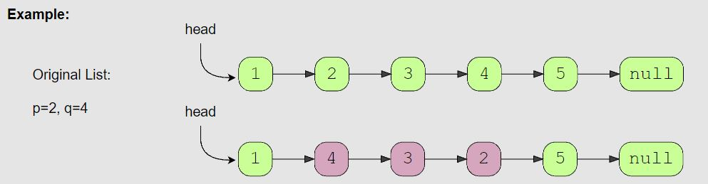
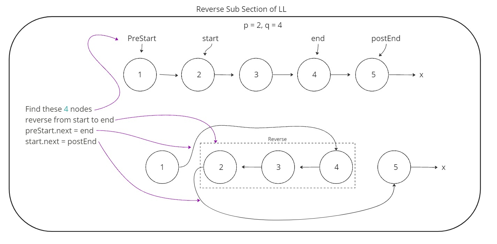

# Reverse a Sub-list (medium)

> **Prompt:** Given the **head of a LinkedList** and **two positions ‘p’ and ‘q’**, *reverse the LinkedList from position ‘p’ to ‘q’*.

<br>

### **Example:**



<br>

### **Big O:**
  - Time: `O(n)` technically O(4n)
  - Space: `O(1)`

<br>

### **Code:**

```js
// No comments
function reverseSubList(head, p, q){
  if( !head || !q || !p || p > q ) return null;
  if(p === q) return head;

  let preStart = get(p - 1, head),
      start    = get(p, head),
      end      = get(q, head); 
  if( !end || !start ) return null;

  return reverse(preStart, start, end, head);
}

// ================ helper functions ===============

function get(position, head){
  if(position <= 0) return null;
  let current = head;

  while(position-1 && current){
    current = current.next;
    position--;
  }
  return current;
}


function reverse(preStart, start, end, head){
  let current = start, 
      endNext = end.next,
      previous = end.next;

  while(current !== endNext){
    let next = current.next;
        current.next = previous;
        previous = current;
        current = next;
  }

  if(preStart){
      preStart.next = previous;
      return head;
  } else {
      return previous;
  }
}

// Comments
function reverseSubList(head, p, q){
  // Edge cases 
  if( !head || !q || !p || p > q ) return null;
  if(p === q) return head;

  // Get nodes we will need to reverse section of LL
  let preStart = get(p - 1, head),
      start    = get(p, head),
      end      = get(q, head);
  
  // If end or start doesn't exist return null
  if( !end || !start ) return null;

  // return the head of the reversed LL
  return reverse(preStart, start, end, head);
}

// ================ helper functions ===============

// Get a node at a given position within the LL 
function get(position, head){
  if(position <= 0) return null; // 1 indexed, make sure we're in bounds
  let current = head;

  while(position-1 && current){
    current = current.next;
    position--; // Count down position until you get there.
  }
  return current;
}


function reverse(preStart, start, end, head){
  let current = start, // Start of the section to reverse
      endNext = end.next, // First node after reversed section
      previous = end.next; // Think of end.next like null when you are reversing an entire list

  // Iterate over the list switching directions until you hit the end of the section to reverse
  while(current !== endNext){
    let next = current.next;
        current.next = previous;
        previous = current;
        current = next;
  }

  // We are going to have different outcomes depending on if we started 
  // reversing from the head node. In both cases, previous will hold the first section of the reversed section.
  if(preStart){
      // If there exists a node ahead of where we started reversing, the head remains the same,
      // But we need to point that node at the new beginning of the reversed section.
      preStart.next = previous; 
      return head;
  } else {
      // If no node exists before where we started reversing, previous will be the new head.
      return previous;
  }
}
```
<br>

### **Comments:**
  - **It is much easier to understand this problem if you draw it out or use some sort of visual aid.**
  - This problem becomes easier when you break it in to sub problems.
  - There are lots of edge cases to consider with this problem.
  - The better you know the basic LL algorithms, the easier this problem becomes.


<br>

### **Basic Pattern:**
  1. Get nodes we will need to reverse section of LL: **start - 1**, **start**, **end**.
  2. Reverse from start to end, 
     1. Making sure to account for the pointers pointing to the new start of the reversed section and pointing from the new section to the rest of the list.
  3. Return the head of the LL, making sure to account for the possibility that the reversed portion starts at the beginning, if so the start of the reversed section is the new head of the LL.

<br>

### Alternate Solution

- This solution doesn't require the reverse function to take as many parameters, not return any values.
- This is the same time complexity.



```js
var reverseBetween = function(head, p, q){
  // Edge cases 
  if(p === q) return head;

  // Get nodes we will need to reverse section of LL
  let preStart = get(p - 1, head),
      start    = get(p, head),
      end      = get(q, head), 
      postEnd  = end.next;

  // return the head of the reversed LL
  reverse(start, end);
  
  // point the node before the reverse section to the new start of the reversed section (the old end)
  if(preStart) preStart.next = end;

  // Point the new end node of the reversed section (the old start) towards the node after the reversed section.
  start.next = postEnd;

  // If there were nodes before the reversed section, the head remains the same.
  // If not, the old end node will be the new head of the LL.
  return preStart ? head : end;
}

// ================ helper functions ===============

// Get a node at a given position within the LL 
function get(position, head){
  if(position <= 0) return null;
  let current = head;

  while(position-1 && current){
    current = current.next;
    position--;
  }
  return current;
}

// Reverse a portion of the LL 
function reverse(start, end){
  let current = start,
      endNext = end.next, // need to make a pointer to end.next because it will change
      previous = null;

  while(current !== endNext){
    let next = current.next;
        current.next = previous;
        previous = current;
        current = next;
  }
}
```