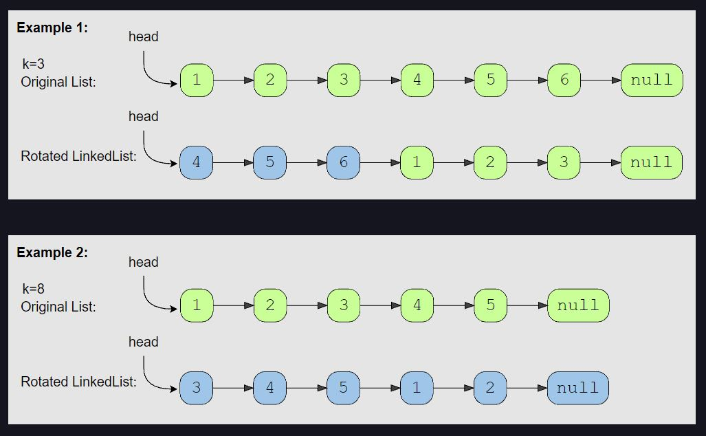

# Rotate a LinkedList (medium)

> **Prompt:** Given the **head of a Singly LinkedList** and a **number ‘k’**, *rotate the LinkedList to the right by ‘k’ nodes*.

<br>

### **Example:**



<br>

### **Big O:**
  - Time: `O(n)`
  - Space: `O(1)`

<br>

### **Code:**

```js
// No comments
var rotateRight = function(head, k) {
  if( !head || !head.next || k <= 0 ) return head;

  let pHead = head;
  let [length, pTail] = findTail(head);

  pTail.next = head;
  
  let numRotations = k % length;
  let rotations = length - numRotations;

  let i = 0;
  while(i < rotations){
    pHead = pHead.next;
    pTail = pTail.next;
    i++;
  }

  pTail.next = null;
  return pHead;
};

function findTail(head){
  let curr = head;
  let count = 1;
  while(curr.next){
    curr = curr.next;
    count++;
  }
  return [count, curr];
}

// Comments
var rotateRight = function(head, k) {
  // Check edge cases
  if( !head || !head.next || k <= 0 ) return head;

  // Create a pointer at the head of the list
  let pHead = head;

  // Create a pointer at the end of the list, 
  // and while doing so, also get the length of the list.
  let [length, pTail] = findTail(head);

  // Make the list circular.
  pTail.next = head;
  
  // If the number of rotations, k, is more than the length of the list, 
  // rotating the array k times is equal to rotating the list k % length times.
  let numRotations = k % length;

  // To find where our new head and tail will be we need to rotate the list right,
  // but to do so our pointers would have to move left.
  // So instead of moving the list right, we keep the list still and move the pointers right.
  //
  // To find where our pointers will end up, we can subtract the number of rotations
  // from the length.
  // IN A CIRCULAR LIST, to move left by k is equivalent to moving right by length - k.

  let rotations = length - numRotations;

  // Move the pointers up by rotations
  let i = 0;
  while(i < rotations){
    pHead = pHead.next;
    pTail = pTail.next;
    i++;
  }

  // Disconnect the tail and point to null.
  pTail.next = null;

  // Return the new head.
  return pHead;
};

function findTail(head){
  let curr = head;
  let count = 1;
  while(curr.next){
    curr = curr.next;
    count++;
  }
  return [count, curr];
}
```
<br>

### **Comments:**
  - **Make sure you are rotating the LIST to the right, not the pointers.**
  - Rotating the list to the right is equivalent to rotating the pointers to the left, which we cannot do with a LL.
  - **Rotating the list to the right by k nodes is equivalent to rotating the pointers to the right by the length - k.**
  - If the number of rotations, k, is greater than the length of the list, rotating the list k % length is equal to rotating it k times.
  - This problem makes more sense if you draw it out.


<br>

### **Basic Pattern:**
  1. Create a pointers at the head and tail of the list.
  2. Point the back of the list to the first node, making a circular list.
  3. Calculate where the pointers will end up.
  4. Move the pointers to those nodes.
  5. Disconnect the list at the new tail and point it towards null.
  6. Return the new head node.