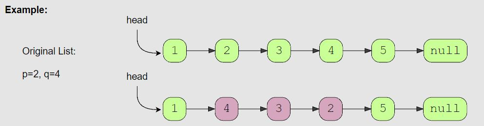

# In-place Reversal of a Linked List

<hr>

## General Notes

- 

## Problems

<hr>

## Problem Name (Difficulty)

> **Prompt:** Given the head of a Singly LinkedList, reverse the LinkedList. Write a function to return the new head of the reversed LinkedList.

<br>

### **Example:**

```js
Original:      2 -> 4 -> 6 -> 8 -> x
Reversed: x <- 2 <- 4 <- 6 <- 8 
```

<br>

### **Big O:**
  - Time: `O(n)`
  - Space: `O(1)`

<br>

### **Code:**

```js
// No comments
function reverseLL(head){
  let current = head,
      previous = null;

  while(current){
    let next = current.next;
        current.next = previous;
        previous = current;
        current = next;
  }
  return previous;
}

// Comments
function reverseLL(head){

  // Create two variables to hold values between iterations
  let current = head,
      previous = null; // Initially point previous to null

  // Current will end at null
  while(current){
    let next = current.next; // Create a next variable and sent it equal to the value current nodes next pointer.
        current.next = previous; // Point the current nodes next pointer to be the value of the previous variable.
        previous = current; // Set previous to be current, since we are working our way down the LL.
        current = next; // Set current to next, as we will be switching where it points next.
  }

  // We will return the previous variable as it will hold a reference to the new head of the LL.
  return previous;
}
```
<br>

### **Comments:**
  - *Variables:* Three, two outer to hold values between loops, and one temp within the loop.
  - *Movement:* We will work our way down the LL until we hit the null value.


<br>

### **Basic Pattern:**
  1. Create two variables to hold values between iterations.
  2. Loop until the end of the LL is reached.
  3. In the loop, 
     1. point the current nodes next pointer towards the previous node, 
     2. update the current and previous variables.
  4. Return the previous variable.

<br>

## Reverse a Sub-list (medium)

> **Prompt:** Given the head of a LinkedList and two positions ‘p’ and ‘q’, **reverse the LinkedList from position ‘p’ to ‘q’**.

<br>

### **Example:**



<br>

### **Big O:**
  - Time: `O(n)` technically O(4n)
  - Space: `O(1)`

<br>

### **Code:**

```js
// No comments
function reverseSubList(head, p, q){
  if( !head || !q || !p || p > q ) return null;
  if(p === q) return head;

  let preStart = get(p - 1, head),
      start    = get(p, head),
      end      = get(q, head); 
  if( !end || !start ) return null;

  return reverse(preStart, start, end, head);
}

// ================ helper functions ===============

function get(position, head){
  if(position <= 0) return null;
  let current = head;

  while(position-1 && current){
    current = current.next;
    position--;
  }
  return current;
}


function reverse(preStart, start, end, head){
  let current = start, 
      endNext = end.next,
      previous = end.next;

  while(current !== endNext){
    let next = current.next;
        current.next = previous;
        previous = current;
        current = next;
  }

  if(preStart){
      preStart.next = previous;
      return head;
  } else {
      return previous;
  }
}

// Comments
function reverseSubList(head, p, q){
  // Edge cases 
  if( !head || !q || !p || p > q ) return null;
  if(p === q) return head;

  // Get nodes we will need to reverse section of LL
  let preStart = get(p - 1, head),
      start    = get(p, head),
      end      = get(q, head);
  
  // If end or start doesn't exist return null
  if( !end || !start ) return null;

  // return the head of the reversed LL
  return reverse(preStart, start, end, head);
}

// ================ helper functions ===============

// Get a node at a given position within the LL 
function get(position, head){
  if(position <= 0) return null; // 1 indexed, make sure we're in bounds
  let current = head;

  while(position-1 && current){
    current = current.next;
    position--; // Count down position until you get there.
  }
  return current;
}


function reverse(preStart, start, end, head){
  let current = start, // Start of the section to reverse
      endNext = end.next, // First node after reversed section
      previous = end.next; // Think of end.next like null when you are reversing an entire list

  // Iterate over the list switching directions until you hit the end of the section to reverse
  while(current !== endNext){
    let next = current.next;
        current.next = previous;
        previous = current;
        current = next;
  }

  // We are going to have different outcomes depending on if we started 
  // reversing from the head node. In both cases, previous will hold the first section of the reversed section.
  if(preStart){
      // If there exists a node ahead of where we started reversing, the head remains the same,
      // But we need to point that node at the new beginning of the reversed section.
      preStart.next = previous; 
      return head;
  } else {
      // If no node exists before where we started reversing, previous will be the new head.
      return previous;
  }
}
```
<br>

### **Comments:**
  - This problem becomes easier when you break it in to sub problems.
  - There are lots of edge cases to consider with this problem.
  - The better you know the basic algorithms, the easier this problem becomes.
  - It is much easier to understand this problem if you draw it out or use some sort of visual aid.


<br>

### **Basic Pattern:**
  1. Get nodes we will need to reverse section of LL, start - 1, start, end.
  2. Reverse from start to end, 
     1. Making sure to account for the pointers pointing to the new start of the reversed section and pointing from the new section to the rest of the list.
  3. Return the head of the LL, making sure to account for the reversed list possibly having a new head node.

<br>

### Alternate Solution


```js
var reverseBetween = function(head, p, q){
  // Edge cases 
  if(p === q) return head;

  // Get nodes we will need to reverse section of LL
  let preStart = get(p - 1, head),
      start    = get(p, head),
      end      = get(q, head), 
      postEnd  = end.next;

  // return the head of the reversed LL
  reverse(start, end);
  
  // point the node before the reverse section to the new start of the reversed section (the old end)
  if(preStart) preStart.next = end;

  // Point the new end node of the reversed section (the old start) towards the node after the reversed section.
  start.next = postEnd;

  // If there were nodes before the reversed section, the head remains the same.
  // If not, the old end node will be the new head of the LL.
  return preStart ? head : end;
}

// ================ helper functions ===============

// Get a node at a given position within the LL 
function get(position, head){
  if(position <= 0) return null;
  let current = head;

  while(position-1 && current){
    current = current.next;
    position--;
  }
  return current;
}

// Reverse a portion of the LL 
function reverse(start, end){
  let current = start,
      endNext = end.next, // need to make a pointer to end.next because it will change
      previous = null;

  while(current !== endNext){
    let next = current.next;
        current.next = previous;
        previous = current;
        current = next;
  }
}
```

## Reverse every K-element Sub-list (medium)

> **Prompt:** Given the head of a LinkedList and a number ‘k’, **reverse every ‘k’ sized sub-list starting from the head**.
> - If, in the end, you are left with a sub-list with less than ‘k’ elements, reverse it too.

<br>


### **Example:**


<br>

### **Big O:**
  - Time: `O(n)`
  - Space: `O(1)`

<br>

### **Code:**

```js
// No comments
const reverse_every_k_elements = function(head, k){    
  let prevStart = head, 
      secondPrevStart = null; 
  
  let curr = head; 

  while(curr){
    
    let prev = null, 
        i = 0; 
    while(curr !== null && i < k){
      let next = curr.next;
          curr.next = prev;
          prev = curr;
          curr = next;
          i++;
    }

    if(!secondPrevStart){
      head = prev;
    } else {
      prevStart.next = prev;
      prevStart = secondPrevStart;
    }

    secondPrevStart = curr;
  }
  return head
}

// Comments
const reverse_every_k_elements = function(head, k){    
  let prevStart = head, // holds the start of a sub-group prior to reversal
      secondPrevStart = null; // holds the start of the following sub-group prior to reversal
  
  let curr = head; // pointer for reversals

  // Run while curr points to a valid node
  while(curr){
    let prev = null, // pointer for reversal
        i = 0; // used to count nodes in group

    // Reverse k nodes counting the nodes with i, stop early if you hit null
    while(curr !== null && i < k){
      let next = curr.next;
          curr.next = prev;
          prev = curr;
          curr = next;
          i++;
    }
    
    // If there is not a secondPrevStart we are on the first sub group,
    // we need to reset the head to be the new head of the reversed section
    if(!secondPrevStart){
      head = prev;
    } else {

      // If we already have a secondPrevStart, we need to 
      // point our prevStart's next pointer to the current prev pointer,
      // then update our prevStart
      // We will move these along down the LL updating the pointers after each reversal.
      prevStart.next = prev;
      prevStart = secondPrevStart;
    }

   // After each reversal we will make the secondPrevStart the first node of the next group to be reversed.
   secondPrevStart = curr;
  }
  return head
}
```
<br>

### **Comments:**
  - This problem become much easier once you track the head of the sub group before it is reversed, and the head of the next sub group before it is reversed as well.


<br>

### **Basic Pattern:**
  1. Track the pre-reversal heads of two sub-groups.
  2. Reverse the sub-group
  3. Point the head pointers to the correct starts of the next group.

<br>

### **Algorithm:**
  1. Create two pointers that will point to the heads of two subsequent sub-groups, set the first to head, the second to null.
  2. Create a current variable to point track where we are in the list at a given time.
  3. Create a while loop that will run while the current node is not null.
     1. Create a previous pointer, for the reversal, set it to null.
     2. Create a counter variable i, set it to 0.
     3. Loop while the current variable is not null, and i is less than k (the number of nodes in a sub-group).
        1. Run reversal algo.
        2. Increment i.
     4. If the second head pointer is null,
        1. Set the head of the LL to be the node currently pointed to by the prev pointer.
     5. If the second head pointer is not null,
        1. Set the first head pointer's next pointer to point towards the node in prev.
        2. Update the first head pointer to be the second head pointer.
     6. Set the second head pointer to point to the node currently in the curr pointer. (This is the first node of the next group we will reverse).

<hr>

## ALTERNATE Reverse every K-element Sub-list (medium)

-- _Note: Realized this is not an optimal solution, this runs in O(n*m) time, not O(n). This is because we are finding the end of the sub-group for each group. As we have more and more subgroups (presumably as n grows), we are going to need to iterate over k nodes each time looking for the end of each group (m)._

<br>

> **Prompt:** Given the head of a LinkedList and a number ‘k’, **reverse every ‘k’ sized sub-list starting from the head**.
> - If, in the end, you are left with a sub-list with less than ‘k’ elements, reverse it too.

<br>

### **Example:**


<br>

### **Big O:**
  - Time: `O(n*m)` 
  - Space: `O(1)`

<br>

### **Code:**

```js
// No comments
const reverse_every_k_elements = function(head, k){
  let newListHead = null,
      newSubHead = null,
      start = head;
  
  while(start){ 
    let end = findEnd(start, k); 
    let prevHead = start; 
    [newSubHead, start] = reverse(start, end); 
    prevHead.next = findEnd(start, k); 
    if(!newListHead) newListHead = newSubHead; 
  }
  return newListHead;
}

function findEnd(head, count){
  if(!head) return null;
  let curr = head;

  while(count-1 && curr.next){ 
    curr = curr.next;
    count--;
  }
  return curr;
}

function reverse(start, end){
  let curr = start,
      prev = null,
      endNext = end.next; 

  while(curr !== endNext){
    let next = curr.next;
        curr.next = prev;
        prev = curr;
        curr = next;
  }
  return [prev, curr];
}

// Comments
const reverse_every_k_elements = function(head, k){
  let newListHead = null,
      newSubHead = null,
      start = head;
  
  // Run while there are more sub-groups left
  while(start){
    // find the end of the first sub-group, k nodes away.  
    let end = findEnd(start, k); 

    // Save the current head of the sub-group.
    let prevHead = start; 

    // Reverse the current sub group,  
    // returns new sub-section head and next sub-section start node.
    [newSubHead, start] = reverse(start, end); 

    // Here we are connecting the new last node in the section to 
    // what will be the first node in the next section once it is reversed.
    // If there are no more sub-sections left this will return null.
    prevHead.next = findEnd(start, k); 

    // After the first reversal we will save the new head 
    // of the first section as the new head of the linked list.
    if(!newListHead) newListHead = newSubHead; 
  }
  
  return newListHead;
}

//============ Helper Functions ========================

// Here we are taking the start node of a sub-section 
// and returning the end node of that section
function findEnd(head, count){
  if(!head) return null;
  let curr = head;

  // if no curr.next end loop early, we have reached the end of our list
  while(count-1 && curr.next){ 
    curr = curr.next;
    count--;
  }

  // If we reach a null value before the end of the section, 
  // that is the last section and we return the current node.
  return curr;
}

function reverse(start, end){
  let curr = start,
      prev = null,

      // We need a pointer to the next node in the list after the reversed section,
      // we can't just use end.next as the condition in the while loop, because end is modified.
      endNext = end.next; 

  while(curr !== endNext){
    let next = curr.next;
        curr.next = prev;
        prev = curr;
        curr = next;
  }

  // We are returning the node currently in prev, 
  // which will be the beginning of our reversed list,
  // and the node in curr which will be the start of our next section.
  return [prev, curr];
}
```
<br>

### **Comments:**
  - The trick with this problem is keeping track of where the reversed sections point. 
    - If we keep track of the previous head (which is now the tail of a reversed section),
    - we can point it towards the next sections end ( which will become the next sections start).
  - This is another problem where drawing out the steps will help you see the solution.


<br>

### **Basic Pattern:**
  1. While the start node is not null.
  2. Give the current start find the end, k nodes away.
  3. Save a reference to the current start node.
  4. Reverse the string from start to end, returning the head of the reversed section and the next start node.
  5. Set the original start node's next pointer to point to the last node in the next section 
     1. (this will end up being the first node in the reversed section)
  6. After the first section is reversed, set the head of the reversed section to be the head of the list.
  7. Return the list.


## Reverse alternating K-element Sub-list (medium)

> **Prompt:** Given the **head of a LinkedList** and **a number ‘k’**, *reverse every alternating ‘k’ sized sub-list starting from the head*.
> - If, in the end, you are left with a sub-list with less than ‘k’ elements, reverse it too.

<br>

### **Example:**


<br>

### **Big O:**
  - Time: `O(n)`
  - Space: `O(1)`

<br>

### **Code:**

```js
// No comments
const reverse_alternate_k_elements = function(head, k) {
  let linkNode = null,
      revLinkNode = head,
      curr = head,
      groupCount = 1;

  while(curr){
    let prev = null, i = 0;

    if(groupCount % 2 !== 0){
      revLinkNode = curr;

      while(curr && i < k){
        let next = curr.next;
            curr.next = prev;
            prev = curr;
            curr = next;
            i++;
      }

      if(linkNode){
        linkNode.next = prev;
      } else {
        head = prev;
      }
    } else {   
      revLinkNode.next = curr;

      while(curr && i < k){
        prev = curr;
        curr = curr.next;
        i++;
      }
      linkNode = prev;
    }
    groupCount++;
  }

  return head;  
};

// Comments
const reverse_alternate_k_elements = function(head, k) {

  // Create two pointers that will point towards the first node in the next section, linking the sections together.
  // One for the reversed section, one for the section that remains unchanged.
  let linkNode = null, revLinkNode = head;

  // Create pointer to track where we are in the list.
  let curr = head;

  // Create counter variable that will track the current group we are in,
  // odd groups will be reversed, even will remain in the same order.
  let groupCount = 1;

  // While we haven't reached the end of the list.
  while(curr){

    // Create a pointer variable to point to the node one before the current node.
    let prev = null;

    // Create a counter variable to count the nodes within a group as we move through it.
    let i = 0;

    // Odd numbered groups will get reversed, even will remain in the same order.
    if(groupCount % 2 !== 0){ // odd, reversed section

      // Set the link node pointer for the reversed section to the node at the current pointer.
      revLinkNode = curr;

      // While we haven't reached the end of the list and the current number of 
      // nodes in the group (i) is less than the size of a group (k).
      while(curr && i < k){
        let next = curr.next;
            curr.next = prev;
            prev = curr;
            curr = next;
            i++;
      }

      // If there is a node in the non-reversed section that needs linked, 
      // we set it's next pointer to point to the node in the prev pointer (the last node in the current group).
      if(linkNode){
        linkNode.next = prev;
      } else {
        // If linkNode is null, we are in the first section, 
        // so we need to set the head to be the first node of the reversed section.
        head = prev;
      }
    } else { // even, non-reversed section

      // Set the reversed sections link node to be the node at the curr pointer (the first of the next section).
      revLinkNode.next = curr;

      // Move over the unchanged group
      while(curr && i < k){
        prev = curr;
        curr = curr.next;
        i++;
      }

      // Set the link node to be the last node in that section
      linkNode = prev;
    }

    // After each section update the group count.
    groupCount++;
  }
  return head;  
};
```
<br>

### **Comments:**
  - This is another one of those problems where drawing out really helps.
  - This problem is all about knowing where to place your pointers and in what order.
  - Just as the last problem, using two pointers to point towards two subsequent subsections makes this problem easier.


<br>

### **Basic Pattern:**
  1. Create two pointers that will point towards the node we will link, in the current section and the one before it.
  2. Count the number of groups, starting at 1.
  3. If the group number is odd
     1. Set the link node for that section
     2. Reverse that section
     3. Set the head pointer or the linkNode for the previous section to prev.
  4. If the group number is even
     1. Set the link node for the reversed section's next pointer to point towards the curr node.
     2. Move over the sub-section.
     3. set the link node for that section to prev.
  5. Increment the group count by 1.
  6. Return the list head. 

<br>

## Rotate a LinkedList (medium)

> **Prompt:** Given the **head of a Singly LinkedList** and a **number ‘k’**, *rotate the LinkedList to the right by ‘k’ nodes*.

<br>

### **Example:**


<br>

### **Big O:**
  - Time: `O(n)`
  - Space: `O(1)`

<br>

### **Code:**

```js
// No comments
var rotateRight = function(head, k) {
  if( !head || !head.next || k <= 0 ) return head;

  let pHead = head;
  let [length, pTail] = findTail(head);
  pTail.next = head;
  
  let numRotations = k % length;
  let rotations = length - numRotations;

  let i = 0;
  while(i < rotations){
    pHead = pHead.next;
    pTail = pTail.next;
    i++;
  }

  pTail.next = null;
  return pHead;
};

function findTail(head){
  let curr = head;
  let count = 1;
  while(curr.next){
    curr = curr.next;
    count++;
  }
  return [count, curr];
}

// Comments
var rotateRight = function(head, k) {
  // Check edge cases
  if( !head || !head.next || k <= 0 ) return head;

  // Create a pointer at the head of the list
  let pHead = head;

  // Create a pointer at the end of the list, 
  // and while doing so, also get the length of the list.
  let [length, pTail] = findTail(head);

  // Make the list circular.
  pTail.next = head;
  
  // If the number of rotations, k, is more than the length of the list, 
  // rotating the array k times is equal to rotating the list k % length times.
  let numRotations = k % length;

  // To find where our new head and tail will be we need to rotate the list right,
  // but to do so our pointers would have to move left.
  // So instead of moving the list right, we keep to list still and move the pointers right.
  //
  // To find where our pointers will end up, we can subtract the number of rotations
  // from the length.
  // IN A CIRCULAR LIST, to move left by k is equivalent to moving right by length - k.

  let rotations = length - numRotations;

  // Move the pointers up by rotations
  let i = 0;
  while(i < rotations){
    pHead = pHead.next;
    pTail = pTail.next;
    i++;
  }

  // Disconnect the tail and point to null.
  pTail.next = null;

  // Return the new head.
  return pHead;
};

function findTail(head){
  let curr = head;
  let count = 1;
  while(curr.next){
    curr = curr.next;
    count++;
  }
  return [count, curr];
}
```
<br>

### **Comments:**
  - **Make sure you are rotating the LIST to the right, not the pointers.**
  - Rotating the list to the right is equivalent to rotating the pointers to the left, which we cannot do with a LL.
  - **Rotating the list to the right by k nodes is equivalent to rotating the pointers to the right by the length - k.**
  - If the number of rotations, k, is greater than the length of the list, rotating the list k % length is equal to rotating it k times.
  - This problem makes more sense if you draw it out.


<br>

### **Basic Pattern:**
  1. Create a pointers at the head and tail of the list.
  2. Point the back of the list to the first node, making a circular list.
  3. Calculate where the pointers will end up.
  4. Move the pointers to those nodes.
  5. Disconnect the list at the new tail and point it towards null.
  6. Return the new head node.

<br>
