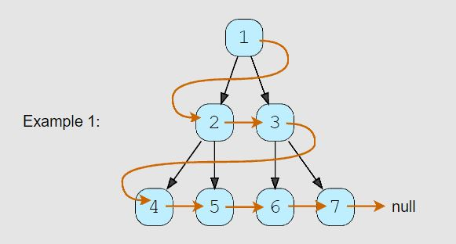

# Connect All Level Order Siblings (medium)

> **Prompt:** Given a binary tree, **connect each node with its level order successor.** The last node of each level should point to the first node of the next level.

<br>

### **Example:**



<br>

### **Big O:**
  - Time: `O(n)`
  - Space: `O(n)`

<br>

### **Code:**

```js
// No comments
const connect_all_siblings = function(root) {
  if(!root) return null;

  let node;
  const queue = [root];

  while(queue.length){
    const qLen = queue.length;

    for(let i = 0; i < qLen; i++){
      node = queue.shift();
      if(node.left)  queue.push(node.left);
      if(node.right) queue.push(node.right);

      node.next = queue.length === 0 ? null : queue[0];
    }
  }
};

// Comments
const connect_all_siblings = function(root) {
  if(!root) return null;

  let node;
  const queue = [root];

  while(queue.length){
    const qLen = queue.length;

    for(let i = 0; i < qLen; i++){
      node = queue.shift();
      if(node.left)  queue.push(node.left);
      if(node.right) queue.push(node.right);

      // Add the first node in the queue as the current node's
      // next property, if there is no node in the queue,
      // set the property to null.
      node.next = queue.length === 0 ? null : queue[0];
    }
  }
};
```
<br>

### **Comments:**
  - The trick with this problem is that we need to add the children to the queue **BEFORE** setting the next node.


<br>

### **Basic Pattern:**
  1. Traverse the tree level by level.
  2. Add the children to the queue **BEFORE** setting the next node to either the first node in the queue, or if the queue is empty set it to null.