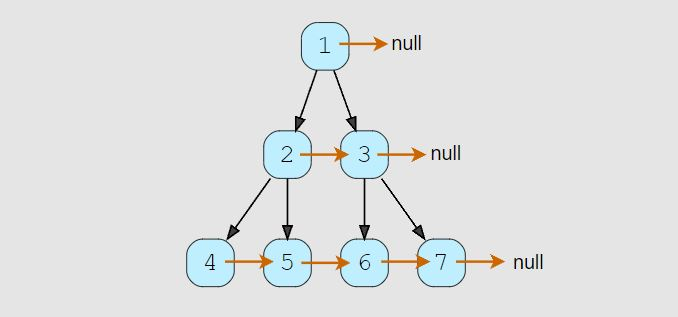

# Connect Level Order Siblings (medium)

> **Prompt:** Given a binary tree, **connect each node with its level order successor.** The last node of each level should point to a null node.

<br>

### **Example:**



<br>

### **Big O:**
  - Time: `O(n)`
  - Space: `O(n)`

<br>

### **Code:**

```js
// No comments
const connect_level_order_siblings = function(root) {
  if(!root) return null;

  let node;
  const queue = [root];

  while(queue.length){
    const qLen = queue.length;

    for(let i = 0; i < qLen; i++){
      node = queue.shift();
      node.next = i === qLen-1 ? null : queue[0];
      if(node.left) queue.push(node.left);
      if(node.right) queue.push(node.right);
    }
  }
};

// Comments
const connect_level_order_siblings = function(root) {
  if(!root) return null;

  let node;
  const queue = [root];

  while(queue.length){
    const qLen = queue.length;

    for(let i = 0; i < qLen; i++){
      node = queue.shift();

      // The next node is either the first node in the queue or null if 
      // we are at the last node in a level.
      node.next = i === qLen-1 ? null : queue[0];


      if(node.left) queue.push(node.left);
      if(node.right) queue.push(node.right);
    }
  }
};
```
<br>

### **Comments:**
  - The trick to understanding this problem is understanding that the next node is the first node in the queue,
    - unless you are at the end of a level, then the next node will be null.


<br>

### **Basic Pattern:**
  1. Traverse the node level by level.
  2. Check that the current node is not the last in the list, 
     1. If it is set it's next property to null, 
     2. Else, make the current node's next property point towards the first node in the queue.