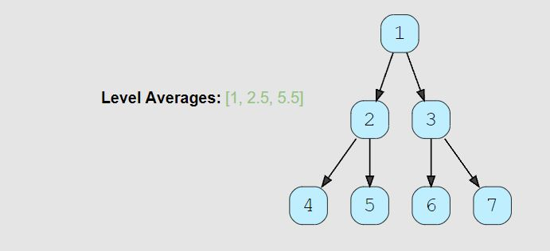

# Level Averages in a Binary Tree (easy)

> **Prompt:** Given a binary tree, **populate an array to represent the averages of all of its levels.**

<br>

### **Example:**



<br>

### **Big O:**
  - Time: `O(n)`
  - Space: `O(n)`

<br>

### **Code:**

```js
// No comments
const find_level_averages = function(root) {
  if(!root) return [];
  let node;
  const results = [], queue = [root];

  while(queue.length){
    const qLen = queue.length;
    let totalVal = 0;

    for(let i = 0; i < qLen; i++){
      node = queue.shift();
      totalVal += node.val;
      if(node.left)  queue.push(node.left);
      if(node.right) queue.push(node.right);
    }
    const average = totalVal/qLen;
    results.push(average);
  }
  return results;
};

// Comments
const find_level_averages = function(root) {
  if(!root) return [];
  let node;
  const results = [], queue = [root];

  while(queue.length){
    const qLen = queue.length;
    let totalVal = 0; // Track the total of all values for a given level.

    for(let i = 0; i < qLen; i++){
      node = queue.shift();
      totalVal += node.val; // Add the current value to the total value.
      if(node.left) queue.push(node.left);
      if(node.right) queue.push(node.right);
    }

    // The qLen is the number of nodes in the current level.
    const average = totalVal/qLen; 

    results.push(average); 
  }
  return results;
};
```
<br>

### **Comments:**
  - Once you recognize that the problem is a BFS problem, it is just a matter of BFS traversal of the tree,then adding up the values for a given level and finding the average.


<br>

### **Basic Pattern:**
  1. Traverse the tree level by level
  2. Total up the value of every node within the level
  3. Find the average of the level
  4. Add average to return array

<br>

### **Similar Problem:**

#### Largest Value Per Level

```js
var largestValues = function(root) {
  if(!root) return [];
  let node;
  const results = [], queue = [root];

  while(queue.length){
    const qLen = queue.length;

    // Create a variable to track the largest value for each level
    // Setting to -Infinity will allow for any negative number as well.
    let largestVal = -Infinity;

    for(let i = 0; i < qLen; i++){
      node = queue.shift();
      largestVal = Math.max(largestVal, node.val); // Find the largest
      if(node.left) queue.push(node.left);
      if(node.right) queue.push(node.right);
    }
    results.push(largestVal); // Add largest to the results array.
  }
  return results;
};
```