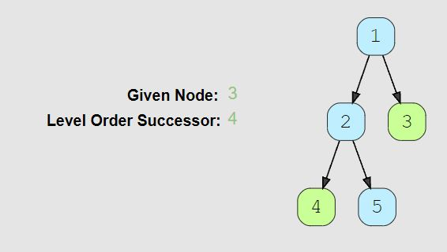

# Level Order Successor (easy)

> **Prompt:** Given a binary tree and a node, **find the level order successor of the given node in the tree**. The level order successor is the **node** that appears right after the given node in the level order traversal.
> - **NOTE:** The prompt is asking for the **node** back, not just the value within the node.

<br>

### **Example:**



<br>

### **Big O:**
  - Time: `O(n)`
  - Space: `O(n)`

<br>

### **Code:**

```js
// No comments
const find_successor = function(root, key) {
  if(!root || !key) return null;

  let node;
  const queue = [root];
  let nodeFound = false;

  while(queue.length){
    const qLen = queue.length;
    for(let i = 0; i < qLen; i++){
      node = queue.shift();

      if(nodeFound) return node;
      if(node.val === key) nodeFound = true;

      if(node.left) queue.push(node.left);
      if(node.right) queue.push(node.right);
    }
  }
  
  return null;
};

// Comments
const find_successor = function(root, key) {
  if(!root || !key) return null;

  let node;
  const queue = [root];
  let nodeFound = false; // Flag to indicate we have found the key node

  while(queue.length){
    const qLen = queue.length;
    for(let i = 0; i < qLen; i++){
      node = queue.shift();

      // If the key node has been found, we return the next node we see.
      if(nodeFound) return node;

      // If we find the key node make the nodeFound flag as true.
      if(node.val === key) nodeFound = true; 

      if(node.left) queue.push(node.left);
      if(node.right) queue.push(node.right);
    }
  }
  return null;
};
```
<br>

### **Comments:**
  - Make sure to always **read prompt question carefully**, it is asking for the whole node to be returned.
  - We can use a **flag** to track if the key node has been found.


<br>

### **Basic Pattern:**
  1. Traverse the tree level by level.
  2. Set nodeFound to true when found.
  3. Return the next node.