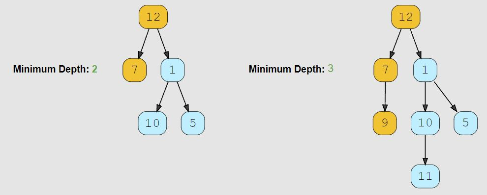

# Minimum Depth of a Binary Tree (easy)

> **Prompt:** Find the minimum depth of a binary tree. **The minimum depth is the number of nodes along the shortest path from the root node to the nearest leaf node.**
> - **NOTE:** Notice that this prompt says nothing about levels or the type of traversal needed!

<br>

### **Example:**



<br>

### **Big O:**
  - Time: `O(n)`
  - Space: `O(n)` due to queue

<br>

### **Code:**

```js
// No comments
const find_minimum_depth = function(root) {
  if(!root) return 0;

  let node;
  let levelCount = 1;
  const queue = [root];

  while(queue.length){
    const qLen = queue.length;
    for(let i = 0; i < qLen; i++){
      node = queue.shift();
      if(!node.left && !node.right) return levelCount;
      if(node.left)  queue.push(node.left);
      if(node.right) queue.push(node.right);
    }
    levelCount++;
  }
};

// Comments
const find_minimum_depth = function(root) {
  if(!root) return 0;

  let node;
  let levelCount = 1; // Variable to track level.
  const queue = [root];

  while(queue.length){
    const qLen = queue.length;
    for(let i = 0; i < qLen; i++){
      node = queue.shift();

      // If we find a node with no children return the level.
      if(!node.left && !node.right) return levelCount; 

      if(node.left) queue.push(node.left);
      if(node.right) queue.push(node.right);
    }
    levelCount++; // Increment level.
  }
};
```
<br>

### **Comments:**
  - Traverse the tree, track which level you are on, return the level once you find a node with no children.
  - The first time we find a node with no children, the current level is the shortest number of nodes from root to leaf.


<br>

### **Basic Pattern:**
  1. Traverse tree level by level.
  2. Count the levels.
  3. If we find a node with no children, return the level. 