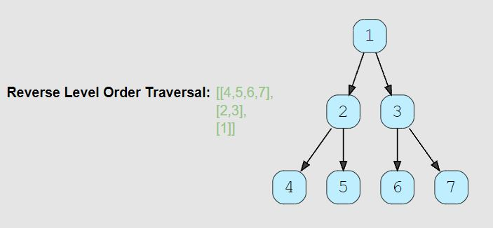

# Reverse Level Order Traversal (medium)

> **Prompt:** Given a binary tree, populate an array to represent its **level-by-level traversal in reverse order**, i.e., the lowest level comes first. 
> - You should populate the values of all nodes in each level from left to right in separate sub-arrays.

<br>

### **Example:**



<br>

### **Big O:**
  - Time: `O(n)`
  - Space: `O(n)`

<br>

### **Code:**

```js
// No comments
const traverse = function(root) {
  if(!root || root.length === 0) return [];

  let node;
  const results = [], queue = [root];
  
  while(queue.length){
      const qLen = queue.length;
      const level = [];

      for(let i = 0; i < qLen; i++){
          node = queue.shift();
          level.push(node.val);
          if(node.left) queue.push(node.left);
          if(node.right) queue.push(node.right);
      }

      results.push(level);
  }
  return results.reverse();
};

// Comments
const traverse = function(root) {
  
  // Check to make sure our tree isn't empty
  if(!root || root.length === 0) return [];

  let node; // node to store current node.

  // Results array and queue with root as first value.
  const results = [], queue = [root];
  
  // while there is nodes in the queue.
  while(queue.length){

    // Save the current length of the queue, this needs to be SEPARATE from the 
    // queue length, because the queue length will grow as we run our for loop.
      const qLen = queue.length;

      const level = []; // Array to hold values at the current level.

      // Loop for the length of the queue before starting the loop.
      for(let i = 0; i < qLen; i++){

          // Set current node to be the first node in the queue.
          node = queue.shift();

          // Add the current nodes value to the level array.
          level.push(node.val);

          // Add the current nodes children to the queue.
          if(node.left) queue.push(node.left);
          if(node.right) queue.push(node.right);
      }

      // Add the current level array to the results array.
      results.push(level);
  }

  // Reverse the results array before returning it, 
  // this will give us a the levels from leaf to root.
  return results.reverse();
};
```
<br>

### **Comments:**
  - The results array can simply be reversed to change the order of the levels from top to bottom, to bottom to top.
    - In some tutorials it tells you to unshift into the results array, but this will add time IF we are using an array instead of an actual queue.
    - Pushing to the results array and then reversing at the end will be faster.


<br>

### **Basic Pattern:**
  1. Check to make sure our input is valid, and the tree isn't empty.
  2. Create a results array and a queue with the root node as the first node.
  3. Loop while there is nodes in the queue
     1. Create a variable that holds the current length of the queue.
     2. Create an array to store all the values at the current level.
     3. Create a for loop that will run for as many nodes are currently in the queue.
        1. Set the current node to be the first node unshifted from the queue.
        2. Add the current nodes value to the level array.
        3. Add the current nodes children to the queue.
     4. Add the current level to the results array.
  4. Reverse the results array.
  5. Return the results array.