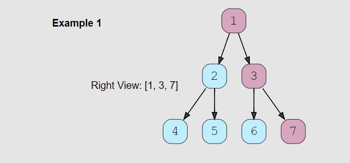

# Right View of a Binary Tree (easy)

> **Prompt:** Given a binary tree, **return an array containing nodes in its right view.** 
> - The right view of a binary tree is the set of nodes visible when the tree is seen from the right side.

<br>

### **Example:**



<br>

### **Big O:**
  - Time: `O(n)`
  - Space: `O(n)`

<br>

### **Code:**

```js
// No comments
const tree_right_view = function(root) {
  if(!root) return null;

  let node;
  const results = [], queue = [root];

  while(queue.length){
    const qLen = queue.length;

    for(let i = 0; i < qLen; i++){
      node = queue.shift();

      if(i === qLen-1) results.push(node.val);

      if(node.left)  queue.push(node.left);
      if(node.right) queue.push(node.right);
    }
  }
  return results;
};

// Comments
const tree_right_view = function(root) {
  if(!root) return null;

  let node;
  const results = [], queue = [root];

  while(queue.length){
    const qLen = queue.length;

    for(let i = 0; i < qLen; i++){
      node = queue.shift();

      // If we are at the end of a level add the value to the results array.
      if(i === qLen-1) results.push(node.val); 

      if(node.left)  queue.push(node.left);
      if(node.right) queue.push(node.right);
    }
  }
  return results;
};
```
<br>

### **Comments:**
  - The trick with this problem is knowing how to find the last node of a level.
    - In the level for loop: `i === qLen-1`. 


<br>

### **Basic Pattern:**
  1. Traverse the tree level by level.
  2. Add the last node of the level to the results array.