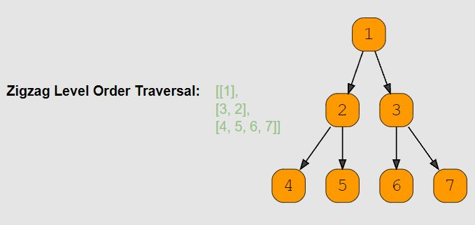

# Zigzag Traversal (medium)

> **Prompt:** Given a binary tree, **populate an array to represent its zigzag level order traversal.** 
> - You should populate the values of all nodes of the first level from left to right, then right to left for the next level and keep alternating in the same manner for the following levels.
> - **NOTE:** it is **not** clear from the prompt exactly how the return data should look, so as always, **it is important to clarify the shape of the data for the return value.**

<br>

### **Example:**



<br>

### **Big O:**
  - Time: `O(n)`
  - Space: `O(n)`

<br>

### **Code:**

```js
// No comments
const zigZagTraverse = function(root) {
  if(!root) return [];

  let node;
  let levelCount = 1;

  const results = [], queue = [root];

  while(queue.length){
    const qLen = queue.length;
    const level = [];

    for(let i = 0; i < qLen; i++){
      node = queue.shift();
      level.push(node.val);
      if(node.left) queue.push(node.left);
      if(node.right) queue.push(node.right);
    }

    if(levelCount % 2 === 0) level.reverse();
    results.push(level);

    levelCount++;
  }
  return results;
};


// Comments
const zigZagTraverse = function(root) {
  if(!root) return []; // Check that we have a tree to traverse
  let node; // Node to hold current node

  let levelCount = 1; // We will need to track the current level to know which levels to reverse.

  const results = [], queue = [root];

  while(queue.length){
    const qLen = queue.length; // SEPARATE THE CURRENT LENGTH to use in the for loop!
    const level = []; // Array to hold the current level's values.

    for(let i = 0; i < qLen; i++){

      // take the first node from the queue and 
      // add it's value to the level, and it's children to the queue.
      node = queue.shift();
      level.push(node.val);
      if(node.left) queue.push(node.left);
      if(node.right) queue.push(node.right);
    }

    // KEY POINT:
    // If the level is even we need to reverse it's values
    // so they read r to l instead of l to r before
    // adding it to the results array.
    if(levelCount % 2 === 0) level.reverse();
    results.push(level);

    // Each time through we will increment the level;
    levelCount++;
  }

  return results;
};
```
<br>

### **Comments:**
  - The trick with this problem is **tracking the level and reversing the values in even numbered levels** prior to adding that level to the results array.
  - IF we are using an actual queue instead of an array for the level we can unshift into the front of the level for the levels that need reversed.


<br>

### **Basic Pattern:**
  1. Count the levels as you traverse the tree in level order.
  2. After adding all values for a given level, if the level is even numbered, 
     1. reverse the values in the level prior to adding it to the results array.

<br>

### **Alternate Solution - Assuming Queues**

```js
const zigZagTraverse = function(root) {
  if(!root) return [];

  let node;
  let levelCount = 1;

  const results = [], queue = [root];

  while(queue.length){
    const qLen = queue.length;
    const levelQueue = [];

    for(let i = 0; i < qLen; i++){
      node = queue.shift();

      // Here the difference is that we are unshifting,
      // adding to the front of the queue in O(1) time.
      levelCount % 2 === 0 ? 
        levelQueue.unshift(node.val) : 
        levelQueue.push(node.val);

      if(node.left) queue.push(node.left);
      if(node.right) queue.push(node.right);
    }

    results.push(levelQueue);

    levelCount++;
  }
  return results;
};
```

### **Basic Pattern:**
  1. Count the levels as you traverse the tree in level order.
  2. If the current level is even, 
     1. Add the current nodes value to the **front** of the level queue.
  3. If the current level is odd,
     1. Add the current nodes value to the **end** of the level queue.