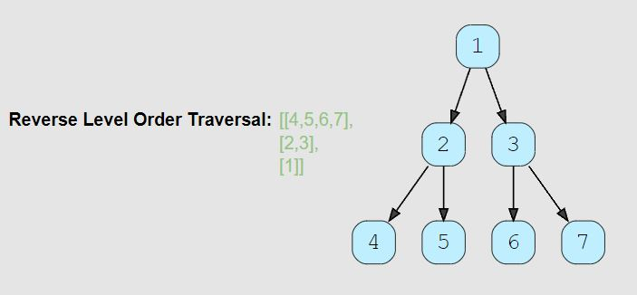

# Tree: Breadth First Search

<hr>

## General Notes


- Any problem involving the **traversal of a tree in a level-by-level order** can be efficiently solved using Breadth First Search. We will use a Queue to keep track of all the nodes of a level before we jump to the next level. 
  - **This also means that the space complexity of the algorithm will be O(W), where ‘W’ is the maximum number of nodes on any level.**
- Can think of the queue as a todo list.

<br>

- Example of BFS from Colt Steele JS_DSA course.

```js

  BFS(node){
    let data  = [];        //This will hold our data to return
    let queue = [];        //This will keep track of the nodes in our tree

    queue.push(node);      //This pushes the root node into the end of our tree, making it the first item in our queue
  
    while(queue.length){                      // Loop while there is something in the queue. We can't just say while(queue), an empty array still returns true
      node = queue.shift();                   // Take the node at the beginning of the queue and put it in the node
      data.push(node.value);                  // Push the current node's value into our data array
      if(node.left) queue.push(node.left);    // Check if there is a left node, if so add it to the queue
      if(node.right) queue.push(node.right);  // Check if there is a right node, if so add it to the queue
    }
    return data; // return the data in our array
  }

``` 

## Problems

## Binary Tree Level Order Traversal (easy)

> **Prompt:** Given a binary tree, populate an array to represent its level-by-level traversal. 

#### Note: this first problem will cover how to print all values into one array.

<br>

### **Example:**


<br>

### **Big O:**
  - Time: `O(n)`
  - Space: `O(n)` The return array will grow as the input tree grows

<br>

### **Code:**

```js
// No comments
const traverse = function(root) {
  let   node;
  const queue   = [root],
        results = [];

  while(queue.length){
    node = queue.shift();
    results.push(node.val);
    if(node.left)  queue.push(node.left);
    if(node.right) queue.push(node.right);
  }

  return results;
};

// Comments
const traverse = function(root) {

  // Create a variable that will hold the current node.
  let node;

  // Create an array to act as a queue and add the root as the first element.
  // Create a results array to hold all the values we will return.
  const queue  = [root],
        results = [];

  // Loop while the queue isn't empty.
  while(queue.length){

    // Set node equal to the first item removed from the queue.
    node = queue.shift();

    // Add that nodes value to the results array.
    results.push(node.val);

    // If that node has a left node child, at it to the queue.
    if(node.left) queue.push(node.left);

    // If that node has a left node child, at it to the queue.
    if(node.right) queue.push(node.right);
  }

  return results;
};
```
<br>

### **Comments:**
  - With Breadth First Traversal, we use an **iterative approach** utilizing a **queue**.


<br>

### **Basic Pattern:**
  1. Starting with the root node as the first node in a queue,
  2. Loop while there are items in the queue.
     1. Set the current node to be the first node shifted out of the queue.
     2. Add the current nodes val to a results array
     3. Add the current nodes children to a queue

<br>

### **Algorithm:**
  1. Create a variable that will hold the current node.
  2. Create an array to act as a queue and add the root as the first element.
  3. Create a results array to hold all the values we will return.
  4. Loop while the queue isn't empty.
     1. Remove the first node from the queue and set the current node equal to it.
     2. Add the current nodes value to the results array.
     3. If the current node has a left node child, at it to the queue.
     4. If the current node has a left node child, at it to the queue.
  5. Return the results array.


## Binary Tree Level Order Traversal (Store Each Level)  (medium)

> **Prompt:** Given a binary tree, populate an array to represent its level-by-level traversal. **You should populate the values of all nodes of each level from left to right in separate sub-arrays.**

<br>

### **Example:**


<br>

### **Big O:**
  - Time: `O(n)`
  - Space: `O(n)` The return array will grow as the input tree grows

<br>

### **Code:**

```js
// No comments
const traverse = function(root) {
  let results = [];
  let node;
  const queue = [root];

  while(queue.length){
    let level = [];
    const qLength = queue.length;
    
    for(let i = 0; i < qLength; i++){
          node = queue.shift();
          level.push(node.val);
          if(node.left) queue.push(node.left);
          if(node.right) queue.push(node.right);
    }
    results.push(level);
  }

  return results;
};
// Comments
const traverse = function(root) {
  
  let node; // Create a node to hold our current node;

  // Create two arrays, one to act as a queue holding the 
  // root as the first element, and one to hold the level arrays.
  const queue   = [root],
        results = [];

  // Loop while there is nodes in the queue.
  while(queue.length){

    // Create a level array to hold the values of a given level
    const level = [];

    // Create a variable to store the current length of the queue,
    // this length must be separate from the queue length in the for loop because
    // the queue will grow as we add children to the queue inside of the loop.
    const qLength = queue.length;

    // Loop the current length of the queue, before adding 
    // the nodes from the current level.
    for(let i = 0; i < qLength; i++){
          // Take the first node out of the queue.
          node = queue.shift();

          // Add it's value to the current levels result array.
          level.push(node.val);

          // Add it's children to the queue.
          if(node.left) queue.push(node.left);
          if(node.right) queue.push(node.right);
    }
    
    // Add the current level array to the results array.
    results.push(level);
  }

  return results;
};
```
<br>

### **Comments:**
  - With Breadth First Traversal, we use an **iterative approach** utilizing a **queue**.
  - We need to separate the length of the queue prior to using that length in the for loop!
    - If not, each time we move through the for loop and add children nodes to the queue that length will grow.
  - To store all levels individually we need a second loop that will run for the current values in the queue.
  - We will store the values at a given level within an array and then store that array in the results array.


<br>

### **Basic Pattern:**
  1. Starting with the root node as the first node in a queue,
  2. Loop while there are items in the queue.
     1. Create an array to hold the values of the given level.
     2. Loop for as long as the current length of the queue.
        1. Set the current node to be the first node shifted out of the queue.
        2. Add the current nodes val to the level array
        3. Add the current nodes children to a queue
     3. Add the level array to the results array.

<br>

## Reverse Level Order Traversal (medium)

> **Prompt:** Given a binary tree, populate an array to represent its **level-by-level traversal in reverse order**, i.e., the lowest level comes first. You should populate the values of all nodes in each level from left to right in separate sub-arrays.

<br>

### **Example:**



<br>

### **Big O:**
  - Time: `O(n)`
  - Space: `O(n)`

<br>

### **Code:**

```js
// No comments
const traverse = function(root) {
  if(!root || root.length === 0) return [];

  let node;
  const results = [], queue = [root];
  
  while(queue.length){
      const qLength = queue.length;
      const level = [];

      for(let i = 0; i < qLength; i++){
          node = queue.shift();
          level.push(node.val);
          if(node.left) queue.push(node.left);
          if(node.right) queue.push(node.right);
      }

      results.push(level);
  }
  return results.reverse();
};

// Comments
const traverse = function(root) {
  
  // Check to make sure our tree isn't empty
  if(!root || root.length === 0) return [];

  let node; // node to store current node.

  // Results array and queue with root as first value.
  const results = [], queue = [root];
  
  // while there is nodes in the queue.
  while(queue.length){

    // Save the current length of the queue, this needs to be SEPARATE from the 
    // queue length, because the queue length will grow as we run our for loop.
      const qLength = queue.length;

      const level = []; // Array to hold values at the current level.

      // Loop for the length of the queue before starting the loop.
      for(let i = 0; i < qLength; i++){

          // Set current node to be the first node in the queue.
          node = queue.shift();

          // Add the current nodes value to the level array.
          level.push(node.val);

          // Add the current nodes children to the queue.
          if(node.left) queue.push(node.left);
          if(node.right) queue.push(node.right);
      }

      // Add the current level array to the results array.
      results.push(level);
  }

  // Reverse the results array before returning it, this will
  // give us a the levels from leaf to root.
  return results.reverse();
};
```
<br>

### **Comments:**
  - The results array can simply be reversed to change the order of the levels from top to bottom, to bottom to top.
    - In some tutorials it tells you to unshift into the results array, but this will add time.
    - Pushing to the results array and then reversing at the end will be faster.


<br>

### **Basic Pattern:**
  1. Check to make sure our input is valid, and the tree isn't empty.
  2. Create a results array and a queue with the root node as the first node.
  3. Loop while there is nodes in the queue
     1. Create a variable that holds the current length of the queue.
     2. Create an array to store all the values at the current level.
     3. Create a for loop that will run for as many nodes are currently in the queue.
        1. Set the current node to be the first node unshifted from the queue.
        2. Add the current nodes value to the level array.
        3. Add the current nodes children to the queue.
     4. Add the current level to the results array.
  4. Reverse the results array.
  5. Return the results array.

