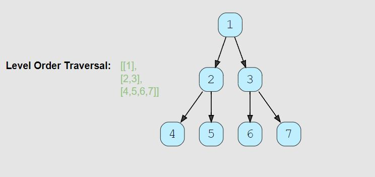

# Tree: Breadth First Search

<hr>

## General Notes


- Any problem involving the **traversal of a tree in a level-by-level order** can be efficiently solved using Breadth First Search. We will use a Queue to keep track of all the nodes of a level before we jump to the next level. 
  - **This also means that the space complexity of the algorithm will be O(W), where ‘W’ is the maximum number of nodes on any level.**
- Can think of the queue as a todo list.

<br>

- Example of BFS from Colt Steele JS_DSA course.

```js

  BFS(node){
    let data  = [];        //This will hold our data to return
    let queue = [];        //This will keep track of the nodes in our tree

    queue.push(node);      //This pushes the root node into the end of our tree, making it the first item in our queue
  
    while(queue.length){                      // Loop while there is something in the queue. We can't just say while(queue), an empty array still returns true
      node = queue.shift();                   // Take the node at the beginning of the queue and put it in the node
      data.push(node.value);                  // Push the current node's value into our data array
      if(node.left) queue.push(node.left);    // Check if there is a left node, if so add it to the queue
      if(node.right) queue.push(node.right);  // Check if there is a right node, if so add it to the queue
    }
    return data; // return the data in our array
  }

``` 

## Problems

## Problem Name (Difficulty)

> **Prompt:** Given a binary tree, populate an array to represent its level-by-level traversal. You should populate the values of all nodes of each level from left to right in separate sub-arrays.

<br>

### **Example:**



<br>

### **Big O:**
  - Time: `O(n)`
  - Space: `O(n)` The return array will grow as the input tree grows

<br>

### **Code:**

```js
// No comments
const traverse = function(root) {
  let   node;
  const queue   = [root],
        results = [];

  while(queue.length){
    node = queue.shift();
    results.push(node.val);
    if(node.left)  queue.push(node.left);
    if(node.right) queue.push(node.right);
  }

  return results;
};

// Comments
const traverse = function(root) {

  // Create a variable that will hold the current node.
  let node;

  // Create an array to act as a queue and add the root as the first element.
  // Create a results array to hold all the values we will return.
  const queue  = [root],
        results = [];

  // Loop while the queue isn't empty.
  while(queue.length){

    // Set node equal to the first item removed from the queue.
    node = queue.shift();

    // Add that nodes value to the results array.
    results.push(node.val);

    // If that node has a left node child, at it to the queue.
    if(node.left) queue.push(node.left);

    // If that node has a left node child, at it to the queue.
    if(node.right) queue.push(node.right);
  }

  return results;
};
```
<br>

### **Comments:**
  - With Breadth First Traversal, we use an **iterative approach** utilizing a **queue**.


<br>

### **Basic Pattern:**
  1. Starting with the root node as the first node in a queue,
  2. Loop while there are items in the queue.
     1. Set the current node to be the first node shifted out of the queue.
     2. Add the current nodes val to a results array
     3. Add the current nodes children to a queue

<br>

### **Algorithm:**
  1. Create a variable that will hold the current node.
  2. Create an array to act as a queue and add the root as the first element.
  3. Create a results array to hold all the values we will return.
  4. Loop while the queue isn't empty.
     1. Remove the first node from the queue and set the current node equal to it.
     2. Add the current nodes value to the results array.
     3. If the current node has a left node child, at it to the queue.
     4. If the current node has a left node child, at it to the queue.
  5. Return the results array.
