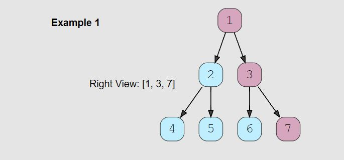

# Tree: Breadth First Search

<hr>

## General Notes


- Any problem involving the **traversal of a tree in a level-by-level order** can be efficiently solved using Breadth First Search. We will use a Queue to keep track of all the nodes of a level before we jump to the next level. 
  - **This also means that the space complexity of the algorithm will be O(W), where ‘W’ is the maximum number of nodes on any level.**
- Can think of the queue as a todo list.
- If **LEVEL** is mentioned you most likely are looking at a BFS problem.
  
<br>

- **It is always important to understand how the nodes are shaped!**
  - Sometimes it is `this.val`, sometimes `this.value`
    - Also note what happens if a property is left undefined like: 
      - `this.val = (val===undefined ? 0 : val)`
  - Ex: 

```js
 function TreeNode(val, left, right) {
     this.val = (val===undefined ? 0 : val)
     this.left = (left===undefined ? null : left)
     this.right = (right===undefined ? null : right)
 }
```

<br>

- Example of BFS from Colt Steele JS_DSA course.

```js

  BFS(node){
    let data  = [];        //This will hold our data to return
    let queue = [];        //This will keep track of the nodes in our tree

    queue.push(node);      //This pushes the root node into the end of our tree, making it the first item in our queue
  
    while(queue.length){                      // Loop while there is something in the queue. We can't just say while(queue), an empty array still returns true
      node = queue.shift();                   // Take the node at the beginning of the queue and put it in the node
      data.push(node.value);                  // Push the current node's value into our data array
      if(node.left) queue.push(node.left);    // Check if there is a left node, if so add it to the queue
      if(node.right) queue.push(node.right);  // Check if there is a right node, if so add it to the queue
    }
    return data; // return the data in our array
  }

``` 

## Problems

## Binary Tree Level Order Traversal (easy)

> **Prompt:** Given a binary tree, populate an array to represent its level-by-level traversal. 

#### Note: this first problem will cover how to print all values into one array.

<br>

### **Example:**


<br>

### **Big O:**
  - Time: `O(n)`
  - Space: `O(n)` The return array will grow as the input tree grows

<br>

### **Code:**

```js
// No comments
const traverse = function(root) {
  let   node;
  const queue   = [root],
        results = [];

  while(queue.length){
    node = queue.shift();
    results.push(node.val);
    if(node.left)  queue.push(node.left);
    if(node.right) queue.push(node.right);
  }

  return results;
};

// Comments
const traverse = function(root) {

  // Create a variable that will hold the current node.
  let node;

  // Create an array to act as a queue and add the root as the first element.
  // Create a results array to hold all the values we will return.
  const queue  = [root],
        results = [];

  // Loop while the queue isn't empty.
  while(queue.length){

    // Set node equal to the first item removed from the queue.
    node = queue.shift();

    // Add that nodes value to the results array.
    results.push(node.val);

    // If that node has a left node child, at it to the queue.
    if(node.left) queue.push(node.left);

    // If that node has a left node child, at it to the queue.
    if(node.right) queue.push(node.right);
  }

  return results;
};
```
<br>

### **Comments:**
  - With Breadth First Traversal, we use an **iterative approach** utilizing a **queue**.


<br>

### **Basic Pattern:**
  1. Starting with the root node as the first node in a queue,
  2. Loop while there are items in the queue.
     1. Set the current node to be the first node shifted out of the queue.
     2. Add the current nodes val to a results array
     3. Add the current nodes children to a queue

<br>

### **Algorithm:**
  1. Create a variable that will hold the current node.
  2. Create an array to act as a queue and add the root as the first element.
  3. Create a results array to hold all the values we will return.
  4. Loop while the queue isn't empty.
     1. Remove the first node from the queue and set the current node equal to it.
     2. Add the current nodes value to the results array.
     3. If the current node has a left node child, at it to the queue.
     4. If the current node has a left node child, at it to the queue.
  5. Return the results array.


## Binary Tree Level Order Traversal (Store Each Level)  (medium)

> **Prompt:** Given a binary tree, populate an array to represent its level-by-level traversal. **You should populate the values of all nodes of each level from left to right in separate sub-arrays.**

<br>

### **Example:**


<br>

### **Big O:**
  - Time: `O(n)`
  - Space: `O(n)` The return array will grow as the input tree grows

<br>

### **Code:**

```js
// No comments
const traverse = function(root) {
  let results = [];
  let node;
  const queue = [root];

  while(queue.length){
    let level = [];
    const qLength = queue.length;
    
    for(let i = 0; i < qLength; i++){
          node = queue.shift();
          level.push(node.val);
          if(node.left) queue.push(node.left);
          if(node.right) queue.push(node.right);
    }
    results.push(level);
  }

  return results;
};
// Comments
const traverse = function(root) {
  
  let node; // Create a node to hold our current node;

  // Create two arrays, one to act as a queue holding the 
  // root as the first element, and one to hold the level arrays.
  const queue   = [root],
        results = [];

  // Loop while there is nodes in the queue.
  while(queue.length){

    // Create a level array to hold the values of a given level
    const level = [];

    // Create a variable to store the current length of the queue,
    // this length must be separate from the queue length in the for loop because
    // the queue will grow as we add children to the queue inside of the loop.
    const qLength = queue.length;

    // Loop the current length of the queue, before adding 
    // the nodes from the current level.
    for(let i = 0; i < qLength; i++){
          // Take the first node out of the queue.
          node = queue.shift();

          // Add it's value to the current levels result array.
          level.push(node.val);

          // Add it's children to the queue.
          if(node.left) queue.push(node.left);
          if(node.right) queue.push(node.right);
    }
    
    // Add the current level array to the results array.
    results.push(level);
  }

  return results;
};
```
<br>

### **Comments:**
  - With Breadth First Traversal, we use an **iterative approach** utilizing a **queue**.
  - We need to separate the length of the queue prior to using that length in the for loop!
    - If not, each time we move through the for loop and add children nodes to the queue that length will grow.
  - To store all levels individually we need a second loop that will run for the current values in the queue.
  - We will store the values at a given level within an array and then store that array in the results array.


<br>

### **Basic Pattern:**
  1. Starting with the root node as the first node in a queue,
  2. Loop while there are items in the queue.
     1. Create an array to hold the values of the given level.
     2. Loop for as long as the current length of the queue.
        1. Set the current node to be the first node shifted out of the queue.
        2. Add the current nodes val to the level array
        3. Add the current nodes children to a queue
     3. Add the level array to the results array.

<br>

## Reverse Level Order Traversal (medium)

> **Prompt:** Given a binary tree, populate an array to represent its **level-by-level traversal in reverse order**, i.e., the lowest level comes first. You should populate the values of all nodes in each level from left to right in separate sub-arrays.

<br>

### **Example:**


<br>

### **Big O:**
  - Time: `O(n)`
  - Space: `O(n)`

<br>

### **Code:**

```js
// No comments
const traverse = function(root) {
  if(!root || root.length === 0) return [];

  let node;
  const results = [], queue = [root];
  
  while(queue.length){
      const qLength = queue.length;
      const level = [];

      for(let i = 0; i < qLength; i++){
          node = queue.shift();
          level.push(node.val);
          if(node.left) queue.push(node.left);
          if(node.right) queue.push(node.right);
      }

      results.push(level);
  }
  return results.reverse();
};

// Comments
const traverse = function(root) {
  
  // Check to make sure our tree isn't empty
  if(!root || root.length === 0) return [];

  let node; // node to store current node.

  // Results array and queue with root as first value.
  const results = [], queue = [root];
  
  // while there is nodes in the queue.
  while(queue.length){

    // Save the current length of the queue, this needs to be SEPARATE from the 
    // queue length, because the queue length will grow as we run our for loop.
      const qLength = queue.length;

      const level = []; // Array to hold values at the current level.

      // Loop for the length of the queue before starting the loop.
      for(let i = 0; i < qLength; i++){

          // Set current node to be the first node in the queue.
          node = queue.shift();

          // Add the current nodes value to the level array.
          level.push(node.val);

          // Add the current nodes children to the queue.
          if(node.left) queue.push(node.left);
          if(node.right) queue.push(node.right);
      }

      // Add the current level array to the results array.
      results.push(level);
  }

  // Reverse the results array before returning it, this will
  // give us a the levels from leaf to root.
  return results.reverse();
};
```
<br>

### **Comments:**
  - The results array can simply be reversed to change the order of the levels from top to bottom, to bottom to top.
    - In some tutorials it tells you to unshift into the results array, but this will add time.
    - Pushing to the results array and then reversing at the end will be faster.


<br>

### **Basic Pattern:**
  1. Check to make sure our input is valid, and the tree isn't empty.
  2. Create a results array and a queue with the root node as the first node.
  3. Loop while there is nodes in the queue
     1. Create a variable that holds the current length of the queue.
     2. Create an array to store all the values at the current level.
     3. Create a for loop that will run for as many nodes are currently in the queue.
        1. Set the current node to be the first node unshifted from the queue.
        2. Add the current nodes value to the level array.
        3. Add the current nodes children to the queue.
     4. Add the current level to the results array.
  4. Reverse the results array.
  5. Return the results array.

## Zigzag Traversal (medium)

> **Prompt:** Given a binary tree, **populate an array to represent its zigzag level order traversal.** You should populate the values of all nodes of the first level from left to right, then right to left for the next level and keep alternating in the same manner for the following levels.
> - **NOTE:** it is not clear from the prompt exactly how the return data should look, so as always, it is important to clarify the shape of the data for the return value.

<br>

### **Example:**


<br>

### **Big O:**
  - Time: `O(n)`
  - Space: `O(n)`

<br>

### **Code:**

```js
// No comments
const zigZagTraverse = function(root) {
  if(!root) return [];
  let node;
  let levelCount = 1;
  const results = [], queue = [root];

  while(queue.length){
    const qLen = queue.length;
    const level = [];

    for(let i = 0; i < qLen; i++){
      node = queue.shift();
      level.push(node.val);
      if(node.left) queue.push(node.left);
      if(node.right) queue.push(node.right);
    }
    if(levelCount % 2 === 0) results.push(level.reverse());
    else results.push(level);
    levelCount++;
  }
  return results;
};


// Comments
const zigZagTraverse = function(root) {
  if(!root) return []; // Check that we have a tree to traverse
  let node; // Node to hold current node
  let levelCount = 1; // We will need to track the current level to know which levels to reverse.

  const results = [], queue = [root];

  while(queue.length){
    const qLen = queue.length; // SEPARATE THE CURRENT LENGTH to use in the for loop!
    const level = []; // Array to hold the current level's values.

    for(let i = 0; i < qLen; i++){

      // take the first node from the queue and 
      // add it's value to the level, and it's children to the queue.
      node = queue.shift();
      level.push(node.val);
      if(node.left) queue.push(node.left);
      if(node.right) queue.push(node.right);
    }

    // KEY POINT:
    // If the level is even we need to reverse it's values
    // so they read r to l instead of l to r before
    // adding it to the results array.
    if(levelCount % 2 === 0) results.push(level.reverse());
    else results.push(level);

    // Each time through we will increment the level;
    levelCount++;
  }

  return results;
};
```
<br>

### **Comments:**
  - The trick with this problem is **tracking the level and reversing the values in even numbered levels** before adding that level to the results array.


<br>

### **Basic Pattern:**
  1. Count the levels as you traverse the tree in level order.
  2. After adding all values for a given level, if the level is even numbered, 
     1. reverse the values in the level prior to adding it to the results array.

<br>


## Level Averages in a Binary Tree (easy)

> **Prompt:** Given a binary tree, **populate an array to represent the averages of all of its levels.**

<br>

### **Example:**


<br>

### **Big O:**
  - Time: `O(n)`
  - Space: `O(n)`

<br>

### **Code:**

```js
// No comments
const find_level_averages = function(root) {
  if(!root) return [];
  let node;
  const results = [], queue = [root];

  while(queue.length){
    const qLen = queue.length;
    let totalVal = 0;

    for(let i = 0; i < qLen; i++){
      node = queue.shift();
      totalVal += node.val;
      if(node.left) queue.push(node.left);
      if(node.right) queue.push(node.right);
    }
    const average = totalVal/qLen;
    results.push(average);
  }
  return results;
};

// Comments
const find_level_averages = function(root) {
  if(!root) return [];
  let node;
  const results = [], queue = [root];

  while(queue.length){
    const qLen = queue.length;
    let totalVal = 0; // Track the total of all values for a given level.

    for(let i = 0; i < qLen; i++){
      node = queue.shift();
      totalVal += node.val; // Add the current value to the total value.
      if(node.left) queue.push(node.left);
      if(node.right) queue.push(node.right);
    }
    const average = totalVal/qLen; // The qLen is the number of nodes in the current level.
    results.push(average); // Add average to the results array.
  }
  return results;
};
```
<br>

### **Comments:**
  - Once you recognize that the problem is a BFS problem, it is just a matter of BFS traversal of the tree,
    - adding up the values for a given level and finding the average.


<br>

### **Basic Pattern:**
  1. Traverse the tree level by level
  2. Total up the value of every node within the level
  3. Find the average of the level
  4. Add average to return array

<br>

### **Similar Problem:**

#### Largest Value Per Level

```js
var largestValues = function(root) {
  if(!root) return [];
  let node;
  const results = [], queue = [root];

  while(queue.length){
    const qLen = queue.length;

    // Create a variable to track the largest value for each level
    // Setting to -Infinity will allow for any negative number as well.
    let largestVal = -Infinity;

    for(let i = 0; i < qLen; i++){
      node = queue.shift();
      largestVal = Math.max(largestVal, node.val); // Find the largest
      if(node.left) queue.push(node.left);
      if(node.right) queue.push(node.right);
    }
    results.push(largestVal); // Add largest to the results array.
  }
  return results;
};
```

<br>

## Minimum Depth of a Binary Tree (easy)

> **Prompt:** Find the minimum depth of a binary tree. **The minimum depth is the number of nodes along the shortest path from the root node to the nearest leaf node.**
> - **NOTE:** Notice that this prompt says nothing about levels of the type of traversal needed!

<br>

### **Example:**


<br>

### **Big O:**
  - Time: `O(n)`
  - Space: `O(n)` due to queue

<br>

### **Code:**

```js
// No comments
const find_minimum_depth = function(root) {
  if(!root) return 0;

  let node;
  let levelCount = 1;
  const queue = [root];

  while(queue.length){
    const qLen = queue.length;
    for(let i = 0; i < qLen; i++){
      node = queue.shift();
      if(!node.left && !node.right) return levelCount;
      if(node.left) queue.push(node.left);
      if(node.right) queue.push(node.right);
    }
    levelCount++;
  }
};

// Comments
const find_minimum_depth = function(root) {
  if(!root) return 0;

  let node;
  let levelCount = 1; // Variable to track level.
  const queue = [root];

  while(queue.length){
    const qLen = queue.length;
    for(let i = 0; i < qLen; i++){
      node = queue.shift();
      if(!node.left && !node.right) return levelCount; // If we find a node with no children return the level.
      if(node.left) queue.push(node.left);
      if(node.right) queue.push(node.right);
    }
    levelCount++; // Increment level.
  }
};
```
<br>

### **Comments:**
  - Traverse the tree, track which level you are on, return the level once you find a node with no children


<br>

### **Basic Pattern:**
  1. Traverse tree level by level.
  2. Count the levels.
  3. If we find a node with no children, return the level.

<br>

## Level Order Successor (easy)

> **Prompt:** Given a binary tree and a node, **find the level order successor of the given node in the tree**. The level order successor is the **node** that appears right after the given node in the level order traversal.
> - **NOTE:** The prompt is asking for the **node** back, not just the value within the node.

<br>

### **Example:**


<br>

### **Big O:**
  - Time: `O(n)`
  - Space: `O(n)`

<br>

### **Code:**

```js
// No comments
const find_successor = function(root, key) {
  if(!root || !key) return null;

  let node;
  const queue = [root];
  let nodeFound = false;

  while(queue.length){
    const qLen = queue.length;
    for(let i = 0; i < qLen; i++){
      node = queue.shift();
      if(nodeFound) return node;
      if(node.val === key) nodeFound = true;
      if(node.left) queue.push(node.left);
      if(node.right) queue.push(node.right);
    }
  }
  
  return null;
};

// Comments
const find_successor = function(root, key) {
  if(!root || !key) return null;

  let node;
  const queue = [root];
  let nodeFound = false; // Flag to indicate we have found the key node

  while(queue.length){
    const qLen = queue.length;
    for(let i = 0; i < qLen; i++){
      node = queue.shift();
      if(nodeFound) return node; // If the key node has been found, we return the next node we see.
      if(node.val === key) nodeFound = true; // If we find the key node make the nodeFound flag as true.
      if(node.left) queue.push(node.left);
      if(node.right) queue.push(node.right);
    }
  }
  return null;
};
```
<br>

### **Comments:**
  - Make sure to read prompt question carefully, it is asking for the whole node to be returned.
  - We can use a flag to track if the key node has been found.


<br>

### **Basic Pattern:**
  1. Traverse the tree level by level.
  2. Set nodeFound to true when found.
  3. Return the next node.

<br>

## Connect Level Order Siblings (medium)

> **Prompt:** Given a binary tree, **connect each node with its level order successor.** The last node of each level should point to a null node.

<br>

### **Example:**


<br>

### **Big O:**
  - Time: `O(n)`
  - Space: `O(n)`

<br>

### **Code:**

```js
// No comments
const connect_level_order_siblings = function(root) {
  if(!root) return null;

  let node;
  const queue = [root];

  while(queue.length){
    const qLen = queue.length;

    for(let i = 0; i < qLen; i++){
      node = queue.shift();
      node.next = i === qLen-1 ? null : queue[0];
      if(node.left) queue.push(node.left);
      if(node.right) queue.push(node.right);
    }
  }
};

// Comments
const connect_level_order_siblings = function(root) {
  if(!root) return null;

  let node;
  const queue = [root];

  while(queue.length){
    const qLen = queue.length;

    for(let i = 0; i < qLen; i++){
      node = queue.shift();

      // The next node is either the first node in the queue or null if 
      // we are at the last node in a level.
      node.next = i === qLen-1 ? null : queue[0];
      if(node.left) queue.push(node.left);
      if(node.right) queue.push(node.right);
    }
  }
};
```
<br>

### **Comments:**
  - The trick to understanding this problem is understanding that the next node is the first node in the queue...
    - unless you are at the end of a level, then the next node will be null.


<br>

### **Basic Pattern:**
  1. Traverse the node level by level.
  2. Check that the current node is not the last in the list, 
     1. If it is set it's next property to null, 
     2. Else, make the current node's next property point towards the first node in the queue.

<br>

## Connect All Level Order Siblings (medium)

> **Prompt:** Given a binary tree, **connect each node with its level order successor.** The last node of each level should point to the first node of the next level.

<br>

### **Example:**


<br>

### **Big O:**
  - Time: `O(n)`
  - Space: `O(n)`

<br>

### **Code:**

```js
// No comments
const connect_all_siblings = function(root) {
  if(!root) return null;

  let node;
  const queue = [root];

  while(queue.length){
    const qLen = queue.length;

    for(let i = 0; i < qLen; i++){
      node = queue.shift();
      if(node.left)  queue.push(node.left);
      if(node.right) queue.push(node.right);
      node.next = queue.length === 0 ? null : queue[0];
    }
  }
};

// Comments
const connect_all_siblings = function(root) {
  if(!root) return null;

  let node;
  const queue = [root];

  while(queue.length){
    const qLen = queue.length;

    for(let i = 0; i < qLen; i++){
      node = queue.shift();
      if(node.left)  queue.push(node.left);
      if(node.right) queue.push(node.right);
      node.next = queue.length === 0 ? null : queue[0];
    }
  }
};
```
<br>

### **Comments:**
  - The trick with this problem is that we need to add the children to the queue BEFORE setting the next node.


<br>

### **Basic Pattern:**
  1. Traverse the tree level by level.
  2. Add the children to the queue BEFORE setting the next node to either the first node in the queue, or if the queue is empty set it to null.

<br>

## Right View of a Binary Tree (easy)

> **Prompt:** Given a binary tree, **return an array containing nodes in its right view.** 
> - The right view of a binary tree is the set of nodes visible when the tree is seen from the right side.

<br>

### **Example:**



<br>

### **Big O:**
  - Time: `O(n)`
  - Space: `O(n)`

<br>

### **Code:**

```js
// No comments
const tree_right_view = function(root) {
  if(!root) return null;

  let node;
  const results = [], queue = [root];

  while(queue.length){
    const qLen = queue.length;

    for(let i = 0; i < qLen; i++){
      node = queue.shift();
      if(i === qLen-1) results.push(node.val);
      if(node.left)  queue.push(node.left);
      if(node.right) queue.push(node.right);
    }
  }
  return results;
};

// Comments
const tree_right_view = function(root) {
  if(!root) return null;

  let node;
  const results = [], queue = [root];

  while(queue.length){
    const qLen = queue.length;

    for(let i = 0; i < qLen; i++){
      node = queue.shift();

      // If we are at the end of a level add the value to the results array.
      if(i === qLen-1) results.push(node.val); 

      if(node.left)  queue.push(node.left);
      if(node.right) queue.push(node.right);
    }
  }
  return results;
};
```
<br>

### **Comments:**
  - The trick with this problem is knowing how to find the last node of a level `i === qLen-1`. 


<br>

### **Basic Pattern:**
  1. Traverse the tree level by level.
  2. Add the last node of the level to the results array.