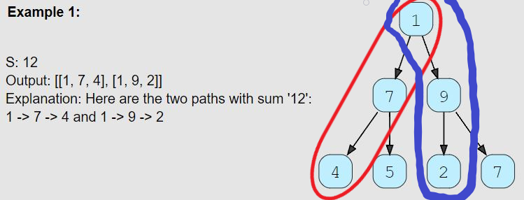

# All Paths for a Sum (medium)

> **Prompt:** Given a binary tree and a number ‘S’, **find all paths from root-to-leaf such that the sum of all the node values of each path equals ‘S’**.

<br>

### **Example:**



<br>

### **Big O:**
  - Time: `O(n^2)` 
    - due to for every leaf node, we might have to store its path (by making a copy of the current path) which will take O(N) time.
  - Space: `O(n)`

<br>

### **Code:**

```js
// No comments
const find_paths = function(root, sum) {
  if(!root) return [];
  const resultsArr = [];

  const pathCheck = (node, s, path) => {
    if(!node) return;

    const correctPathCondition = !node.left && !node.right && s - node.val === 0;

    path.push(node.value);

    if(correctPathCondition) resultsArr.push([...path]);

    pathCheck(node.left, s-node.value, path);
    pathCheck(node.right, s-node.value, path);
    
    path.pop();
  }

  pathCheck(root, sum, []);
  return resultsArr;
};

// Comments
const find_paths = function(root, sum) {
  if(!root) return [];
  const resultsArr = []; // Array to hold all paths

  // This enclosed function will always have access to the results array.
  const pathCheck = (node, s, path) => {
    if(!node) return;

    // For readability, condition for finding a correct path
    const correctPathCondition = !node.left && !node.right && s - node.val === 0;

    path.push(node.value); // Add the current nodes value to the path.

    // If we find a correct path, we push the path to the results array,
    // IMPORTANT: we need to make a DEEP copy of the path array, so that 
    // it remains unchanged once it enters the results array.
    if(correctPathCondition) resultsArr.push([...path]);

    // Recursively call pathcheck, the new sum (s) value will 
    // be the current value minus the nodes value.
    pathCheck(node.left, s-node.value, path);
    pathCheck(node.right, s-node.value, path);

    // Once we finish completely evaluating a node and it's children,
    // we need to pop it off the path array, 
    // as that node has been completely evaluated.
    path.pop();
  }

  // Call helper function after we defined it.
  pathCheck(root, sum, []);

  return resultsArr;
};
```
<br>

### **Comments:**
  - You **cannot** insert the path array into the results array without making a deep copy of it, if you don't, it will continue to be modified within the results array!


<br>

### **Basic Pattern:**
  1. Perform a preOrder traversal of the tree.
  2. Add the value at the given node to a path array.
  3. If you find a **leaf node** and the values along the path add to the given sum, 
     1. Make a deep copy of the path array and push the copy to the results array.
  4. Recursively call the traversal on the left and right nodes.
  5. After exploring the left and right nodes, pop the current nodes value off of the path array.
  6. Return results array.