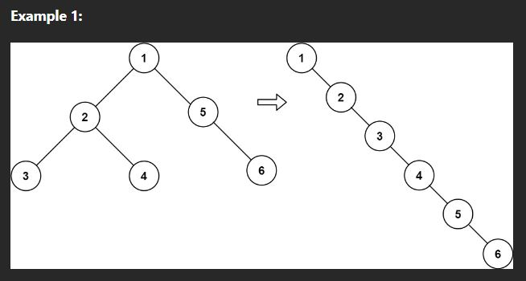

# Flatten Binary Tree to Linked List (Medium)

> **Prompt:** Given the root of a binary tree, **flatten the tree into a "linked list"**:
>   - The "linked list" should use the same TreeNode class where the right child pointer points to the next node in the list and the left child pointer is always null.
>   - The "linked list" should be in the same order as a pre-order traversal of the binary tree.

<br>

### **Example:**



<br>

### **Big O:**
  - Time: `O(n)`
  - Space: `O(n)`

<br>

### **Code:**

```js
// No comments
var flatten = function(root) {
    if (!root) return;

    let next = null;
    function revPostOrder(node){
        if(!node) return;
        revPostOrder(node.right);
        revPostOrder(node.left);
        node.left = null, node.right = next, next = node;
    }
    revPostOrder(root);
};


// Comments
var flatten = function(root) {
    if (!root) return;

    let next = null; // Temp variable to hold node to point to next.

    function revPostOrder(node){
        if(!node) return;
        // Reverse postOrder Traversal (right to left)
        revPostOrder(node.right);
        revPostOrder(node.left);

        // Make the node on the left null as it has already been evaluated.
        // Set the right to the current next, then set next to the current node as it will be the 
        // node that is pointed to next.
        node.left = null, node.right = next, next = node;
    }

    // Call recursive fn on root
    revPostOrder(root);
};

// With Stack O(n)t, O(2n)s
var flatten = function(root) {
    if(!root) return;
    const stack = [];
    dfs(root);
    
    function dfs(node){
        if(!node) return;
        
        if(node.right){
            stack.push(node.right);
            node.right = null;
        }
        if(node.left){
            node.right = node.left;
            node.left = null;
        }
        if(!node.right){
            node.right = stack.pop() || null;
        }
        dfs(node.right);
    }

};
```
<br>

### **Comments:**
  - We can solve this problem multiple ways, the direction of travel will change the additional variables needed.


<br>

### **Basic Pattern:**
  1. Create an outer fn.
  2. Create a next variable and set it to null.
  3. Create an inner fn, accepting a node.
     1. traverse to the right and then the left calling the inner fn on the right and left children in that order.
     2. Set the current nodes left child to be null.
     3. Set the current nodes right child to the next variable.
     4. Set the next variable equal to the current node.
  4. Call the inner fn, passing in the root.

### **Morris Traversal**

> Allows for `O(n)t` and `O(1)s`

<br>

- [Link to good explanation](https://leetcode.com/problems/flatten-binary-tree-to-linked-list/solutions/1207642/js-python-java-c-simple-o-1-space-recursive-solutions-w-explanation/?orderBy=most_votes)

> *The approach is called the Morris traversal. At its heart, it takes advantage of the basic nature of ordered traversals to iterate through and unwind the tree. In a pre-order traversal of a binary tree, each vertex is processed in (node, left, right) order. This means that the entire left subtree could be placed between the node and its right subtree.*
> 
> *To do this, however, we'll first have to locate the last node in the left subtree. This is easy enough, since we know that the last node of a pre-order tree can be found by moving right as many times as possible from its root.*
> 
> *So we should be able to move through the binary tree, keeping track of the current node (curr). Whenever we find a left subtree, we can dispatch a runner to find its last node, then stitch together both ends of the left subtree into the right path of curr, taking heed to sever the left connection at curr.*
> 
> *Once that's done, we can continue to move curr to the right, looking for the next left subtree. When curr can no longer move right, the tree will be successfully flattened.*

<br>


```js
var flatten = function(root) {
    let curr = root; // Var to hold the current node.

    // While there is a current node,
    while (curr) {

        // If there is a left child at the current node,
        if (curr.left) {

            // We create a runner variable that will run to the right
            // until it runs out of right children.
            let runner = curr.left
            while (runner.right) runner = runner.right

            // We will then make the runners right child point to the current nodes right child,
            // Then we will make the current nodes right child point to the left child (connecting the nodes)
            // we will then set the left node to null
            runner.right = curr.right, curr.right = curr.left, curr.left = null
        }
        curr = curr.right
    }
};
```