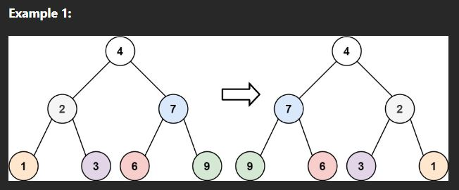

# Invert Binary Tree (easy)

> **Prompt:** Given the root of a binary tree, **invert the tree**, and return its root.
> - Inverting a binary tree means to make it's order reversed in the left and right direction.

<br>

### **Example:**



<br>

### **Big O:**
  - Time: `O(n)`
  - Space: `O(n)`

<br>

### **Code:**

```js
// No comments
var invertTree = function(root) {
    if(!root) return root;
    invertPreOrder(root);
    return root;

    function invertPreOrder(node){
        if(!node) return;
        [node.left, node.right] = [node.right, node.left];
        invertPreOrder(node.left);
        invertPreOrder(node.right);
    }
};

// Comments
var invertTree = function(root) {
    if(!root) return root;
    invertPreOrder(root);
    return root;

    function invertPreOrder(node){
        if(!node) return;
        [node.left, node.right] = [node.right, node.left];
        invertPreOrder(node.left);
        invertPreOrder(node.right);
    }
};
```
<br>

### **Comments:**
  - For this problem we will use a preOrder traversal.
  - Inverting a binary tree means to make it's order reversed, such that it's left most node is now it's right most node, and everything in between.

<br>

### **Basic Pattern:**
  1. Swap left and right child nodes
  2. Evaluate left node
  3. Evaluate right node
  4. Return root