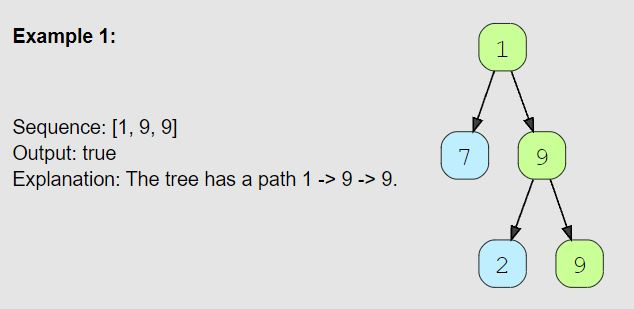

# Path With Given Sequence (medium)

> **Prompt:** Given a binary tree and a number sequence, **find if the sequence is present as a root-to-leaf path in the given tree**.

<br>

### **Example:**



<br>

### **Big O:**
  - Time: `O(n)` Worst case we have a wide tree as deep as the length and no correct paths.
  - Space: `O(l)` Our recursive stack will be as big as the length of the sequence.

<br>

### **Code:**

```js
// No comments
const find_path = function(root, seq) {
  if(!root) return false; 
  let pathFound = false;

  const pathCheck = node => {
    if(!node || node.value !== seq[0] || pathFound) return;
    
    const curNum = seq.shift();  

    if(seq.length === 0 && !node.left && !node.right){
      pathFound = true;
      return;
    }

    pathCheck(node.left);
    pathCheck(node.right);

    seq.unshift(curNum);
  }

  pathCheck(root);
  return pathFound;
};

// Comments
const find_path = function(root, seq) {
  if(!root) return false;
  let pathFound = false;

  const pathCheck = node => {
    // If we do not have a valid node, or
    // if the node's value is not equal to the current number we are evaluating for, or
    // or, if we have found a correct path, return;
    if(!node || node.value !== seq[0] || pathFound) return;

    // Remove the first number from the sequence and store it's value
    // if we evaluate the node completely and find no correct sequence,
    // we will place the value back into the sequence.
    const curNum = seq.shift();
    
    // If there are no more numbers left in the sequence and 
    // we are at a leaf node, we have found a correct path.
    // We will set the pathFound variable in the enclosing scope to true.
    if(seq.length === 0 && !node.left && !node.right){
      pathFound = true;
      return;
    }

    // Evaluate the left and right side nodes
    pathCheck(node.left);
    pathCheck(node.right);

    // If we have evaluated this node, we need to backtrack,
    // we will place the current number back at the front of the sequence.
    seq.unshift(curNum);
  }
  
  // Call our recursive function on the root node.
  pathCheck(root);
  return pathFound;
};
```
<br>

### **Comments:**
  - The trick with this problem is immediately returning when you find and incorrect value, shifting the front value off when you find a correct value, and adding the value back onto the front after traversing the left and right nodes.


<br>

### **Basic Pattern:**
  1. Create an outer function 
  2. Create a pathFound boolean
  3. Create an inner function that accepts a node.
     1. Check that we have a valid node, a correct number, and that the path is not found, return if not.
     2. Shift the first number off of the sequence and store it in a temp variable.
     3. If the sequence has no more values in it and the node is a leaf node,
        1. set the pathFound variable to true
     4. Evaluate the left and right side nodes, passing each into the inner fn and calling it recursively.
     5. Add the number in the temp variable back to the front of the sequence.
  4. Call the inner function passing in the root node of the give tree.
  5. Return the pathFound variable.