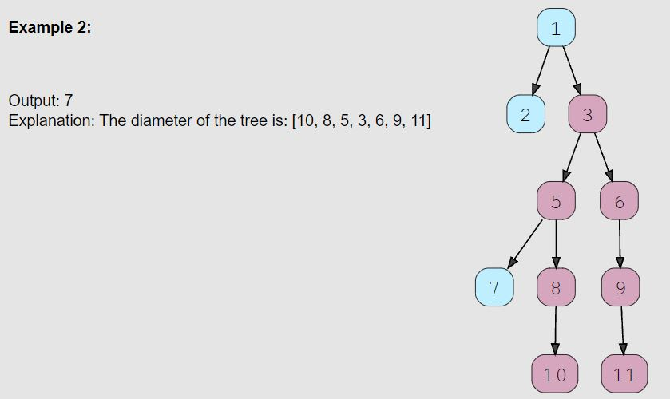

# Tree Diameter (medium)

> **Prompt:** Given a binary tree, **find the length of its diameter.** 
>   - The diameter of a tree is the number of nodes on the longest path between **any** two leaf nodes. The diameter of a tree may or may not pass through the root.
>   - **NOTE:** This questions is defining the diameter by the number of **nodes**, but leetcode defines the diameter as the number of **connections/edges**. As always, **BE SURE TO READ THE QUESTION CAREFULLY!**

<br>

### **Example:**


- Notice how it is NOT (necessarily)the outer diameter!

<br>

### **Big O:**
  - Time: `O(n)`
  - Space: `O(n)`

<br>

### **Code:**

```js
// No comments
var diameterOfBinaryTree = function(root) {
    let diameter = 0;
    
    function dfs(node) {
        if (!node) return 0;
        
        const left = dfs(node.left);
        const right = dfs(node.right);
        
        diameter = Math.max(diameter, left + right);

        return 1 + Math.max(left, right);
    }

    dfs(root);
    
    return diameter + 1;
};

// Comments
var diameterOfBinaryTree = function(root) {
    let diameter = 0; // Track the largest diameter
    
    function dfs(node) {
        if (!node) return 0; // Base case
        
        // post order traversal
        const left = dfs(node.left);
        const right = dfs(node.right);
        
        // update diameter at every node,
        // Make the diameter the larger between the current diameter
        // and the return values from the left and right nodes.
        diameter = Math.max(diameter, left + right);

        // Update the largest number of edge so far,
        // we are looking for the bigger of the two paths, and
        // adding one since on return we will have one more edge.
        return 1 + Math.max(left, right);
    }

    // Call inner fn
    dfs(root);
    
    // The diameter will hold the greatest number of EDGES, 
    // the number of nodes for a given number of edges is edges + 1;
    return diameter + 1;
};
```
<br>

### **Comments:**
  - This problem works from the bottom up, we get all the way to a bottom node, start at zero, and moving up the path, check for the largest diameter, and returning the greater of the left and right nodes each time we evaluate a node.
  - READ THE PROBLEM CAREFULLY, the number of **edges** in a path will always be one less than the number of nodes, **this problem may ask for either**.

<br>

### **Basic Pattern:**
  1. Track largest diameter
  2. Post order traversal
  3. Update diameter at each node
  4. Update the largest number of edges
  5. Return largest number of edges plus one.

<br>

### **Basic Pattern:**
  1. Create an outer fn which takes in the root node of a tree.
     1. Create a diameter variable to track the largest diameter.
     2. Create an inner fn which takes a node.
        1. If the node passed in is null, return 0 (base case).
        2. Create a left and right variable and set them equal to the return value of calling the inner fn passing in the left and right variables respectively.
        3. Find the larger value between the diameter and the sum of the left and right values, set diameter to the larger.
        4. Return the greater of the left and right values, plus one.
     3. Call inner fn passing in the root node.
     4. Return the diameter, plus one.

### **LeetCode Version of the Problem:**

- Very similar, but with one very important key difference:
  - *The length of a path between two nodes is represented by the number of **edges** between them.*

```js
var diameterOfBinaryTree = function(root) {
    let diameter = 0;
    
    
    
    function dfs(node) {
        if (!node) return 0;
        
        const left = dfs(node.left);
        const right = dfs(node.right);
        
        diameter = Math.max(diameter, left + right);
        return 1 + Math.max(left, right);
    }

    dfs(root);
    
    return diameter; // <--- notice here that we are NOT adding one.
};
```