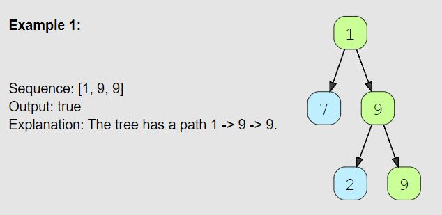
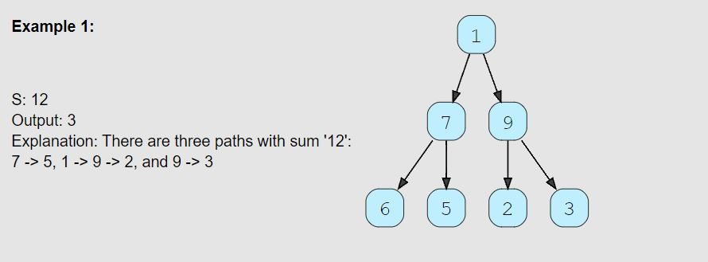

# Tree: Depth First Search

<hr>

## General Notes

  - The "Worst Case" for a DFS problem is if the tree is actually just a linked list.

<br>

  - Article on DFS of binary tree: [LINK](https://blog.bitsrc.io/depth-first-search-of-a-binary-tree-in-javascript-874701d8210a)

<br>

- Always ask, "in what direction do I need to process the nodes?"
  - DFS traversal can be thought of as a height first traversal:
    - **Top Down:** preOrder
    - **Bottom Up:** inOrder and postOrder
  - In standard form, these will traverse the tree from **Left to Right**
    - This happens because in the code we explore the left child node before the right.
  - If we want to traverse **Right to Left**
    - We can explore the right child node before the left.

## Problems

### Binary Tree Path Sum (easy)

> **Prompt:** Given a binary tree and a number ‘S’, find if the tree has a path from **root-to-leaf** such that the **sum of all the node values of that path equals ‘S’**.

<br>

### **Example:**


<br>

### **Big O:**
  - Time: `O(n)` we will visit each node once.
  - Space: `O(n)` worst case (linked list).

<br>

### **Code:**

```js
// No comments
const has_path = function(root, sum) {
  if(!root) return false;
  let hasPath = false;
  
  function traverse(node, sum){
    const newSum = sum - node.value;

    if(!node.left && !node.right && newSum === 0) hasPath = true;
    if(node.left)  traverse(node.left,  newSum);
    if(node.right) traverse(node.right, newSum);
  }

  traverse(root, sum);
  return hasPath;
};

// Comments
const has_path = function(root, sum) {
  if(!root) return false;
  // Create a variable to flag if a path was found.
  let hasPath = false;
  
  // We will subtract the value at the current node from the input sum, and 
  // check to see if we are at a leaf node with the newSum equal to zero, if so we will return true,
  // if not we will recursively traverse over the tree, 
  // at each node we will traverse the left and/or right child passing in the newSum.
  function traverse(node, sum){
    const newSum = sum - node.value;

    if(!node.left && !node.right && newSum === 0) hasPath = true;
    if(node.left)  traverse(node.left,  newSum);
    if(node.right) traverse(node.right, newSum);
  }

  // Will call traverse and set hasPath if a correct node is found.
  traverse(root, sum);

  return hasPath;
};
```

<br>

### **Comments:**
  - This problem can be solved either with recursion directly, or by using a recursive helper function.
  - Recursive helper function is a few more lines of code but is arguably more readable.
  - We are subtracting the current nodes value from the passed in sum, this allows us to work down and look for zero.


<br>

### **Basic Pattern:**
  1. Create a hasPath boolean set to false.
  2. Traverse the tree passing in the node and the sum.
     1. Define the new sum to be the sum minus the nodes value.
     2. If the node is a leaf and the newSum is equal to zero, set the hadPath var to true.
     3. Traverse the left and right nodes passing in the newSum.


### **Alternate Solution:**

```js

// No comments
const has_path = function(root, sum) {
  if(!root) return false;

  if(!root.left && !root.right && sum - root.value === 0) return true;

  return has_path(root.left, sum - root.value) || has_path(root.right, sum - root.value);
};

// Comments
const has_path = function(root, sum) {
  if(!root) return false; // Base case

  // If we find a leaf node where the value meets the prompt requirement return true.
  if(!root.left && !root.right && sum - root.value === 0) return true;


  // Recursively call has path for both the left and right nodes of the current node
  // Subtract the current value from the sum before passing it in to the recursive call.
  return has_path(root.left, sum - root.value) || has_path(root.right, sum - root.value);
};
```

### **Basic Pattern:**
  1. Define base case.
  2. Check for a leaf node where the the sum minus the current nodes value is zero.
  3. Recursively call the function on the left and right nodes, passing in the current value subtracted from the sum.

<br>

## All Paths for a Sum (medium)

> **Prompt:** Given a binary tree and a number ‘S’, **find all paths from root-to-leaf such that the sum of all the node values of each path equals ‘S’**.

<br>

### **Example:**


<br>

### **Big O:**
  - Time: `O(n^2)` 
    - due to for every leaf node, we might have to store its path (by making a copy of the current path) which will take O(N) time.
  - Space: `O(n)`

<br>

### **Code:**

```js
// No comments
const find_paths = function(root, sum) {
  if(!root) return [];
  const resultsArr = [];

  const pathCheck = (node, s, path) => {
    if(!node) return;

    path.push(node.value);
    if(!node.left && !node.right && s - node.value === 0) resultsArr.push([...path]);
    pathCheck(node.left, s-node.value, path);
    pathCheck(node.right, s-node.value, path);
    path.pop();
  }

  pathCheck(root, sum, []);
  return resultsArr;
};

// Comments
const find_paths = function(root, sum) {
  if(!root) return [];
  const resultsArr = []; // Array to hold all paths

  // This enclosed function will always have access to the results array.
  const pathCheck = (node, s, path) => {
    if(!node) return;

    // For readability, condition for finding a correct path
    const correctPathCondition = !node.left && !node.right && s - node.val === 0;

    path.push(node.value); // Add the current nodes value to the path.

    // If we find a correct path, we push the path to the results array,
    // IMPORTANT: we need to make a DEEP copy of the path array, so that 
    // it remains unchanged once it enters the results array.
    if(correctPathCondition) resultsArr.push([...path]);

    // Recursively call pathcheck, the new sum (s) value will 
    // be the current value minus the nodes value.
    pathCheck(node.left, s-node.value, path);
    pathCheck(node.right, s-node.value, path);

    // Once we finish completely evaluating a node and it's children,
    // we need to pop it off the path array, 
    // as that node has been completely evaluated.
    path.pop();
  }

  // Call helper function after we defined it.
  pathCheck(root, sum, []);

  return resultsArr;
};
```
<br>

### **Comments:**
  - You **cannot** insert the path array into the results array without making a deep copy of it, if you don't, it will continue to be modified within the results array!


<br>

### **Basic Pattern:**
  1. Perform a preOrder traversal of the tree.
  2. Add the value at the given node to a path array.
  3. If you find a **leaf node** and the values along the path add to the given sum, 
     1. Make a deep copy of the path array and push the copy to the results array.
  4. Recursively call the traversal on the left and right nodes.
  5. After exploring the left and right nodes, pop the current nodes value off of the path array.
  6. Return results array.

<br>

## Sum of Path Numbers (medium)

> **Prompt:** Given a binary tree where each node can only have a digit (0-9) value, each root-to-leaf path will represent a number. Find the total sum of all the numbers represented by all paths.

<br>

### **Example:**


<br>

### **Big O:**
  - Time: `O(n)`
  - Space: `O(n)` worst case (linked list) ...basically always...

<br>

### **Code:**

```js
// No comments
const find_sum_of_path_numbers = function(root) {
  if(!root) return 0;
  let totalSum = 0;

  const sumPaths = (node, pathSum) => {
    if(!node) return

    pathSum = pathSum * 10 + node.value;
    if(!node.left && !node.right) totalSum += pathSum;
    sumPaths(node.left, pathSum);
    sumPaths(node.right, pathSum);
  }

  sumPaths(root, 0);

  return totalSum;
};

// Comments
const find_sum_of_path_numbers = function(root) {
  if(!root) return 0;
  let totalSum = 0; // Track the total sum in closure

  const sumPaths = (node, pathSum) => {
    if(!node) return

    pathSum = pathSum * 10 + node.value; // Find new number

    // If we have reached a leaf node, add to total sum.
    if(!node.left && !node.right) totalSum += pathSum;

    // Evaluate left and right nodes.
    sumPaths(node.left, pathSum);
    sumPaths(node.right, pathSum);
  }

  // Call sumPaths starting at the root with a pathSum of zero.
  sumPaths(root, 0);

  return totalSum;
};
```
<br>

### **Comments:**
  - preOrder DFS, tracking a pathSum variable and adding to a totalSum variable which exists outside of function to add up the path sum.


<br>

### **Basic Pattern:**
  1. Create an outer function
     1. Create a variable to track the total sum.
     2. Create a inner function accepting a node and a path sum.
        1. If no node exists, return
        2. Set pathSum to be itself times 10 plus the current node's value.
        3. If we are on a leaf node, add the pathSum to the total sum.
        4. Recursively call the inner function passing in left and right nodes and the pathSum.
     3. Call the outer function passing in the root node and zero for the path sum.
     4. Return the total sum.

<br>

## Path With Given Sequence (medium)

> **Prompt:** Given a binary tree and a number sequence, **find if the sequence is present as a root-to-leaf path in the given tree**.

<br>

### **Example:**



<br>

### **Big O:**
  - Time: `O(n)` Worst case we have a wide tree as deep as the length and no correct paths.
  - Space: `O(l)` Our recursive stack will be as big as the length of the sequence.

<br>

### **Code:**

```js
// No comments
const find_path = function(root, seq) {
  if(!root) return false; 
  let pathFound = false;

  const pathCheck = node => {
    if(!node || node.value !== seq[0] || pathFound) return;
    
    const curNum = seq.shift();  

    if(seq.length === 0 && !node.left && !node.right){
      pathFound = true;
      return;
    }

    pathCheck(node.left);
    pathCheck(node.right);

    seq.unshift(curNum);
  }

  pathCheck(root);
  return pathFound;
};

// Comments
const find_path = function(root, seq) {
  if(!root) return false;
  let pathFound = false;

  const pathCheck = node => {
    // If we do not have a valid node, 
    // if the node's value is not equal to the current number we are evaluating for,
    // or, if we have found a correct path, return;
    if(!node || node.value !== seq[0] || pathFound) return;

    // Remove the first number from the sequence and store it's value
    // if we evaluate the node completely and find no correct sequence,
    // we will place the value back into the sequence.
    const curNum = seq.shift();
    
    // If there are no more numbers left in the sequence and 
    // we are at a leaf node, we have found a correct path.
    // We will set the pathFound variable in the enclosing scope to true.
    if(seq.length === 0 && !node.left && !node.right){
      pathFound = true;
      return;
    }

    // Evaluate the left and right side nodes
    pathCheck(node.left);
    pathCheck(node.right);

    // If we have evaluated this node, we need to backtrack,
    // we will place the current number back at the front of the sequence.
    seq.unshift(curNum);
  }
  
  // Call our recursive function on the root node.
  pathCheck(root);
  return pathFound;
};
```
<br>

### **Comments:**
  - The trick with this problem is immediately returning when you find and incorrect value, shifting the front value off when you find a correct value, and adding the value back on after traversing the left and right nodes.


<br>

### **Basic Pattern:**
  1. Create an outer function 
  2. Create a pathFound boolean
  3. Create an inner function that accepts a node.
     1. Check that we have a valid node, a correct number, and that the path is not found, return if not.
     2. Shift the first number off of the sequence and store it in a temp variable.
     3. If the sequence has no more values in it and the node is a leaf node,
        1. set the pathFound variable to true
     4. Evaluate the left and right side nodes, passing each into the inner fn and calling it recursively.
     5. Add the number in the temp variable back to the front of the sequence.
  4. Call the inner function passing in the root node of the give tree.
  5. Return the pathFound variable.

<br>

## Count Paths for a Sum (medium)

<br>

> **Prompt:** Given a binary tree and a number ‘S’, **find all paths in the tree such that the sum of all the node values of each path equals ‘S’**. 
>   - Please note that the paths can start or end at any node but all paths must follow direction from parent to child (top to bottom).

<br>

### **Example:**



<br>

### **Big O:**
  - Time: `O(n)` 
    - Reduced from `O(n^2) where each node must be examined as the root.
  - Space: `O(n)`

<br>

### **Code:**

```js
// No comments
var pathSum = function(root, target) {
  if(!root) return 0;
  let pathCount = 0;
  const pfMap = {};

  const pathCheck = (node, prevSum) => {
    if(!node) return;
    const runningSum = prevSum + node.val;

    if(runningSum === s) pathCount++;
    pathCount += pfMap[runningSum - target] || 0;
    pfMap[runningSum] =  pfMap[runningSum]+1 || 1;

    pathCheck(node.left, runningSum);
    pathCheck(node.right, runningSum);
    pfMap[runningSum] = pfMap[runningSum] - 1;
  }
  
  return pathCount;
};

// Light Comments

const count_paths = function(root, target) {
  if(!root) return 0;
  let pathCount = 0;
  const pfMap = {}; // Map of previous sums in current path

  const pathCheck = (node, sum) => {
    if(!node) return
    const curSum = sum + node.value;

    // Count path if we have a match
    if(curSum === s) pathCount++;

    // Increment the count by as many paths as are in the map for curSum - target
    pathCount += pfMap[curSum - target] || 0;

    // Add or increment the curSum key in the map.
    pfMap[curSum] = pfMap[curSum]+1 || 1;

    // Navigate
    pathCheck(node.left, curSum);
    pathCheck(node.right, curSum);

    // Remove current sum from previous sums map
    pfMap[curSum] = pfMap[curSum] - 1;
  }

  // Call pathCheck starting at root
  pathCheck(root, 0);
  return pathCount;
};

// Heavy Comments
var pathSum = function(root, target) {
  if(!root) return 0;
  let pathCount = 0;
  const pfMap = {};

  const pathCheck = (node, prevSum) => {
    if(!node) return

    // Calculate the running sum, adding the current nodes value to the previous sum.
    const runningSum = prevSum + node.val;

    // if the running sum is equal to our target, increment out pathCount.
    if(runningSum === s) pathCount++;

    // Here we are checking if we have a key in our map that is equal to the current 
    // running sum minus the target (s). If find a key that means there is a running sum in the current path which, if 
    // eliminated at that point will produce a valid path from the subsequent node to the current node.
    // If there is more than one such point, the map will reflect that and all points will be added to the count.
    // If there is no such key, nothing will be added to the count.
    pathCount += pfMap[runningSum - target] || 0;

    // Here we are setting the running sum in our map. Incrementing if it exists, 
    // or setting it to one if it doesn't.
    pfMap[runningSum] =  pfMap[runningSum]+1 || 1;

    // Evaluate the left and right child nodes, passing in the current running sum.
    pathCheck(node.left, runningSum);
    pathCheck(node.right, runningSum);

    // Remove the current running sum value from the pfMap.
    pfMap[runningSum] = pfMap[runningSum] - 1;
  }
  
  // Call pathCheck starting at the root with a previous sum of zero.
  pathCheck(root, 0);
  
  return pathCount;
};
```
<br>

### **Comments:**
  - This "prefix sum" concept used in the solution was quite tricky to grasp, [watch this video for a good explanation](https://www.youtube.com/watch?v=uZzvivFkgtM)
  - The trick with this problem is that you need to use a map to hold all the running sums at each node within the current path.
    - For any given node in a path, we can check the previous sums, if we find a previous sum that, if we take away that sum, we are left with the target, the we have found a match.
    - We calculate the previous sum to search for by subtracting the running sum from the target.
      - `pathCount += pfMap[runningSum - target] || 0;`
      - As an example, if we have a running sum of 18, and we have a target of 8, we need to see if we have previously seen a running sum of 10.
        - If we have a running sum of 10 in our map, that means if we were to take all the nodes AFTER the node were we had a running sum of 10, they would sum to the target.
    - **The video does a better job of explaining this.**


<br>

### **Basic Pattern:**
  1. In an outer fn, create a variable to count the number of paths, and an object or map to hold the previous sums in the current path.
  2. In an inner fn, accept a root node and a previous sum
     1. Calculate the current running sum (curSum) by adding the previous sum and the value at the passed in node.
     2. If the curSum matches the target, add one to our count.
     3. Calculate the sum which, if removed would allow the rest of the nodes to add to the target. If we find this sum in our previous sum map, then all nodes after this node will sum to the target, and we have therefore found a valid path.
     4. Search map for this sum, if we find it, add the current value at that key plus one, to the count.
     5. Add or increment the curSum key in the map.
     6. Navigate the left and right nodes by calling the inner fn recursively, passing in the current sum.
     7. Remove the current sum from the map after all nodes have been explored.
  3. Call the inner fn, passing in the root node and 0 for the previous sum.
  4. Return the count.

<br>

## Tree Diameter (medium)

> **Prompt:** Given a binary tree, **find the length of its diameter.** 
>   - The diameter of a tree is the number of nodes on the longest path between any two leaf nodes. The diameter of a tree may or may not pass through the root.
>   - **NOTE:** This questions is defining the diameter by the number of nodes, but leetcode defines the diameter as the number of connections/edges. As always, BE SURE TO READ THE QUESTION CAREFULLY!

<br>

### **Example:**


<br>

### **Big O:**
  - Time: `O(n)`
  - Space: `O(n)`

<br>

### **Code:**

```js
// No comments
var diameterOfBinaryTree = function(root) {
    let diameter = 0;
    
    function dfs(node) {
        if (!node) return 0;
        
        const left = dfs(node.left);
        const right = dfs(node.right);
        
        // update diameter at every node
        diameter = Math.max(diameter, left + right);

        // update the largest number of edge so far
        return 1 + Math.max(left, right);
    }

    dfs(root);
    
    return diameter + 1;
};

// Comments
var diameterOfBinaryTree = function(root) {
    let diameter = 0; // Track the largest diameter
    
    function dfs(node) {
        if (!node) return 0; // Base case
        
        // post order traversal
        const left = dfs(node.left);
        const right = dfs(node.right);
        
        // update diameter at every node
        diameter = Math.max(diameter, left + right);

        // update the largest number of edge so far
        return 1 + Math.max(left, right);
    }

    // Call inner fn
    dfs(root);
    
    // The diameter will hold the greatest number of edges, 
    // the number of nodes for a given number of edges is edges + 1;
    return diameter + 1;
};
```
<br>

### **Comments:**
  - This problem works from the bottom up, we get all the way to a bottom node, start at zero, and moving up the path, check for the largest diameter, and returning the greater of the left and right nodes each time we evaluate a node.
  - READ THE PROBLEM CAREFULLY, the number of edges in a path will always be one less than the number of nodes, this problem may ask for either.

<br>

### **Basic Pattern:**
  1. Track largest diameter
  2. Post order traversal
  3. Update diameter at each node
  4. Update the largest number of edges
  5. Return largest number of edges plus one.

<br>

### **Basic Pattern:**
  1. Create an outer fn which takes in the root node of a tree.
     1. Create a diameter variable to track the largest diameter.
     2. Create an inner fn which takes a node.
        1. If the node passed in is null, return 0 (base case).
        2. Create a left and right variable and set them equal to the return value of calling the inner fn passing in the left and right variables respectively.
        3. Find the larger value between the diameter and the sum of the left and right values, set diameter to the larger.
        4. Return the greater of the left and right values, plus one.
     3. Call inner fn passing in the root node.
     4. Return the diameter, plus one.

### **LeetCode Version of the Problem:**

- Very similar, but with one very important key difference:
  - *The length of a path between two nodes is represented by the number of **edges** between them.*

```js
var diameterOfBinaryTree = function(root) {
    let diameter = 0;
    
    
    
    function dfs(node) {
        if (!node) return 0;
        
        const left = dfs(node.left);
        const right = dfs(node.right);
        
        // update diameter at every node
        diameter = Math.max(diameter, left + right);

        // update the largest number of edge so far
        return 1 + Math.max(left, right);
    }

    dfs(root);
    
    return diameter; // notice here that we are not adding one.
};
```
<br>

## Path with Maximum Sum (hard)


> **Prompt:** **Find the path with the maximum sum in a given binary tree.** Write a function that returns the maximum sum.
> - A path can be defined as a sequence of nodes between any two nodes and doesn’t necessarily pass through the root. The path must contain at least one node.

<br>

### **Example:**


<br>

### **Big O:**
  - Time: `O(n)`
  - Space: `O(n)`

<br>

### **Code:**

```js
// No comments
var maxPathSum = function(root) {
    let maxPathSum = -Infinity;
    
    dfs(root);
    
    return maxPathSum;
    
    function dfs(node) {
        if (!node) return 0;
        
        const left = dfs(node.left);
        const right = dfs(node.right);
        
        maxPathSum = Math.max(maxPathSum, left + right + node.val);

        return node.val + Math.max(0, left, right);
    }
};

// Comments
var maxPathSum = function(root) {
    // As with almost all "max" variables, start with -Infinity
    let maxPathSum = -Infinity; 

    // Call Traversal fn.
    dfs(root);
    
    return maxPathSum;
    

    //Define traversal fn. Hoisting will allow fn to be called above definition.
    function dfs(node) {
        if (!node) return 0; //Base case
        
        // Post order traversal
        const left = dfs(node.left);
        const right = dfs(node.right);
        
        // Check the current path sum vs the largest path sum
        maxPathSum = Math.max(maxPathSum, left + right + node.val);

        // Zero here represents ignoring all the values the the current node
        // If for instance all the values are negative.
        return node.val + Math.max(0, left, right);
    }
};
```
<br>

### **Comments:**
  - **POST ORDER PROBLEMS WORK BOTTOM UP!**
    - In this problem we start adding up the sum starting at the bottom.
  - For any given node, the path consists of a path starting from it's left node, itself, and a path starting from it's right node.
  - It is possible that the sum of some path is less than zero, a negative number will never sum to make a greater positive, in the case that we have a negative sum at some node we replace that sum with zero, effectively cutting that part of the path off.
  - When considering the greatest path at a given node, we have three scenarios.
    - The node value plus the left sum is greater than the node value plus the right sum, in which case we return the node value plus the left sum, or 
    - vice versa, 
    - Or both the left and right sums are negative, in which case we return zero.


<br>

### **Basic Pattern:**
  1. Create outer fn.
  2. Create a variable to track the max path sum.
  3. Create an inner fn, taking a root node as an argument.
     1. Recursively call the inner fn on both the left and right nodes of the input node, setting the returned value to a left and right variable respectively.
     2. Set the max path variable to be the larger of itself and the sum of the node's value and both the left and right variable set in the previous step.
     3. Return the largest value between 0, the node value plus the left value, and the node value plus the right variable.
  4. Return the max path variable.

<br>

## Flatten Binary Tree to Linked List (Medium)

> **Prompt:** Given the root of a binary tree, **flatten the tree into a "linked list"**:
>   - The "linked list" should use the same TreeNode class where the right child pointer points to the next node in the list and the left child pointer is always null.
>   - The "linked list" should be in the same order as a pre-order traversal of the binary tree.

<br>

### **Example:**


<br>

### **Big O:**
  - Time: `O(n)`
  - Space: `O(n)`

<br>

### **Code:**

```js
// No comments
var flatten = function(root) {
    if (!root) return;

    let next = null;
    function revPostOrder(node){
        if(!node) return;
        revPostOrder(node.right);
        revPostOrder(node.left);
        node.left = null, node.right = next, next = node;
    }
    revPostOrder(root);
};


// Comments
var flatten = function(root) {
    if (!root) return;

    let next = null; // Temp variable to hold node to point to next.

    function revPostOrder(node){
        if(!node) return;
        // Reverse postOrder Traversal (right to left)
        revPostOrder(node.right);
        revPostOrder(node.left);

        // Make the node on the left null as it has already been evaluated.
        // Set the right to the current next, then set next to the current node as it will be the 
        // node that is pointed to next.
        node.left = null, node.right = next, next = node;
    }

    // Call recursive fn on root
    revPostOrder(root);
};

// With Stack O(n)t, O(2n)s
var flatten = function(root) {
    if(!root) return;
    const stack = [];
    dfs(root);
    
    function dfs(node){
        if(!node) return;
        
        if(node.right){
            stack.push(node.right);
            node.right = null;
        }
        if(node.left){
            node.right = node.left;
            node.left = null;
        }
        if(!node.right){
            node.right = stack.pop() || null;
        }
        dfs(node.right);
    }

};
```
<br>

### **Comments:**
  - We can solve this problem multiple ways, the direction of travel will change the additional variables needed.


<br>

### **Basic Pattern:**
  1. Create an outer fn.
  2. Create a next variable and set it to null.
  3. Create an inner fn, accepting a node.
     1. traverse to the right and then the left calling the inner fn on the right and left children in that order.
     2. Set the current nodes left child to be null.
     3. Set the current nodes right child to the next variable.
     4. Set the next variable equal to the current node.
  4. Call the inner fn, passing in the root.

### **Morris Traversal**

> Allows for `O(n)t` and `O(1)s`

<br>

- [Link to good explanation](https://leetcode.com/problems/flatten-binary-tree-to-linked-list/solutions/1207642/js-python-java-c-simple-o-1-space-recursive-solutions-w-explanation/?orderBy=most_votes)

> *The approach is called the Morris traversal. At its heart, it takes advantage of the basic nature of ordered traversals to iterate through and unwind the tree. In a pre-order traversal of a binary tree, each vertex is processed in (node, left, right) order. This means that the entire left subtree could be placed between the node and its right subtree.*
> 
> *To do this, however, we'll first have to locate the last node in the left subtree. This is easy enough, since we know that the last node of a pre-order tree can be found by moving right as many times as possible from its root.*
> 
> *So we should be able to move through the binary tree, keeping track of the current node (curr). Whenever we find a left subtree, we can dispatch a runner to find its last node, then stitch together both ends of the left subtree into the right path of curr, taking heed to sever the left connection at curr.*
> 
> *Once that's done, we can continue to move curr to the right, looking for the next left subtree. When curr can no longer move right, the tree will be successfully flattened.*

<br>


```js
var flatten = function(root) {
    let curr = root; // Var to hold the current node.

    // While there is a current node,
    while (curr) {

        // If there is a left child at the current node,
        if (curr.left) {

            // We create a runner variable that will run to the right
            // until it runs out of right children.
            let runner = curr.left
            while (runner.right) runner = runner.right

            // We will then make the runners right child point to the current nodes right child,
            // Then we will make the current nodes right child point to the left child (connecting the nodes)
            // we will then set the left node to null
            runner.right = curr.right, curr.right = curr.left, curr.left = null
        }
        curr = curr.right
    }
};
```

<br>

## Invert Binary Tree (easy)

> **Prompt:** Given the root of a binary tree, **invert the tree**, and return its root.
> - Inverting a binary tree means to make it's order reversed in the left and right direction.

<br>

### **Example:**


<br>

### **Big O:**
  - Time: `O(n)`
  - Space: `O(n)`

<br>

### **Code:**

```js
// No comments
var invertTree = function(root) {
    if(!root) return root;
    invertPreOrder(root);
    return root;

    function invertPreOrder(node){
        if(!node) return;
        [node.left, node.right] = [node.right, node.left];
        invertPreOrder(node.left);
        invertPreOrder(node.right);
    }
};

// Comments
var invertTree = function(root) {
    if(!root) return root;
    invertPreOrder(root);
    return root;

    function invertPreOrder(node){
        if(!node) return;
        [node.left, node.right] = [node.right, node.left];
        invertPreOrder(node.left);
        invertPreOrder(node.right);
    }
};
```
<br>

### **Comments:**
  - For this problem we will use a preOrder traversal.
  - Inverting a binary tree means to make it's order reversed, such that it's left most node is now it's right most node, and everything in between.

<br>

### **Basic Pattern:**
  1. Swap left and right child nodes
  2. Evaluate left node
  3. Evaluate right node
  4. Return root

<br>

## Validate Binary Search Tree (medium)

> **Prompt:** Given the root of a binary tree, **determine if it is a valid binary search tree (BST)**.
> - A valid BST is defined as follows:
>   - The left subtree of a node contains only nodes with keys less than the node's key.
>   - The right subtree of a node contains only nodes with keys greater than the node's key.
>   - Both the left and right subtrees must also be binary search trees.

<br>

### **Example:**


<br>

### **Big O:**
  - Time: `O(n)`
  - Space: `O(n)`

<br>

### **Code:**

InOrder Check
```js
// No comments
var isValidBST = function (root) {
    let valid = true;
    let prevNode = null;

    const inOrderCheck = (node) => {
        if(!node) return;

        inOrderCheck(node.left);
        if(prevNode && node.val <= prevNode.val) valid = false;
        prevNode = node;
        inOrderCheck(node.right);
    };
    inOrderCheck(root);

    return valid;
};

// Comments
var isValidBST = function (root) {
    if(!root) return false;

    // Create a valid flag 
    // and a temp var that will hold the node evaluated last
    let valid = true, prevNode = null;

    const inOrderCheck = (node) => {
        if(!node) return;

        // Move all the way to the left side of the tree
        inOrderCheck(node.left);

        // Check that the prevNode is not null (it will be to start)
        // Check that the value of the current node is less or equal to the previous node.
        // If so, we have found an invalid node.
        if(prevNode && node.val <= prevNode.val) valid = false;
        // After checking the current node, make it the previous node.
        prevNode = node;

        // Move the current node to the right.
        inOrderCheck(node.right);
    };

    // Call recursive fn on the root.
    inOrderCheck(root);

    // Return the valid flag.
    return valid;
};
```

Fill Array with Nodes in Order, then Check Array.
```js
// Comments
var isValidBST = function(root) {

    let nodeVals = []; // Array to hold node values.
    
    // Fill NodeVals array with values from nodes in an inOrder method.
    const fillNodeVals = (node) => {
        if(!node) return;
        fillNodeVals(node.left);
        nodeVals.push(node.val);
        fillNodeVals(node.right);
    }
    fillNodeVals(root);

    // Check that all values are in ascending order
    // return false if we find an out of order value.
    for(let i = 1; i < nodeVals.length; i++){
        if(nodeVals[i] <= nodeVals[i-1]) return false;
    }

    // If we reach here, all nodes are in proper order.
    return true;
};
```

<br>

### **Comments:**
  - Moving in an inOrder fashion will allow for us to check against the previous node as we traverse left to right.

<br>

### **Basic Pattern:**
  1. Create an outer fn.
  2. Create a valid flag set to true.
  3. Create a prevNode variable and set to null.
  4. Create a inner fn, accepting a node.
     1. Move all the way to the left by calling the inner fn passing the node's left child.
     2. Check that the prevNode is not null and that that the value the current node is less or equal to the previous node's value.
        1. If so, we have found an invalid node, return false.
     3. Set the prevNode to be the current node.
     4. Move the current node to the right, calling the inner fn passing the node's right child.
  5. Call inner fn on the root node.
  6. Return the valid flag.