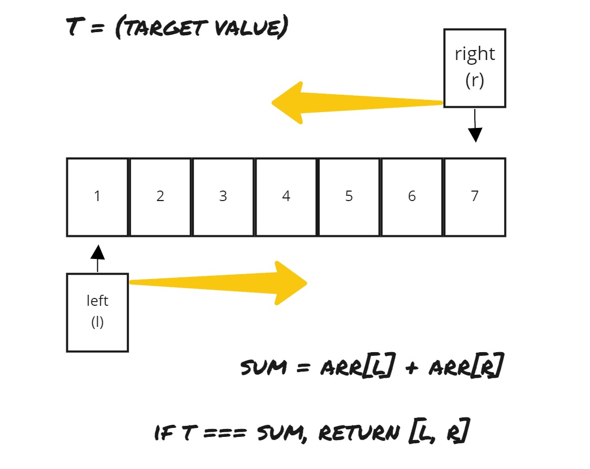

# Pair with Target Sum - TwoSum - (easy)

> **Prompt:** Given an **array of *sorted* numbers and a *target sum***, find a pair in the array whose sum is equal to the given target. 
> - Write a function to return the indices of the two numbers (i.e. the pair) such that they add up to the given target.
<br>

- **Example:**

```js
Input: [1, 2, 3, 4, 6], target=6
Output: [1, 3]
Explanation: The numbers at index 1 and 3 add up to 6: 2+4=6
```
<br>

- **Big O:**
  - Time: `O(n)`
  - Space: `O(1)`

<br>

- **Code:**

```js
// No comments
const pair_with_targetsum = function(arr, targetSum) {
  let L = 0;
  let R = arr.length - 1;

  while(L < R){ // O(n)t
    const currentSum = arr[L] + arr[R]; 
    if(currentSum === targetSum) return [L, R];
    if(currentSum > targetSum){
      R--;
    } else {
      L++;
    }
  }
  return [-1, -1];
}

// Comments
const pair_with_targetsum = function(arr, targetSum) {

  // Create two pointers 
  // set them such that they will begin on either side of the array.
  let L = 0;
  let R = arr.length - 1;

  // Here we create a loop that will run until the pointers cross,
  // that means that one of the two pointers MUST move every time through the loop.
  while(L < R){ 
    // Here we find the current condition we will be checking against.
    // Creating a well named variable here makes the code more readable.
    const currentSum = arr[L] + arr[R]; 

    //Here we check if the value we are searching for has been found, returning if so.
    if(currentSum === targetSum) return [L, R];

    // If the value hasn't been found we will move one of the two pointers 
    // in an attempt to get closer to our target
    // because our array is sorted we know if the L is incremented our sum will be 
    // either the same or increase, the opposite if the R is decremented.
    if(currentSum > targetSum){
      R--;
    } else {
      L++;
    }
  }

  // If we have reached the end of the loop, no value has been
  // found that meets the conditions
  return [-1, -1];
}
```

- **Comments:**
  - *Pointers:* Two, one starts at the beginning and the other at the end of the array.
  - *Movement:* pointers work their way in towards each other.
  - This is a good example of a problem that **must** use a while loop.

<br>

- **Basic Pattern:**
  - Create and assign pointers
  - Loop till pointers touch
    - check if condition is met, return values if so
    - move one pointer if not
  - return a negative response if the value is not found
  
<br>



- **Algorithm:**
  1. Create pointers at both ends.
  2. Create a loop that will run until the pointers meet.
  3. Add the valuse at the each pointers.
  4. If the added value (currentSum) matches the target, return the pointer values in an array.
  5. If the currentSum does not match the target,
     1. If the currentSum is greater than the target, decrement the right pointer.
     2. Else, increment the left pointer.
  6. If we reach this point, we have broken out of the loop and not found a matching value, so we will return `[-1, -1]` in this case as the prompt dictates.

