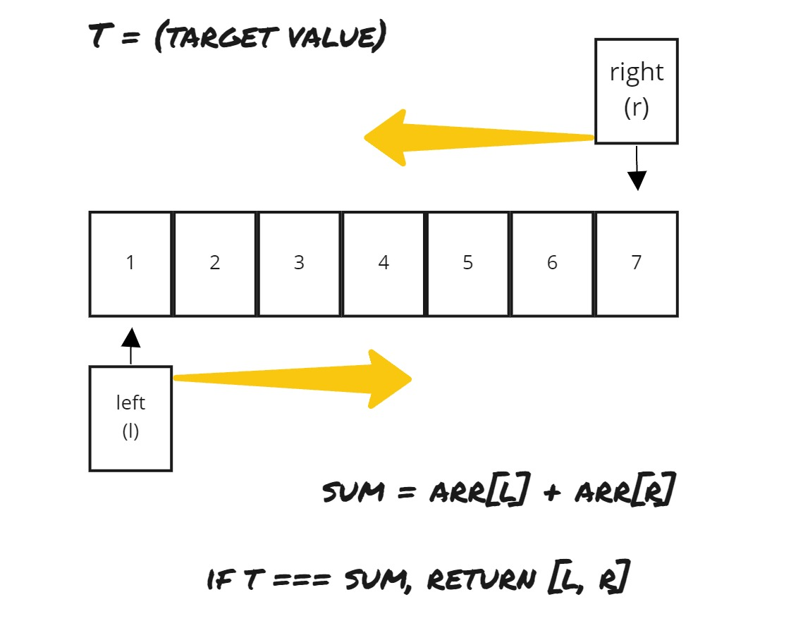
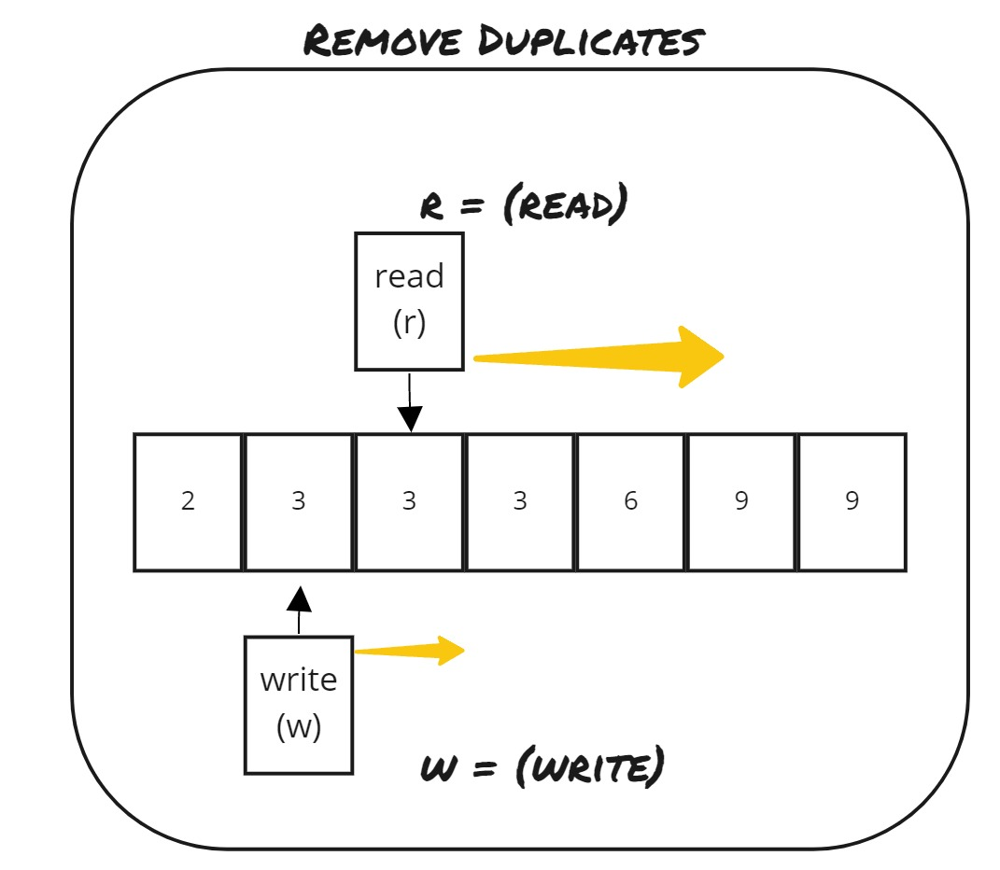

# Two (Three) Pointers

<hr>

## General Notes

- The **pointers may start in different points, move in different directions, start or restart at different points, they may stop when they meet or cross through and continue on** depending on the problem you are trying to solve.
- Sometimes a **for loop** can be used to make the code more readable.
- `Infinity` and `-Infinity` are good for starting comparisons where you are looking for mins (Infinity) and maxes (-Infinity).
  - This is because no matter how large or small the number it will be less than Infinity or more than -Infinity, and your comparison can move in the same pattern from there.
  - Using -Infinity helps when finding the largest value among negative numbers.
  - When you are trying to find a max value, you want to start with the smallest number possible (-Infinity).
  - When you are trying to find a min value, you want to start with the largest number possible (Infinity).
- Sometimes the trick is to do it in the opposite way you think of doing it
  - Instead of searching for the first time you find an instance of some condition, try looking for the last.


## Problems

### Pair with Target Sum - TwoSum - (easy)

- **Prompt:** Given an *array of **sorted** numbers* and a *target sum*, find a pair in the array whose sum is equal to the given target. Write a function to return the indices of the two numbers (i.e. the pair) such that they add up to the given target.
<br>

- **Example:**

```js
Input: [1, 2, 3, 4, 6], target=6
Output: [1, 3]
Explanation: The numbers at index 1 and 3 add up to 6: 2+4=6
```
<br>

- **Comments:**
  - *Pointers:* Two, one starts at the beginning and the other at the end of the array.
  - *Movement:* pointers work their way in towards target.
  - This is a good example of a problem that must use a while loop.
<br>

- **Basic Pattern:**
  - Create and assign pointers
  - Loop till pointers touch
    - check if condition is met, return values if so
    - move one pointer if not
  - return a negative response if the value is not found
  - <br>



- **Algorithm:**
  1. Create pointers at both ends.
  2. Create a loop that will run until the pointers meet.
  3. Add the value at the two pointers.
  4. If the added value (currentSum) matches the target, return the pointer values in an array.
  5. If the currentSum does not match the target,
     1. If the currentSum is greater than the target, decrement the right pointer.
     2. Else, increment the left pointer.
  6. If we reach this point, we have broken out of the loop and not found a matching value, so we will return `[-1, -1]` in this case as the prompt dictates.
<br>

- **Big O:**
  - Time: `O(n)`
  - Space: `O(1)`

- **Code:**

```js
// No comments
const pair_with_targetsum = function(arr, target_sum) {
  let lPtr = 0;
  let rPtr = arr.length - 1;

  while(lPtr < rPtr){ // O(n)t
    const currentSum = arr[lPtr] + arr[rPtr]; 
    if(currentSum === target_sum) return [lPtr, rPtr];
    if(currentSum > target_sum){
      rPtr--;
    } else {
      lPtr++;
    }
  }
  return [-1, -1];
}

// Comments
const pair_with_targetsum = function(arr, target_sum) {

  // Create two pointers 
  // set them such that they will begin on either side of the array.
  let lPtr = 0;
  let rPtr = arr.length - 1;

  // Here we create a loop that will run until the pointers touch,
  // that means that one of the two pointers MUST move 
  // every time through the loop.
  while(lPtr < rPtr){ 
    // Here we find the current condition we will be checking against.
    // Creating a well named variable here will make your code more readable.
    const currentSum = arr[lPtr] + arr[rPtr]; 

    //Here we check if the value we are searching for has been found, returning if so.
    if(currentSum === target_sum) return [lPtr, rPtr];

    // If the value hasn't been found we will move one of the two pointers 
    // in an attempt to get closer to our target
    // because our array is sorted we know if the lPtr is incremented our sum will be 
    // either the same or increase, the opposite if the rPtr is decremented.
    if(currentSum > target_sum){
      rPtr--;
    } else {
      lPtr++;
    }
  }

  // If we have reached the end of the loop, no value has been
  // found that meets the conditions
  return [-1, -1];
}
```

<hr>

### Remove Duplicates (easy)

- **Prompt:** Given an *array of sorted numbers*, **remove all duplicate number instances** from it **in-place**, such that each element appears only once. 
  - Move all the unique elements at the beginning of the array and after moving **return the length of the subarray** that has no duplicate in it.
<br>

- **Example:**

```js
Input: [2, 3, 3, 3, 6, 9, 9]
Output: 4
Explanation: The first four elements after removing the duplicates will be [2, 3, 6, 9].
```
<br>

- **Comments:**
  - *Pointers:* both pointer start at the first (`arr[1]`) index of the array.
  - *Movement:* the pointers will both more towards the end of the array at (most likely) different speeds.
  - This is a good example of a problem that is simplified / made more readable by using a for loop.
<br>


- **Basic Pattern:**
  1. Create a read an write variable starting at the same position.
  2. Iterate over array.
  3. When you find a value with your read variable that meets your condition
  4. Copy that value into your write variable and move it up one position. 
  5. Return the write variable, as it is equivalent to the length of the new sub-array you just made.
 <br>

 

- **Algorithm:**
  1. Create variable to track where the next non duplicate value will be written to the array, set to 1;
  2. Create for loop with variable to read the value at each position within the array.
     1. Check if the value at read is not equal the the value one prior.
        1. If the value is not equal, we have found our next non-duplicated number, and so we will
        2. Set the value at our write variable to be the value at our read variable.
        3. increment our write variable by one.
  3. return our write variable, as it will be equal to the length of our non-duplicate sub-array.
<br>

- **Big O:**
  - Time: `O(n)`
  - Space: `O(1)`

- **Code:**

```js
// No comments
const remove_duplicates = function(arr) {
  let write = 1;

  for(let read = 1; read < arr.length; read++){ // O(n)t
    if(arr[read] !== arr[read - 1]){
      arr[write] = arr[read];
      write++;
    }
  }

  return write;
};

// Comments
const remove_duplicates = function(arr) {

  // Here we are creating a pointer variable to keep track of where we will place 
  // non-duplicated values. Because the array is sorted, the value at the zeroth index
  // will always be in it's correct place, also because out condition is checking the value behind it in the array
  // this variable will start at 1, so we don't get any out of bounds errors.
  let write = 1;

  // Here we are create a for loop with a 'read' variable, this variable will track the current index to evaluate.
  for(let read = 1; read < arr.length; read++){

    // We will check if the value at the read index is NOT a duplicate of the previous value, if true we have
    // found a new value to place in our non-duplicate sub-array. 
    if(arr[read] !== arr[read - 1]){
      // When a value is found we will copy that value into the write index of our array, 
      arr[write] = arr[read];
      // then increment out write pointer.
      write++;
    }
  }

  // Once we have reached the end of our for loop, the value at write will be one more than the last
  // index of our sub-array. Which will be equal to the number of elements in our new sub-array since 
  // arrays are zero indexed.
  return write;
};
```

<hr>

### Squaring a Sorted Array (easy)

- **Prompt:** Given a **sorted array**, **create a new array** *containing squares of all the numbers of the input array* in the **sorted order**.
<br>

- **Example:**

```js
Input: [-2, -1, 0, 2, 3]
Output: [0, 1, 4, 4, 9]
```
<br>

- **Comments:**
  - *Pointers:* Two, one beginning at each end.
  - *Movement:* Both pointers towards each other, and the index of the loop moving in reverse order.
  - The trick with this one is that **the square of a negative number is a positive**, so -3<sup>2</sup> and 3<sup>2</sup> are both equal to 9. **But -3 and 3 will be on the other ends of a sorted array**.
    - Squaring `[-3, 0, 3]` in place will return `[9, 0, 9]` which is no longer sorted. We want the sorted array: `[0, 9, 9]` to be returned.
  - *We will fill our new array in reverse order, working from largest to smallest. Because the largest square values will be at both ends if our input array has negative values in it.*
<br>

- **Basic Pattern:**
  1. Create array
  2. Create pointers
  3. Loop, counting down
  4. find the squares
  5. add the larger of the two squares to the new array
  6. decrement or increment the pointer which held the value which lead to the larger square, towards the other pointer.
 <br>

- **Algorithm:**
  1. Create new array to hold the squared values.
  2. Create pointers and set them equal to both ends of the array.
  3. Loop over our input array once **from beginning to end**.
  4. Create two variables and set them equal to the square of the value at each pointer.
  5. Copy to the new array the **greater** of the two squared values.
  6. Increment or decrement the respective pointer, towards the other pointer.
  7. Return the new array after the loop finishes.
<br>

- **Big O:**
  - Time: `O(n)`
  - Space: `O(n)` // building the return array

- **Code:**

```js
// No comments
const make_squares = function(arr) {
  
  const squareArr = []; // O(n)s
  let lPtr = 0;
  let rPtr = arr.length - 1;

  for(let i = arr.length - 1; i >= 0; i--){ // O(n)t
    let lVal = arr[lPtr]**2;
    let rVal = arr[rPtr]**2;

    if(lVal > rVal){
      squareArr[i] = lVal;
      lPtr++;
    } else {
      squareArr[i] = rVal;
      rPtr--;
    }
  }

  return squareArr;
};

// Comments
const make_squares = function(arr) {

  // Here we create the arr that will hold our squared values
   const squareArr = []; 

  // Create two pointers 
  // set them such that they will begin on either side of the array.
  let lPtr = 0;
  let rPtr = arr.length - 1;

  // Create a for loop using the input array length and moving FROM END TO BEGINNING,
  // because our output array will be the same length.
  for(let i = arr.length - 1; i >= 0; i--){ 

    // Here we are creating two variables that hold the square or the values at each pointer.
    let lVal = arr[lPtr]**2;
    let rVal = arr[rPtr]**2;

    // Because we are creating a sorted array, and because we are working backwards, 
    // we push the GREATER of the two values in our array.
    // We then move our respective pointer towards the other.
    if(lVal > rVal){
      squareArr[i] = lVal;
      lPtr++;
    } else {
      squareArr[i] = rVal;
      rPtr--;
    }
  }

  // After the loop we return our new array that has been filled with the squared values.
  return squareArr;
};
```

<hr>

### Triplet Sum to Zero (medium)

- **Prompt:** Given an **array of unsorted numbers**, **find all unique triplets** in it that **add up to zero**.
<br>

- **Example:**

```js
Input: [-3, 0, 1, 2, -1, 1, -2]
Output: [-3, 1, 2], [-2, 0, 2], [-2, 1, 1], [-1, 0, 1]
Explanation: There are four unique triplets whose sum is equal to zero.
```
<br>

- **Comments:**
  - *Pointers:* The first left to right, increasing order, then two pointers one at each end of the array past that first index.
  - *Movement:* The first to iterate over the array, the two pointers moving towards each other.
  - Avoiding duplicates is what makes this question more difficult.
<br>

- **Basic Pattern:**
  1. Sort the input array
  2. create array to hold results values
  3. iterate up to end or zero in array
  4. call twoSum algo for each element in the array
  5. return the results array
 <br>

- **Algorithm:**
  1. Sort the input array
  2. create array to hold results values
  3. iterate up to end or zero in array
  4. Check for duplicated value, if not, call twoSum
     1. Create pointers at i+1 and last index
     2. Define target as negation of the value currently at i
     3. Create a loop that runs while the lower pointer is less than the higher pointer
     4. Move one of two pointers accordingly if the sum of the value at the two pointers is more or less than the target
     5. Or, if a match is found, create a new array with the values at i and each pointer, then push it to the results array
        1. then increment the lower pointer and decrement the higher pointer so as to avoid duplicates
        2. continue incrementing the lower pointer if it is a duplicate of the last value
  5. return the results array
<br>

- **Big O:**
  - Time: `O(n^2)`
  - Space: `~O(n)` dependant on the sorting algo

- **Code:**

```js
// No comments
const search_triplets = function(arr) {  
    if(arr.length < 3) return [];
    arr.sort((a, b) => a - b);  
    let resultsArr = [];
    
    for(let i = 0; i < arr.length && arr[i] <= 0; i++){
        if(arr[i] !== arr[i-1]) twoSum(i, arr, resultsArr);
    }
    
    return resultsArr;
};


function twoSum(idx, inputArr, resArr){
    let lPtr = idx + 1;
    let rPtr = inputArr.length - 1;
    let target = -inputArr[idx];
    
    while(lPtr < rPtr){
        const sum = inputArr[lPtr] + inputArr[rPtr];
        
        if(sum < target){           
            lPtr++;  
        } else if (sum > target){
            rPtr--;
        } else {
            resArr.push([ inputArr[idx], inputArr[lPtr], inputArr[rPtr]]);
            lPtr++;
            rPtr--;
            while(lPtr < rPtr && inputArr[lPtr] === inputArr[lPtr-1]){
                lPtr++;
            }
        }      
    }
}

// Comments
const search_triplets = function(arr) {
    // If there is less than 3 values within the array we do not have enough values to make a triplet.
    if(arr.length < 3) return [];

    // We first sort the array, this will allow us to then run a twoSum style algorithm later on
    arr.sort((a, b) => a - b); // O(n log n)
    
    // Create an array that will store our triplet values to return 
    let resultsArr = []; //O(n)s
    
    // We will iterate over our input array, until there is only three values left, or
    // until the current value in the array is greater than or equal to zero ( arr[i] <= 0 ),
    // this is because two larger numbers cannot add to a smaller number and all numbers
    // in a sorted array after 0 are larger.
    for(let i = 0; i < arr.length - 2 && arr[i] <= 0; i++){ // O(n)t
        
        // Here we are calling a twoSum algorithm to search for the pair of values that will add to i to make zero.
        // We do not want duplicates within our array, so we will check before.
        if(arr[i] !== arr[i-1]) twoSum(i, arr, resultsArr); // O(n)t
    }
    
    // Once we have iterated over our array we return any triplets we have found.
    return resultsArr;
};

// This function is essentially the "Pair with Target Sum" problem from above
// Except we are storing any solutions we find and skipping over duplicated values within our array.
function twoSum(idx, inputArr, resArr){

    // Create pointers starting at one more than the current index of for loop in the search_triplets function 
    // and one at the last index of the array.
    let lPtr = idx + 1;
    let rPtr = inputArr.length - 1;

    // Here we define the target we are searching for
    // the target is the negation of the current value at the i-th index of the input array in the search_triplets function, 
    // we are searching for triplets that sum to 0, 0 = X + Y + Z is equal to -X = Y + Z, where X is the current value in the input array. 
    let target = -inputArr[idx];
    
    while(lPtr < rPtr){ // O(n)t
        // Here we create a sum variable for readability
        const sum = inputArr[lPtr] + inputArr[rPtr];
        
        // We check the current sum against the target
        // Moving the pointers that help make up the sum as needed
        if(sum < target){           
            lPtr++;  
        } else if (sum > target){
            rPtr--;
        } else {
            // When we have found a sum that matches our target, we add all the values into an array and
            // push that array to our results array.
            resArr.push([ inputArr[idx], inputArr[lPtr], inputArr[rPtr]]);

            // Then, because we do not want duplicates, we must move both pointers from their current positions.
            lPtr++;
            rPtr--;

            // We will continue moving the lPtr up as long as we find duplicate values at that pointer
            while(lPtr < rPtr && inputArr[lPtr] === inputArr[lPtr-1]){
                lPtr++;
            }
        }      
    }
}
```

<hr>

### Triplet Sum Close to Target (medium) 

- **Prompt:** Given an **array** of **unsorted numbers** and a **target number**, *find a triplet in the array whose sum is as close to the target number as possible*, **return the sum** of the triplet. If there are *more than one such triplet, return the sum of the triplet with the smallest sum.*
<br>

- **Example:**

```js
Input: [-2, 0, 1, 2], target=2
Output: 1
Explanation: The triplet [-2, 1, 2] has the closest sum to the target.
```
<br>

- **Comments:**
  - *Pointers:* One iterating over the array, two at each end of the remaining array after the first index
  - *Movement:* The first moving left to right, increasing, the two moving towards each other looking for a target value
  - You need to keep track of the closest, and the smallest sum, but when a new closest is found the smallest sum must be redefined!
<br>

- **Basic Pattern:**
  1. Sort the input array
  2. create variables to track the smallest sum and the closest sum to the target
  3. Iterate over the array running a twoSum style algorithm to find the closest sum to the target
  4. return the smallest sum
 <br>

- **Algorithm:**
  1. Sort the input array
  2. create variables to track the smallest sum and the closest sum to the target
  3. Iterate over the array running a twoSum style algorithm to find the closest sum to the target
     1. Create pointers at one more than the current index and the last index
     2. Loop while the left pointer is less than the right pointer
        1. add the values at each pointer to find the current sum
        2. find the absolute value (distance) of the target minus the current sum
        3. if we have found a new closest
           1. set the closest to the current distance 
           2. set the smallest sum to be the the sum of the current indices
        4. else if the distance is equal
           1. check if the current sum is less than the saved sum, if so, set it to be the smallest sum.
        5. move one of the pointers in the direction so as to bring the current sum closer to the target
  4. return the smallest sum variable.
<br>

- **Big O:**
  - Time: `O(n^2)`
  - Space: `~O(n)` dependant on the sorting algo

- **Code:**

```js
// No comments
const triplet_sum_close_to_target = function(arr, target) {

  arr.sort((a, b) => a - b); // O(n log n)

  let smallest = null;
  let closest = null;
    
  for(let i = 0; i < arr.length - 2; i++){ // O(n) -> O(n^2)
    let lPtr = i + 1;
    let rPtr = arr.length - 1;

    while(lPtr < rPtr){ // O(n) 
      const sum = arr[lPtr] + arr[rPtr] + arr[i];
      let dist = Math.abs( target - sum );

      if(!closest || dist < closest){
        closest = dist;
        smallest = sum;
      } else if ( dist === closest ){
          if(sum < smallest) smallest = sum;
      }

      if(sum < target){
        lPtr++;
      } else {
        rPtr--;
      }
    }
  }

  return smallest;
}

// Comments
const triplet_sum_close_to_target = function(arr, target) {

  // Sorting helps use two pointer technique, lowering Big 0
  arr.sort((a, b) => a - b);

  // We need to track how close a sum is, and what the smallest sum of close values are.
  let smallest = null;
  let closest = null;
    
  for(let i = 0; i < arr.length - 2; i++){
    
    // create two pointers for twoSum
    let lPtr = i + 1;
    let rPtr = arr.length - 1;

    while(lPtr < rPtr){
      const sum = arr[lPtr] + arr[rPtr] + arr[i];

      // Finding the absolute value tells us the distance from the target
      // Because the values may be negative we need to use Math.absolute
      let dist = Math.abs( target - sum );

      // Check if the current distance is closer or equally as close
      // If there is not currently a value saved in closest,
      // or the current distance is closer than the closest,
      // we have found a new closest.
      if(!closest || dist < closest){

        //set our tracker variables if we have a new closest
        closest = dist;
        smallest = sum;
      } else if ( dist === closest ){
          // If it is equally close, we need to save the smaller of the two sums
          if(sum < smallest) smallest = sum;
      }

      // If we haven't found a value that is closer,
      // move one of our pointers to try to get closer to the sum
      if(sum < target){
        lPtr++;
      } else {
        rPtr--;
      }
    }
  }

  // We return the sum of the triplet closest to to sum
  return smallest;
}
```

<hr>

### Triplets with Smaller Sum (medium)

- **Prompt:** Given an **array** arr of **unsorted numbers** and a **target sum**, *count all triplets in it such that arr[i] + arr[j] + arr[k] < target, where i, j, and k are three different indices.* Write a function to **return the count** of such triplets.
<br>

- **Example:**

```js
Input: [-1, 0, 2, 3], target=3 
Output: 2
Explanation: There are two triplets whose sum is less than the target: [-1, 0, 3], [-1, 0, 2]
```
<br>

- **Comments:**
  - *Pointers:* One to evaluate each index of the array, two to search for all sums less than the target (twoSum style).
  - *Movement:* The first left to right, the next to towards each other.
  -  The trick with this problem is once you find a triplet that works, every value lower than the current rPtr will work for the current lPtr, so you can just subtract the rPtr from the lPtr to get the number of triplets to add to the count, then move on from that lPtr. 
<br>

- **Basic Pattern:**
  1. Create a count variable.
  2. Sort the array.
  3. Iterate over the array, running a twoSum style algo
     1. Adding the number of triplet sums less than the target for any give index to the count.
  4. Return the the count.
 <br>

- **Algorithm:**
  1. Create a count variable.
  2. Sort the array.
  3. Iterate over the array, running a twoSum style algo
     1. Creating pointer variables, one at one more than the index of the for loop, and one at the last index.
     2. While the left pointer is less than the right,
        1. Move the pointers such that they find the first value lower than the target
        2. Then, subtract the right pointer from the left pointer, and add that value to the count.
        3. Then increment the left pointer.
  4. Return the count.
<br>

- **Big O:**
  - Time: `O(n^2)`
  - Space: `~O(n)` dependant on the sorting algo

- **Code:**

```js
// No comments
const triplet_with_smaller_sum = function(arr, target) {
	let count = 0;

	arr.sort((a, b) => a - b); // O(n log n)t - O(n)s

	// O(n) -> O(n^2)
	for(let i = 0; i < arr.length - 2; i++){
		let lPtr = i + 1;
		let rPtr = arr.length - 1;
        
		// O(n)
		while(lPtr < rPtr){
		    let sum = arr[i] + arr[lPtr] + arr[rPtr];

            if(sum >= target){
                rPtr--;
            }else{
              count += rPtr - lPtr;
                lPtr++;
            }
        } 
  }
  return count;
}

// Comments
const triplet_with_smaller_sum = function(arr, target) {

  // Sort array, this will allow us to run twoSum style algo later on
	arr.sort((a, b) => a - b); 

  // Create a variable to track the number of triplets with a smaller sum
  let count = 0;  
	
  // Evaluate each index in the array, until only two are left (not enough to make up a triplet)
  // Run twoSum style algorithm starting at one passed the i-th index
	for(let i = 0; i < arr.length - 2; i++){
		let lPtr = i + 1;
		let rPtr = arr.length - 1;
        
		
		while(lPtr < rPtr){
		    let sum = arr[i] + arr[lPtr] + arr[rPtr];

            // We want to decrement the rPtr to make the sum value less for any value equal to or larger than our target.
            if(sum >= target){
              rPtr--;
            }else{
              // Once you find a triplet that works, every value lower than the current rPtr will work for a given lPtr as well
              // So we can just add each of those to the count and be done with that lPtr
              count += rPtr - lPtr;
              lPtr++;
            }
        } 
  }
  return count;
}
```

<hr>

### Dutch National Flag Problem (medium)

- **Prompt:** **Given an array containing 0s, 1s and 2s, sort the array in-place.** You should *treat numbers of the array as objects*, hence, we can’t count 0s, 1s, and 2s to recreate the array.
<br>

- **Example:**

```js
Input: [1, 0, 2, 1, 0]
Output: [0, 0, 1, 1, 2]
```
<br>

- **Comments:**
  - *Pointers:* Three pointers, two on each end and one in the middle.
  - *Movement:* The two on the end move in, while the pointer in the middle moves left to right starting in the same position as the lower pointer.
  - The trick to this problem is knowing when to swap the variables and when to move the pointers.
<br>

- **Basic Pattern:**
  1. Create pointers
  2. Iterate once over array
  3. Swap the values at the middle pointer and move the pointers accordingly
 <br>

- **Algorithm:**
  1. Create three pointers, one at each end of the array and one to traverse the array 
  2. Loop while the traversing pointer is less than the right pointer
     1. If the value at the traversing pointer is 0, 
        1. swap the value with the value at left pointer
        2. increment the left pointer
        3. increment the traversing ptr
     2. Else if the value at the traversing pointer is 2
        1. swap the value at the traversing pointer with the value at the right pointer
        2. decrement the right pointer (do NOTHING to the traversing pointer)
     3. Else
        1. increment the traversing pointer (this means we have found a 1, which belongs in the middle).
  3. Return the input array
<br>

- **Big O:**
  - Time: `O(n)`
  - Space: `O(1)`

- **Code:**

```js
// No comments
const dutch_flag_sort = function(arr) {


  let low = 0;
  let high = arr.length - 1;
  let ptr = 0;

	while(ptr <= high){ //O(n)
		if(arr[ptr] === 0){
			swap(arr, ptr, low);
			low++;
      ptr++;
    } else if (arr[ptr] === 2){
	    swap(arr, ptr, high);
      high--;
    } else {
	    ptr++;
    }
  }
  return arr;
}


function swap(arr, ptr1, ptr2){
	[arr[ptr1], arr[ptr2]] = [arr[ptr2], arr[ptr1]]
}


// Comments
const dutch_flag_sort = function(arr) {
	
  // We are going to need three pointers for this problem
  // One at the each end and one in between
  let low = 0;
  let high = arr.length - 1;
	let ptr = 0;

  // We are going to move the middle ptr until it reaches the high pointer
	while(ptr <= high){

    // If the value at the ptr var is 0, swap it with the value at the low pointer
    // Then move both the low and ptr vars up one step
		if(arr[ptr] === 0){
			swap(arr, ptr, low);
			low++;
      ptr++;
    // If the value at the ptr var is 2, swap it with the value at the high pointer
    // The move the high pointer down one step, but leave the ptr var where it is
    } else if (arr[ptr] === 2){
	    swap(arr, ptr, high);
      high--;
    // If we have reached this part of the conditional we have found a 1, and will just move the ptr var up by one step
    } else {
	    ptr++;
    }
  }

  // Finally we will return the input array
  return arr;
}

// Swap two values within an array
function swap(arr, ptr1, ptr2){
	[arr[ptr1], arr[ptr2]] = [arr[ptr2], arr[ptr1]]
}

```

<hr>

### Quadruple Sum to Target (medium)

- **Prompt:** Given an array of unsorted numbers and a target number, find all unique quadruplets in it, whose sum is equal to the target number.
<br>

- **Example:**
```js
Input: [4, 1, 2, -1, 1, -3], target=1
Output: [-3, -1, 1, 4], [-3, 1, 1, 2]
Explanation: Both the quadruplets add up to the target.
```
<br>

- **Comments:**
  - *Pointers:* 4 ptrs, two in a nested forloop and two acting as the pointers for twoSum style algo
  - *Movement:* The two nested for loop pointers move left to right, and tw thw twoSum style pointers move in towards each other. 
  - Again, with all nested non-duplicate xSum style problems, the thing to watch out for is duplicate values.
  - **In this problem we just push past all non-duplicates every time after we find a new solution.**
<br>

- **Basic Pattern:**
  1. threeSum with an extra for loop
 <br>

- **Algorithm:**
  1. Sort input array
  2. Create array to hold quadruplets
  3. Create nested for loop
  4. run twoSum style algo
  5. if a sum is found that matches the target
     1. push an array containing all pointers to the results array
     2. **run a while loop for each of the pointers to skip over any of the duplicate values**
     3. **Then increment the lPtr and decrement the rPtr once more**
  6. return results array
<br>

- **Big O:**
  - Time: `O(n^3)`
  - Space: `O(n) - sorting`

- **Code:**

```js
// No Comments
var fourSum = function(nums, target) {
    nums.sort((a,b) => a-b); // O(n)s
    let result = [];

    for (let i=0; i<nums.length - 3; i++) { // O(n^2)t
        for (let j=i+1; j<nums.length - 2; j++) {

            let lPtr = j+1, 
            rPtr = nums.length - 1;

            while (lPtr < rPtr) { // O(n)t
                let sum = nums[i] + nums[j] + nums[lPtr] + nums[rPtr];

                if (sum > target){
                  rPtr--;
                }
                else if(sum < target){
                  lPtr++;
                }  
                else {
                    result.push([nums[i], nums[j], nums[lPtr], nums[rPtr]]);
                    while (nums[i] === nums[i+1]) i++;
                    while (nums[j] === nums[j+1]) j++;
                    while (nums[lPtr] === nums[lPtr+1]) lPtr++;
                    while (nums[rPtr] === nums[rPtr-1]) rPtr--;
                    lPtr++; rPtr--;
                }   
            }
        }
        
    }
    return result;
};

//Comments
var fourSum = function(nums, target) {

    // Sort input array
    nums.sort((a,b) => a-b); //O(n)s
    // Create an array to hold the quadruplets whose sum match the target
    let result = [];

    // Create a nested for loop - O(n^2)t
    for (let i=0; i<nums.length - 3; i++) {
        for (let j=i+1; j<nums.length - 2; j++) {

            // twoSum Style algo - O(n)t
            // Create pointers
            let lPtr = j+1, 
                rPtr = nums.length - 1;

            while (lPtr < rPtr) {

                // Find current sum
                let sum = nums[i] + nums[j] + nums[lPtr] + nums[rPtr];

                // Move sum towards target
                if (sum > target){
                  rPtr--;
                }
                else if(sum < target){
                  lPtr++;
                }
                // If a match is found
                else {
                    // Push current values to the results array as a quadruplet
                    result.push([nums[i], nums[j], nums[lPtr], nums[rPtr]]);
                    
                    //Increment i, j, lPtr and decrement rPtr while there are duplicate values
                    while (nums[i] === nums[i+1]) i++;
                    while (nums[j] === nums[j+1]) j++;
                    while (nums[lPtr] === nums[lPtr+1]) lPtr++;
                    while (nums[rPtr] === nums[rPtr-1]) rPtr--;

                    // Increment and decrement once more to avoid duplicates
                    lPtr++; rPtr--;
                }   
            }
        }
    }

    // Return results array
    return result;
};
```

- **Alternate Solution:**

```js
// No comments
var fourSum = function(arr, target) {
    
  let resultsArr = [];
	arr.sort((a, b) => a - b);

	for(let i=0; i < arr.length-3 ; i++){ // O(n)
		if (arr[i] === arr[i - 1]) continue; 

		for(let j = i+1; j < arr.length-2; j++){ // O(n)
            if (j > i + 1 && arr[j] === arr[j - 1]) continue;           
            findPair(i, j, arr, resultsArr, target); // O(n)
      }
    }
	return resultsArr;
}

function findPair(i, j, arr, resArr, target){
    let lPtr = j+1;
    let rPtr = arr.length-1;
    
    while(lPtr < rPtr){
        const sum = arr[i] + arr[j] + arr[lPtr] + arr[rPtr];
        
        if(sum < target){
            lPtr++;
        } else if (sum > target){
            rPtr--;
        } else {
            resArr.push([arr[i], arr[j], arr[lPtr], arr[rPtr]]);
            lPtr++;
            rPtr--;
            while(lPtr < rPtr && arr[lPtr] === arr[lPtr-1]){
                lPtr++;
            }
        }
    }
}

// Comments
var fourSum = function(arr, target) {
    
    // Create an array to store the quadruplets that add to the target 
    let resultsArr = [];
	
    // Sort the array O(n log n)t
	arr.sort((a, b) => a - b);
    
    // Iterate over the array until you can make one final triplet
	for(let i=0; i < arr.length-3 ; i++){ // O(n)
        
        // If you find a duplicate skip to the next i value
		if (arr[i] === arr[i - 1]) continue; 
        
        // Starting at one more than i, iterate over the array
		for(let j = i+1; j < arr.length-2; j++){
            
            // If j is at least one more than i and is a duplicate, skip to next j value
            if (j > i + 1 && arr[j] === arr[j - 1]) continue;
            
            findPair(i, j, arr, resultsArr, target);
      }
    }
	return resultsArr;
}

// twoSum style algo, making sure there are no duplicate values
// and pushing any found values to the resultsArr
function findPair(i, j, arr, resArr, target){
    let lPtr = j+1;
    let rPtr = arr.length-1;
    
    while(lPtr < rPtr){
        const sum = arr[i] + arr[j] + arr[lPtr] + arr[rPtr];
        
        if(sum < target){
            lPtr++;
        } else if (sum > target){
            rPtr--;
        } else {
            // Push the quadruplet to the results array
            resArr.push([arr[i], arr[j], arr[lPtr], arr[rPtr]]);
            // move on from both indices to avoid duplicates
            lPtr++;
            rPtr--;
            // keep incrementing the lPtr if it holds the same value as the last lPtr
            while(lPtr < rPtr && arr[lPtr] === arr[lPtr-1]){
                lPtr++;
            }
        }
    }
}
```

<hr>

### Comparing Strings containing Backspaces (medium)

- **Prompt:** Given two strings containing backspaces (identified by the character ‘#’), check if the two strings are equal.
<br>

- **Example:**
```js
Input: str1="xp#", str2="xyz##"
Output: true
Explanation: After applying backspaces the strings become "x" and "x" respectively.
In "xyz##", the first '#' removes the character 'z' and the second '#' removes the character 'y'.
```
<br>

- **Comments:**
  - *Pointers:* Two main pointers, two secondary pointers used to find the next valid index.
  - *Movement:*  All moving right to left in decreasing order.
<br>

- **Basic Pattern:**
  1. Create two pointers at the last index of each string
  2. . Starting at that index find the next valid index
  3. Check if there is a next valid index, if not return false
  4. Check if the valid indices match, if not return false
  5. check if we have reached the last indices, it they match, return true
  6. If we get here and we haven't returned, set the indices to the next elements to be evaluated
 <br>

- **Algorithm:**
  1. Create two pointers at the last index of each string
  2. Starting at that index create a while loop that will run while neither index has reached the end of it's respective string
  3. find the next valid index for each string and set to new pointers
     1. create a variable to track the next valid index, set it to the current index
     2. while the value of the current string at that index is a '#'
        1. set the valid index to the current valid index minus two
        2. decrement the current index by one
     3. If the current index is less than zero, return null, else return the valid index
  4. Check if there is a next valid index, if not return false
  5. Check if the valid indices match, if not return false
  6. check if we have reached the last indices, it they match, return true
  7. If we get here and we haven't returned, set the indices to the next elements to be evaluated
<br>

- **Big O:**
  - Time: `O(n + m)`
  - Space: `O(1)`

- **Code:**

```js
// No comments
const backspace_compare = function(str1, str2) {

  let idx1 = str1.length;
  let idx2 = str2.length;

  while(idx1 >= 0 && idx2 >= 0){
    let vIdx1 = validIndex(str1, idx1);
    let vIdx2 = validIndex(str2, idx2);

    if(vIdx1 === null || vIdx2 === null) return false;
    if(str1[vIdx1] !== str2[vIdx2]) return false;
    if(vIdx1 === 0 && vIdx2 === 0) return true;

    idx1 = --vIdx1;
    idx2 = --vIdx2;
  }
}

function validIndex(str, i){
  let valid = i;

  while(str[i] === '#'){
    valid-=2;
    i--;
  }

  return i < 0 ?  null : valid;
}

// Comments
const backspace_compare = function(str1, str2) {

  // Current index for evaluation
  let idx1 = str1.length;
  let idx2 = str2.length;

  while(idx1 >= 0 && idx2 >= 0){

    // valid index after backspaces
    let vIdx1 = validIndex(str1, idx1);
    let vIdx2 = validIndex(str2, idx2);

    // If null, we have backspaced out of the string
    if(vIdx1 === null || vIdx2 === null) return false;

    // If the values at each valid index don't match, our strings don't match
    if(str1[vIdx1] !== str2[vIdx2]) return false;

    // If we have reached the last indices at the same time and our values match, return true
    if(vIdx1 === 0 && vIdx2 === 0) return true;

    // If we reach here we have a valid string so far, continue to verify at next unknown index
    idx1 = --vIdx1;
    idx2 = --vIdx2;
  }
}

function validIndex(str, i){
  let valid = i; // track the next valid index;

  // For each backspace the next potentially valid index grows by two ( one for the #, one for the deleted valid char)
  while(str[i] === '#'){
    valid-=2;
    i--;
  }

  // If we have reached the beginning of our string we have nothing left to skip over
  return i < 0 ?  null : valid;
}

```

<hr>

### Minimum Window Sort (medium)

- **Prompt:** Given an array, find the length of the smallest subarray in it which when sorted will sort the whole array.
<br>

- **Example:**

```js
Input: [1, 3, 2, 0, -1, 7, 10]
Output: 5
Explanation: We need to sort only the subarray [1, 3, 2, 0, -1] to make the whole array sorted
```

<br>

- **Comments:**
  - *Pointers:* Four, two starting at the beginning and end of the input array, two to mark the start and end of the unsorted sub-array.
  - *Variables* Two, one to hold the largest value seen by the lPtr, and one to hold the smallest value seen by the rPtr
  - *Movement:* The lPtr will work right and the rPtr will work left, they will **NOT** stop until they reach the other side, they will cross each other.
  - Instead of searching for the first instance of an unsorted value in the array, you need to search for the last, so, you start from the beginning looking for the end and start at the end looking for the beginning.
  - This is one of those problems where you really must understand and think deeply about the properties of the data structure you are working with and the conditions put upon it (sorted in this case).
    - E.g. A value in a sorted array will always be greater or equal to the value that came before it.
  - Another important trick is the use of + and - Infinity, allowing for the variables to effectively not be set yet still perform properly in a comparison the first time around.
<br>

- **Basic Pattern:**
  1. Move lPtr right and rPtr left, lPtr looking for values not in ascending order, and the rPtr looking for values not in descending order.
  2. Assign an e and start pointer respectively every time an unsorted value is found.
  3. return end minus start plus one after each index is evaluated once.
 <br>

- **Algorithm:**
  1. Create an lPtr and rPtr to evaluate the indices in ascending and descending order.
  2. Create a start and end pointer to point to the beginning and end of the unsorted section, set end to -1.
  3. Create a min variable set to Infinity and a max variable set to -Infinity.
  4. Loop over each index in the array once.
     1. If the value at the lPtr is greater than the max, set max to that value, if not set the end pointer to be equal to the lPtr (found unsorted value).
     2. If the value at the rPtr is less than the min, set min to that value, if not set the start pointer to be equal to the rPtr (found unsorted value).
     3. Increment lPtr, decrement rPtr.
  5. Return the end pointer minus the start pointer, add one to the difference to find the length.
<br>

- **Big O:**
  - Time: `O(n)`
  - Space: `O(1)`

- **Code:**

```js
// No Comments
var findUnsortedSubarray = function(arr) {

    let lPtr = 0, rPtr = arr.length-1;
    let start = 0,  end = -1;
    let min = Infinity, max = -Infinity;

    while(lPtr < arr.length){

        arr[lPtr] >= max ? max = arr[lPtr] : end = lPtr;
        arr[rPtr] <= min ? min = arr[rPtr] : start = rPtr;

        lPtr++;
        rPtr--;
    }

    return end - start + 1;
};

//Comments

var findUnsortedSubarray = function(arr) {
    // Create pointers at each end of the array
    let lPtr = 0, rPtr = arr.length-1;

    // Create pointers that will point to the beginning and end of the unsorted portion of the array
    // End is set to -1, this will only come into play when the array is sorted and therefore the 
    // length of the array is zero. Because of the way the return is set up with a +1, it will balance out to 0.
    let start = 0,  end = -1;

    // Create a min and max variable, 
    // min will track the lowest value the rPtr has seen on it's way down the array.
    // max will track the highest value the lPtr has seen on it's way up the array.
    // We start the variables as +/- Infinity to maintain the pattern in the loop
    // No matter what the first value for each, it will be larger or smaller respectively.
     let min = Infinity, max = -Infinity;

    // Create a while loop that will run until the left or right pointer (pick one, they will move at the same rate) 
    // reaches the opposite side. This could be done as a for loop as well, but it helps to 
    // illustrate what is going on when it is a while loop imo.
    while(lPtr < arr.length){

        // What we need to do is find the last time in the array that a value is out of order,
        // Working up from the beginning for the end point, and 
        // Working down from the end for the start point

        // In a sorted array, as you iterate l to r (like the lPtr), 
        // you should expect to continually find the next number to be equal to or greater than the last
        // If this is the case set the max variable to that number.
        // If you find a number that is less than the largest number you have seen, it means you have found 
        // a number that is out of order.
        // Each time you find an out of order number, set the end pointer to that index, as you continue
        // If the numbers keeps increasing until the end, that portion of the array is sorted, therefore the
        // last time you set the end pointer it will point to the end of the unsorted portion of the array.
        arr[lPtr] >= max ? 
            max = arr[lPtr] : 
            end = lPtr;

        // The rPtr does the exact opposite of the lPtr. It moves from the end of the array in descending order
        // looking for values in the array that are out of order given that each value in a sorted array should be 
        // less than the one previous. Each time we find one of these out of order values, 
        // we will set the start pointer to be the current rPtr value. The last time we set this value will be the 
        // start of the unsorted portion of the array. 
        arr[rPtr] <= min ? 
            min = arr[rPtr] : 
            start = rPtr;


        // For each time through the loop we will increment and decrement
        // the lPtr and the rPtr, working them from one end of the array to the other.
        lPtr++;
        rPtr--;
    }

    // When we reach the end we will have the end and the start of the unsorted portion of the array
    // but the problem wants to know the length of that sub portion, because arrays are zero indexed we need to add one 
    // after we subtract the end value from the start to geth the length. 
    // As mentioned above, if the array is fully sorted or empty, we want to return 0, as that is the length of the 
    // unsorted portion of the array, in both of those cases end and start will not have been updated 
    // You would expect for both end and start to be zero in this case, however, because we have to adjust 
    // to find the length of the sub-array, we start the end at -1 to counter this and return zero
    return end - start + 1;
};
 ```

- **Alternative:**

```js
var findUnsortedSubarray = function (arr) {

  let start = null; 
  let end = null;

  let lPtr = 0;
  let hPtr = arr.length - 1;

  while(lPtr < hPtr){

    for(let i = lPtr; i <= hPtr; i++){
      if(start === null && arr[i] < arr[lPtr]){
        start = lPtr;
      }
      if(end === null && arr[i] > arr[hPtr]){
        end = hPtr;
      } 
    }

    if(start !== null && end !== null) return end - start + 1; 
    if(start === null) lPtr++;
    if(end === null) hPtr--;
  }

  return arr[0] > arr[arr.length-1] ? arr.length : 0;
};
```