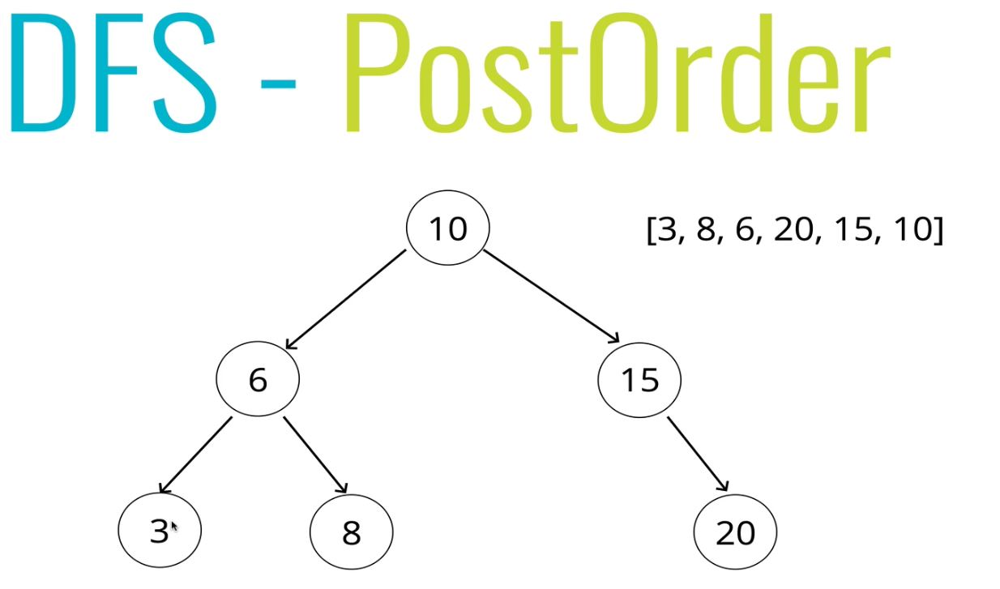

# Tree Traversal

## 172: Intro to Tree Traversal

> How do we visit every node one time?

### Two way to traverse a tree:
  - Breadth-first Search
  - Depth-first Search

#### Breadth First Search (BFS):

- Primary direction: going across, hitting the end, going down a layer.
  - Starting at the top and going layer by layer left to right.

#### Depth First Search (DFS):

- Primary Direction: going down.
- **Three Main Ways**
  - `inOrder`
  - `preOrder`
  - `postOrder`

---
## 173: Breadth First Search Intro (BFS):

  - Visit all nodes on the same level before working our way down.
    - First across, then down.
 
  

#### Steps (Iteratively):
  - Create a queue (can be an array, just needs to model a queue) and a variable to store the values of the nodes visited.
    - *Queue = FiFo structure*
  - Place the root node in the queue.
  - Loop as long as there is anything in the queue.
    - Dequeue a node from the queue amd push the value of the node into the variable that stores the nodes.
    - If there is a left property on the node dequeued:
      - add it to the queue.
    - If there is a right property on the node dequeued:
      - add it to the queue.
  - Return the variable that stores the values.
<br>
- Can think of the queue as a "to-do" list.

## 174: Breadth First Search Solution:

```js
class Binary Search Tree{
  ...
  BFS(){
    let node  = this.root; // Set our root node to our node
    let data  = [];        //This will hold our data to return
    let queue = [];        //This will keep track of the nodes in our tree

    queue.push(node);      //This pushes the root node into the end of our tree, making it the first item in our queue
  
    while(queue.length){                      // Loop while there is something in the queue. We can't just say while(queue), an empty array still returns true
      node = queue.shift();                   // Take the node at the beginning of the queue and put it in the node
      data.push(node.value);                  // Push the current node's value into our data array
      if(node.left) queue.push(node.left);    // Check if there is a left node, if so add it to the queue
      if(node.right) queue.push(node.right);  // Check if there is a right node, if so add it to the queue
    }
    return data; // return the data in our array
  }
}
``` 

--- 
## 175: Depth First **preOrder** Intro (DFS):

#### All Depth First Searches traverse vertically, down to the end of the tree before visiting sibling nodes.
  - First down, then across.

#### Binary Tree Searches can be broken down into three main steps:
  - Visit the node.
  - Explore the left side.
  - Explore the right side.

#### *Changing the order above will change the output of our search.*

### preOrder:

  > We look at the node, THEN we explore all children.

  - BST: We visit the node, THEN look at the left and the right.

  - **Order:**
    1. Visit the node.
    2. Explore the left side.
    3. Explore the right side.


### Steps (recursively):

- Create a variable to store the values of nodes visited
- Store the root of the BST in a variable called current
- Write a helper function which accepts a node
  - **Push the value of the node to the variable that stores the values**
  - if the node has a **left property:**
    - call the helper function with the left property of the node
  - if the node has a **right property:**
    - call the helper function with the right property of the node
- Invoke the helper function with the current variable
- Return the array of values

## 176: Depth First preOrder Solution:

```js
class Binary Search Tree{
  ...
  preOrder_DFS(){
    let data    = [];     // The array that will hold our return data

    function traverse(node){    // Create a helper function to traverse
      data.push(node.value);                // Push the value in the argument node into our return value array    
      if(node.left)  traverse(node.left);   // Check if there is a left node, if so,  call the traverse function recursively, passing node.left in
      if(node.right) traverse(node.right);  // Check if there is a right node, if so,  call the traverse function recursively, passing node.right in
    }

    traverse(this.root); // Call the traverse function, passing in the root node of the BST
    return data;         // Return the data in our array
  }
}
```

---
## 177: Depth First **postOrder** Intro (DFS):

### postOrder:

  > We explore all the children, THEN we look at the node.

  - BST: We look at the left and the right, THEN visit the node.

  - **Order:**
    1. Explore the left side.
    2. Explore the right side.
    3. Visit the node.



### Steps (recursively):

- Create a variable to store the values of nodes visited
- Store the root of the BST in a variable called current
- Write a helper function which accepts a node
  - if the node has a **left property:**
    - call the helper function with the left property of the node
  - if the node has a **right property:**
    - call the helper function with the right property of the node
  - **Push the value of the node to the variable that stores the values**
- Invoke the helper function with the current variable
- Return the array of values

---
## 178: Depth First **postOrder** Solution:

```js
class Binary Search Tree{
  ...
  postOrder_DFS(){
    let data    = [];     // The array that will hold our return data

    function traverse(node){    // Create a helper function to traverse
      if(node.left)  traverse(node.left);   // Check if there is a left node, if so,  call the traverse function recursively, passing node.left in
      if(node.right) traverse(node.right);  // Check if there is a right node, if so,  call the traverse function recursively, passing node.right in
      data.push(node.value);                // Push the value in the argument node into our return value array    
    }

    traverse(this.root); // Call the traverse function, passing in the root node of the BST
    return data;         // Return the data in our array
  }
}
```

## 179: Depth First **inOrder** Intro (DFS):

### inOrder:

  > We explore the entire left side, THEN we look at the node, THEN we explore the entire right side.

  - BST: We look at the left, THEN visit the node, THEN the right.

  - **Order:**
    1. Explore the left side.
    2. Visit the node.
    3. Explore the right side.


### Steps (recursively):

- Create a variable to store the values of nodes visited
- Store the root of the BST in a variable called current
- Write a helper function which accepts a node
  - if the node has a **left property:**
    - call the helper function with the left property of the node
  - **Push the value of the node to the variable that stores the values**
  - if the node has a **right property:**
    - call the helper function with the right property of the node
- Invoke the helper function with the current variable
- Return the array of values

---
## 180: Depth First **inOrder** Solution:

```js
class Binary Search Tree{
  ...
  inOrder_DFS(){
    let data    = [];     // The array that will hold our return data

    function traverse(node){    // Create a helper function to traverse
      if(node.left)  traverse(node.left);   // Check if there is a left node, if so,  call the traverse function recursively, passing node.left in
      data.push(node.value);                // Push the value in the argument node into our return value array    
      if(node.right) traverse(node.right);  // Check if there is a right node, if so,  call the traverse function recursively, passing node.right in
    }

    traverse(this.root); // Call the traverse function, passing in the root node of the BST
    return data;         // Return the data in our array
  }
}
```

---
## 181: When to Use BFS and DFS:

> It depends...

  #### Complexity:
  - **Time is the same**
    - We're visiting every node once.
  - **Space is different**
    - This will vary depending on the search you choose.
    - How many nodes are we having to keep in memory at any given time.

  #### If your tree is fully flushed out, as wide as it can be all the way down:
    
  - Breadth First is a lot of nodes to keep in memory.
     
<br>
  - Depth First only needs to keep track of one route all the way down 
     

> - **If it's wider than it is deep: Depth First.**
> - **If it's deeper than it is wide: Breadth First.**

--- 
## When to us the different variants of DFS:

  ### Not any *REALLY* good answers, most of the time it is just because it is good to know.

  #### inOrder:

  - Will return the data we get back in order, left to right.

  #### preOrder:

  - Good for flattening the tree out, or export it so that it can easily be reconstructed.