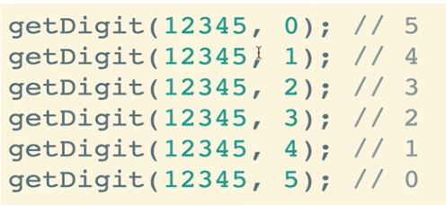
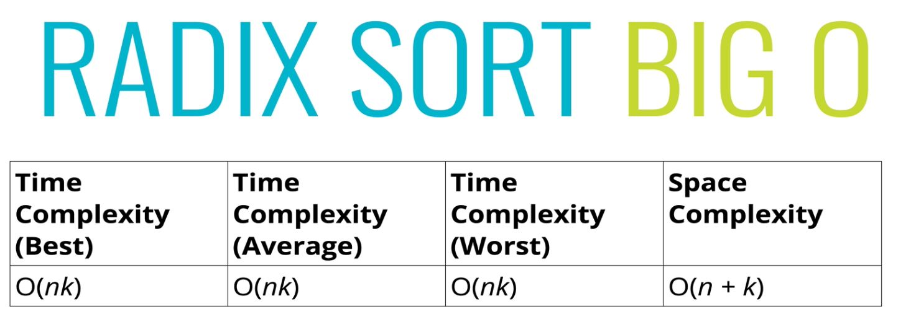

# Radix Sort

## 98: Intro to the Radix Sort:

- The algorithms we have looked at so far have all been **comparison sorts**, the best average time complexity you can hope to get out of a comparison sort algorithm is **O(n log^n)**

- We can do better in certain scenarios, but only with specific cases and without using direct comparisons. 

> **Radix fort is a special sorting algorithm that works on lists of numbers only**
> - it is possible to sort other data, but it has to be converted to numbers first.
> **Radix sort never makes direct comparisons, it exploits te fact that information about the size of a number is encoded in the number of digits.**


## 99: Radix Sort: Helper Methods

- **In order to impliment radix sort, it's helpful to build a few helper functions first:**
<br>

#### getDigit

- **getDigit(*num, place*)** - returns the digit in *num* at the given **place**.
<br>



<br>

```js

function getDigit(num, i){
  return Math.floor(Math.abs(num) / Math.pow(10, i) % 10 )
}

```

#### digitCount

- **digitCount(*num*)** - returns the number of digits in *num*.


```js

function digitCount(num){
  if(num === 0) return 1;
  return Math.floor(Math.log10(Math.abs(num))) + 1;
}

```

#### mostDigits

- **mostDigits(*nums*)** - Given an array of numbers, returns the number of digits in the largest number(s) in the list.
  - ``` mostDigits([2, 444, 22]) //returns 3 ``` 

<br>

```js

function mostDigits(nums){
  let maxDigits = 0;
  for(let i = 0; i < nums.length; i++){
    maxDigits = Math.max(maxDigits, digitCount(nums[i]));
  }
  return maxDigits;
}
```
 <br>

 ## 100: Radix Sort: Pseudocode

 - Define a function that accepts a list of numbers
 - Figure out how many digits the largest number has **mostDigits()**
 - loop from k = 0 up to the largest number of digits
   - For each iteration
     - Create buckets for each digit (0 - 9)
     - place each number in the corresponding bucket based on it's *k*th digit
 - Replace our existing array with the values in our buckets, started with 0 and going up to 9.
 - Return list at the end

## 101 Radix Sort: Implementation 

```js

function radixSort(nums){
  let highestDigitCount = maxDigits(nums);

  for(let k = 0; k < highestDigitCount; k++){
    let digitBuckets = [ [], [], [], [], [], [], [], [], [], [] ];

    for(let i = 0; i < nums.length; i++){
      let digit = getDigits(nums[i], k);
      digitalBuckets[digit].push(nums[i]);
    }
    nums = [].concat(...digitBuckets);
  }
  return nums
}

```

## 102: Radix Sort: BIG O Complexity

- There is some controversy, but these are the generally accepted BigO values:



<br>

> k here stands for the length of digits in the largest number
> n stands for the length of the array as usual