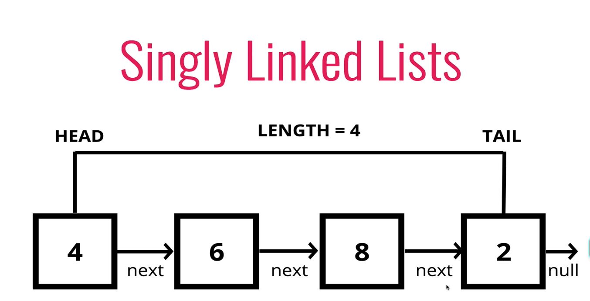
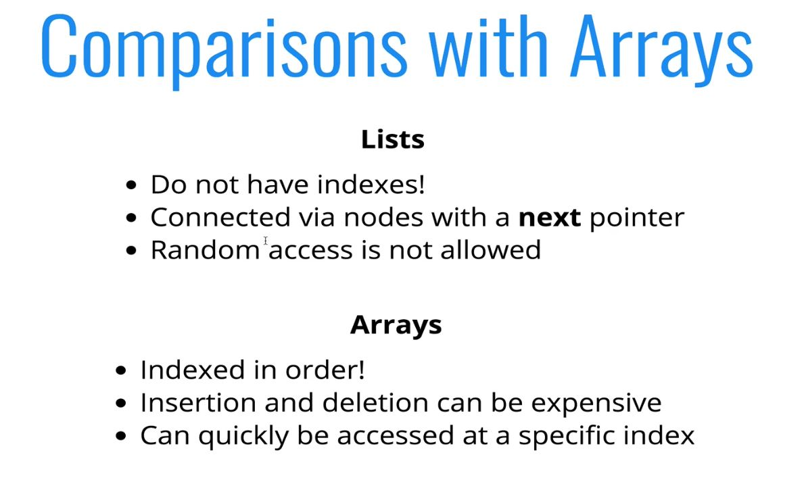
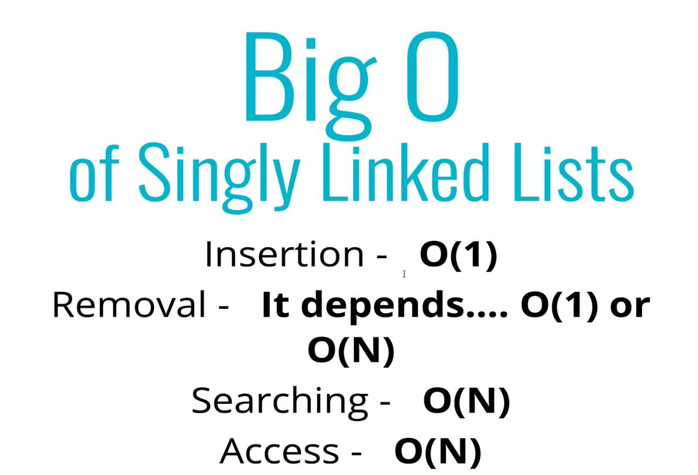
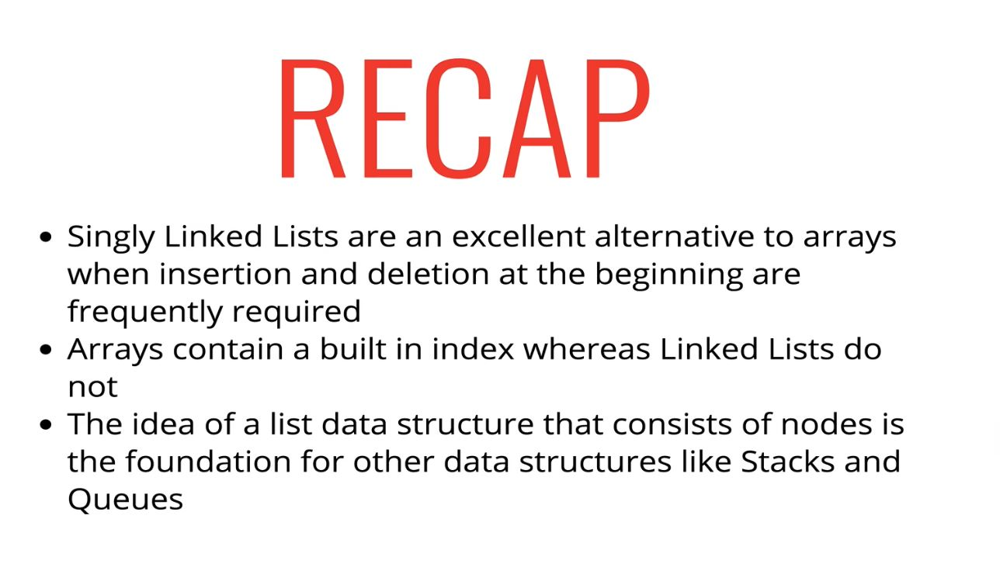

# Singly Linked Lists

## 109: Intro to Singly Linked Lists

> An Array and a Linked List are both ordered data structures.
> <br>
>  The difference is that in an Array each item is mapped by an index with a number, where as a Linked List consists of a bunch of elements with no indices, each element just points to the next element.

<br>

>**Linked List:** A data structure that contains a **head**, **tail**, and **length** property.
<br>

> Linked lists consist of **nodes** and each node has a **value** and a **pointer** to another node, or null.

**There is no index with Linked Lists, if we wish to find the fifth item in a Linked List, we have to start at the head of the linked list and move through the LL one node at a time following the pointer to the next nodes as we go.**



- A **Singly Linked List** refers to the fact that each node is only connected one directionally to the next node.
- Linked lists are good if you care about insertion, because unlike an Array, you don't have to care about re-indexing the whole array after you insert a new element. 



## 110: Started Code and Push and Solution:

- Adding a tail property to a linked list allows for insertions at the end of the list to be O(1) vs O(n) without.

```js

//node
// piece of data - val
// reference to the next node - next
class Node{
  constructor(val){
    this.val = val;
    this.next = null;
  }
}

class SinglyLinkedList{
  constructor(){
    this.head = null; // Keeps track of the first node in the list
    this.tail = null; // Keeps track of the last node in the list
    this.length = 0;  // Keeps track of the amount of notes in the list
  }

  // Adds a new node to the list (append)
  push(val){ // O(1)

  //Create a new node using the given value
    let newNode = new Node(val);

    // If the list is empty
    if(!this.head){
      // In JS objects are passed by reference, so each the tail and the head are pointing to the same node object.
      this.head = newNode;
      this.tail = newNode;
    } 
    else {
      this.tail.next = newNode; // Set the current nodes next property to point to the new node
      this.tail = newNode;      // Set the tail property of the linked list to be the new node
    }
    this.length++;
    
    return this // returns the whole linked list
  }

}


let list = new SinglyLinkedList();

```

### Pushing

- Adding a new node to the end of a linked list.

#### PseudoCode:

- Accept a value
- Create a new Node using the passed in value
  - If, the the head property is null
    - set the head and the tail property to be the newly created node
  - Else, set the next property on the tail to be the new node and the tail property on the list to be the newly created node.
- Increment the count by one.

## 112-113: Popping:

- **Popping:** removing a node from the end of a linked list.
<br>

> To update the tail we have to start at the beginning and go through the entire list and find the second to last item in the list and make that the new tail. 

<br>

### Traversing a Linked List:

  - To traverse a linked list, we must start at the beginning (this.head), and loop while there is a .next property on the node we are examining. We update the node we are examining to be the .next property of the current node.

  - Traverse: O(n)

```js
    traverseAndPrint(){
      let current = this.head;

      // check to see if current is a truthy value.
      while(current){ 
        console.log(current.val);
        current = current.next;
      }
    }
```

### Popping Pseudocode

- If there is no nodes in the list return 'undefined'
- Loop through the list until you reach the tail
- While you are looping through the list, keep track of the previously checked node in addition to the current node.
- Once the tail has been found, set the next property of the 2nd to last node to be null
- Set the tail property of the list to be the second to last node.
- Subtract the length of the list by 1
- return the original tail node


### Popping Code

- O(n)

```js

  Pop(){
    // If the list is empty
    if(!this.head) return undefined
    
    // If the list has one item
    if(this.length === 1){
      let temp = this.head;
      this.head = null;
      this.tail = null;
      this.length--;
      return temp;
    }

    // Trackers for the current and the previous node;
    let pre;
    let current = this.head;

    // while there is something for current to move forward to
    while(current.next){ 
      pre = current;
      current = current.next;
    }

    pre.next = null; // sever the connection with the old tail object
    this.tail = pre; // Reset the tail value of the List object
    this.length--;   // Decrement the length of the list
    return current;
  }

```

## 114-115: Shifting and Solution:

> Shifting: Removing a new **node from the beginning of the Linked List.**

### Shifting Pseudocode

- If there are no nodes, return undefined
- Store the current head property in a variable
- Set the head property to be the current heads next property
- Decrement the list by one

### Shifting Code

```js

shift(){
  if(!this.head) return undefined;

  let temp = this.head; //save original head to return
  this.head = this.head.next;
  this.length--;
  if(this.length === 0) this.tail = null;
  return temp;
}

```

## 116-117: Unshifting and Solution:

- **Adding a new node to the beginning of the Linked List.**

### Pseudocode 

- Accepts a value
- Create a new node, using the passed in value
- Set the new nodes next property to be current head
- Set the head value to be the new node
- increment the lists length property
- If there is only one node, set the tail to  equal the head
- return the list

### Code

```js

unshift(val){
  let newNode = new Node(val);

  newNode.next = this.head;
  this.head = newNode;
  this.length++;
  if(this.length === 1) this.tail = this.head;

  return this;
}

```

## 118-119: Get and Solution:

- **Retrieve a node by it's position in the Linked List.**

### Pseudocode

- Takes in a number which represents the position of the node you wish to access
- If that number is greater than the length or less than 0, return null
- Loop through the list the number received amount of times.
- return the current value

### Code

```js

get(position){
  if(position > this.length || position < 0) return null;

  let current = this.head;

  for(let i = 0; i < position; i++){
    current = this.head.next;
  }

  return current
}

```

## 120-121: Set and Solution:

- **Changing the value of a node by it's position in the Linked List.**

### Pseudocode

- Accept a position and a value
- Use get function to find specific node
- Update value

### Code

```js

set(position, val){
  let foundNode = get(position);
  if(! foundNode) return false;

  foundNode.val = val;
  return true;
}

```

## 122-123: Insert and Solution:

- **Inserting a node to the Linked List at a specific position.**

### Pseudocode

- Accept a position and a value
- If the position is the same as the length, use push() method
- If the position is 0 use the unshift() method
- Else it will be the case that the position is in the middle
  - Call the get() method with the position - 1
  - Create a new node with the passed in value.
  - Set the newNodes next prop to be the foundNodes next prop
  - Set the foundNodes next prop to be the new node
  - Increment the lists length property
- Return true

### Code

> **!! is _double negation_: one ! will coerce what ever value it is attached to, to be the negation of it's truthiness. A second ! will negate that negated coerced value and therefore give it's truthiness value**

```js

insert(position, val){
  if(position > this.length || position < 0) return false;
  if(position === this.length) return !!this.push(val);
  if(position === 0) return !!this.unshift(val);

  let newNode = new Node(val);
  let foundNode = get(position - 1);

  newNode.next = foundNode.next;
  foundNode.next = newNode;

  this.length++;
  return true;
}

```

## 124-125: Remove and Solution:

- **Removing a node by it's position in the Linked List.**

### Pseudocode

- Accept a position
- Checks that position is in range
- If the position is the same as the length - 1, use pop() method
- If the position is 0 use the shift() method
- Else it will be the case that the position is in the middle
  - Call the get() method with the position - 1
  - Set the next property on the foundNode to be the next property on it's next property;
  - decrement the length
- return the value of the returned node.

### Code

```js

remove (position){
  if(position > this.length || position < 0) return false;
  if(position === this.length - 1) return this.pop();
  if(position === 0) return this.shift();

  let foundNode = get(position - 1);

  let tempNode = foundNode.next;
  foundNode.next = foundNode.next.next;

  this.length--;
  return tempNode;
}

```

## 126-127: Reversing a Linked List in Place:

- Classic Computer Science interview question.

### Pseudocode

- No arguments
- Swap the head and the tail
- Create a var called
  - next
  - prev
  - node and set equal to the head
- loop through the list
- Set the 'next' var to be the current nodes next property
- set the nodes next property to be the prev var
- set prev to be the value of the node var
- set the node var to be the value of the next variable
- return the list

### Code

```js

reverse(){
  let current = this.head;
  this.head = this.tail;
  this.tail = current;

  let next;
  let prev = null;
  for(let i = 0; i > this.length; i++){
    next = current.next;
    current.next = prev;
    prev = current;
    current = next;
  }
  return this;
}

```

## 128: Big O of Singly Linked Lists and Recap



