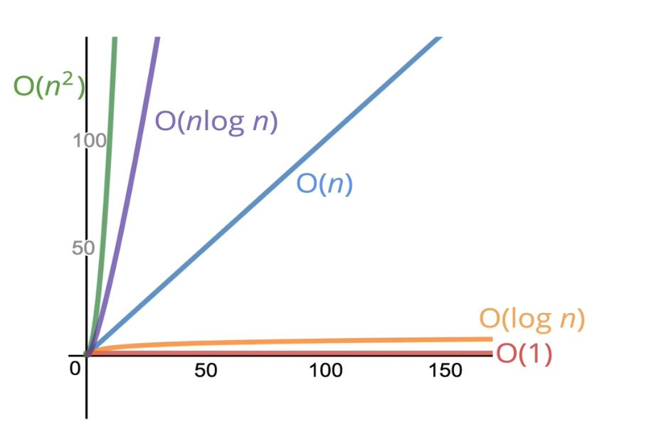
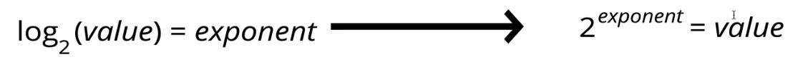

# Big O Notation

## 4: Intro to Big O

- Big O establishes a framework for talking about code.
- Gives us a high level understanding of the time or space complexity of an algorithm
- Big O doesn't care about precision, it cares about general trends
- The time and space of an algorithm depends on the algorithm **only** not the hardware.

### Why we need Big O

- There is no one way to solve most problems in computer science. Big O helps us determine which is best.
- Big O allows us to compare different solutions to the same problem to find the optimal.
 
- Important for:
  - Interviews
  - Working with large data sets
  - When you need top performance
  - Discussing trade offs for different solutions
  - Helps for debugging

## 5: Timing Our Code 

  - "Better" is subjective and depends on a case by case basis.
    - Faster and Memory usage are often the most important
      - but they often come at the expense of readability

> Writing good code is a balance of performance and readability

  - Timing functions aren't always accurate enough, and timing your code isn't always the best way to evaluate it, as it can change as the machine it is running on changes, etc...

## 6: Counting Operations

> Rather than counting seconds to calculate time, we can count the number of simple operations a computer has to perform.

- Operations stay constant regardless of machines.
- "simple Operations" are things like `+-*/%=` and `>< || &&`

> - The number of operations **Doesn't matter**, what matters is the **general trend**
> - We are focused on the **big picture**, what we want to know is: **"As our input grows, how does the time (or space) of our function grow?"**

## 8: The Official Intro to Big O

> Big O notation is a way to formalize fuzzy counting 

- **It allows us to talk formally about how the runtime (or space) of a algorithm grows as the runtime grows**

> Represents the relationship between the input and the time (space) of an algorithm.

- We only care about the big trends

### Big O Definition

> "We say that an algorithm is **O(f(n))** if the number of simple operations the computer fas to do is eventually less than a constant times **f(n)**, as **n** increase.

- **O(f(n) = x)**
- **f(n)** <-- input
- **x**    <-- how time(space) grows as the input grows
 
  - **f(n)** could be constant: **(f(n) = 1)**
  - **f(n)** could be linear: **(f(n) = n)**
  - **f(n)** could be quadratic: **(f(n) = n2)**
  - **f(n)** could be something else all together.

### Important Things to Remember:

> **WHEN WE TALK ABOUT BIG O WE ARE TALKING ABOUT THE WORST CASE SCENARIO.** 
> (the upper bound for run time)

- We are concerned with general trends

> We are concerned with **orders of magnitude**

- Examples:
  - O(3) = **O(1)**
  - O(50n) = **O(n)**

> **O(n)** operation *inside* of an **O(n)** operation is an **O(n2)** operation.

## 9: Simplifying Big O Expressions

### Helpful Time Complexity Rules to Follow:

- Constants Don't Matter
  - O(500) = **O(1)**
  - O(50n) = **O(n)**
  - O(13n2) = **O(n2)**
 
- Smaller Terms also Don't Matter
  - O(n+10) = **O(n)**
  - O(1000n+50) = **O(n)**
  - O(n2+5n+8) = **O(n2)**
    - 5n+8 is meaningless compared to n2
 
- Big O shorthand
  - Arithmetic and Variable assignment = **Constant Time**
  - Assessing Elements by key or index = **Constant Time**
  - In a loop, the complexity is the length of the loop *times* the complexity of whatever happens *inside* that loop
 
- Graph:

## 10: Space Complexity

> **Space Complexity:** *How much additional memory do we need to allocate in order to run the code in our algorithms?*

- Same formal language: Big O

- **We are talking about *additional* space the ALGORITHM takes up, *not including* the space the input(s) take up** 

### Helpful Space Complexity Rules to Follow:

- Most Primitives: **Constant Space**
- Strings: **O(n) Space** (where n is the length of the string)
- Reference Types: Generally **O(n) Space** (where n is the length, or number of keys)

## 11: Logs and Recap

### Logarithms

- O(1), O(n), O(n2) are the most common complexities, but they're not the only complexities:

- Another type of complexity that comes up often is logarithmic complexity.

> Logarithms are the **inverse** of exponentiation 

- Like division and multiplication are a pair, logarithms and exponents are a pair.
 

- **log2(8) = 3** - Reads as "log base 2 of 8 equals 3"
  - What **log2(8)** is asking here is "2, to what power, equals 8?"
    - answer **23 = 8**
 

> log2 is not the only logarithm, but it is the most common. So common that the "2" is often dropped.
> **If you see log without a subscript, you can assume that it is log2**

#### log time is GREAT! (see graph)

- When log comes into play:
  - Some searching algorithms
  - Some (efficient) sorting algorithms
  - **Recursion**