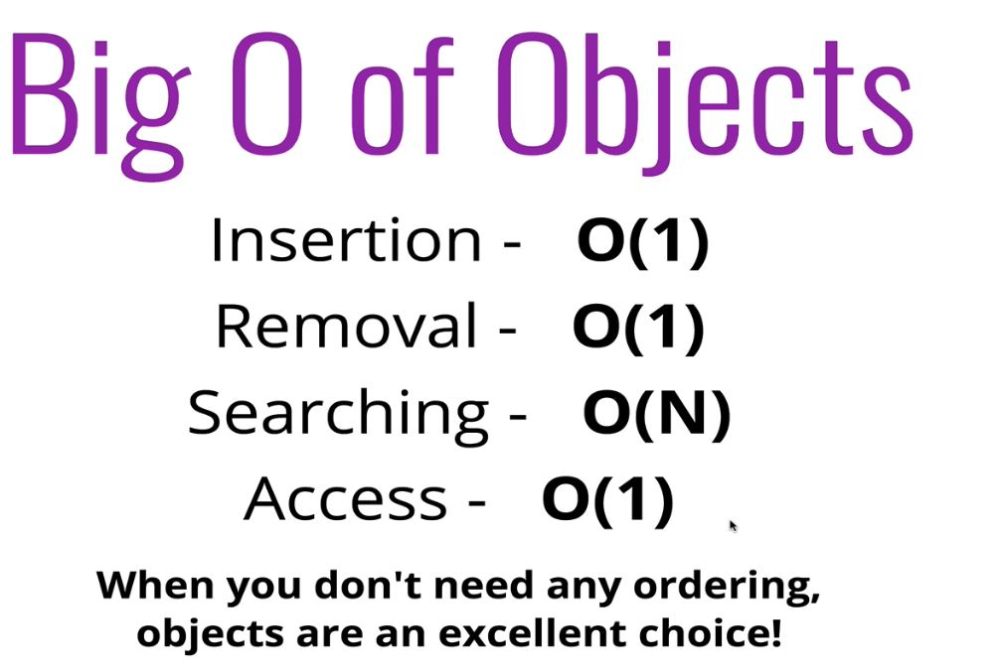
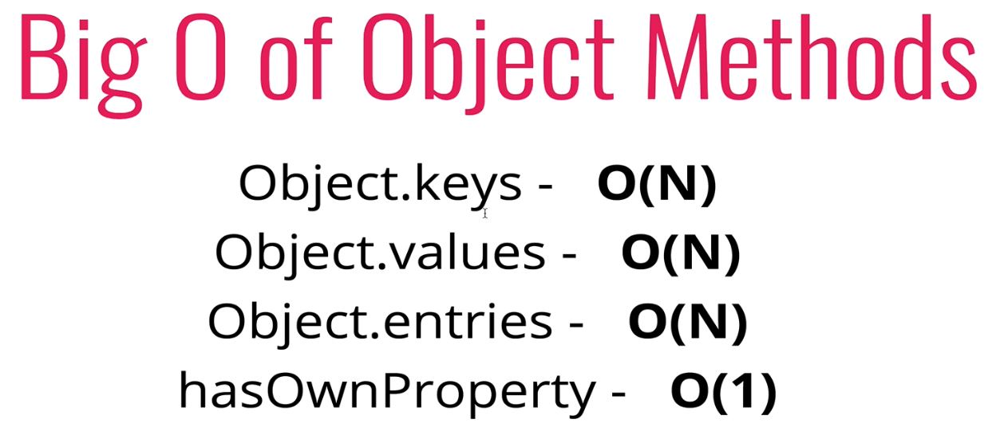
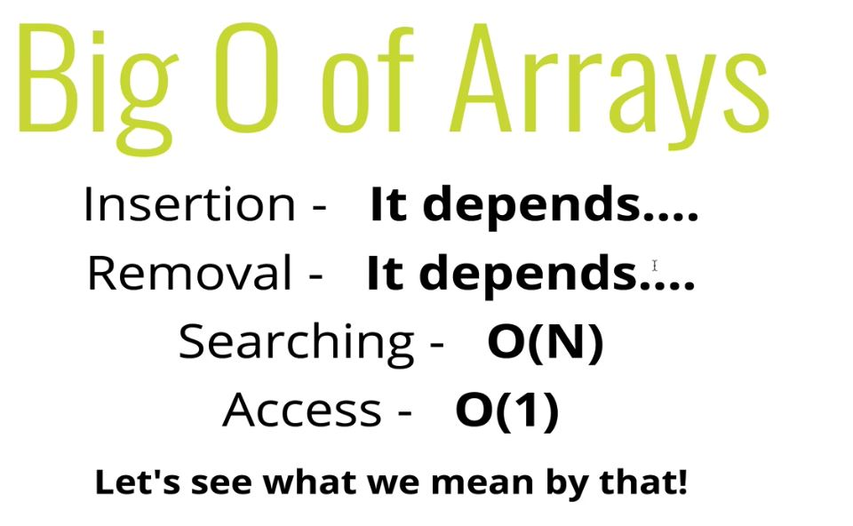
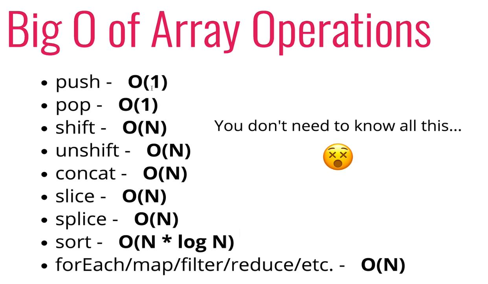

# Built-In Data Structures (through the lens of Big O)

## 14: The Big O of Objects

  - When to use objects:
    - when you don't need order
    - when you want fast access, insertion, and removal
 

 
- 'searching' here means checking to see if a given peice of information is in a value of our object.
  - We would potentially have to check every property in our object, and as the number of properties in the object grows, so too does the time it takes to search through them. Therefore, **O(n)**.
 

## 15: The Big O of Arrays (When are Arrays Slow)

- When to use Arrays:
  - When you need order
  - When you need fast access, insertion, removal (sort of...)

 

- **Insertion**
  - Adding to the end: **Constant Time**
  - Adding to the beginning: **O(n)**
    - Because we have to reindex the **entire array**.
  - Removing from the end: **Constant Time**
  - Removing from the beginning: **O(n)**
    - Because we have to re-index the **entire array**.

> .push() and .pop() **Always faster than** .shift() and .unshift() (unless the array is empty)

## 16: Big O of Array Methods

